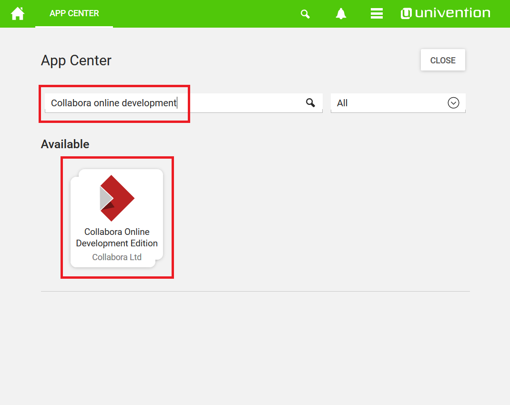
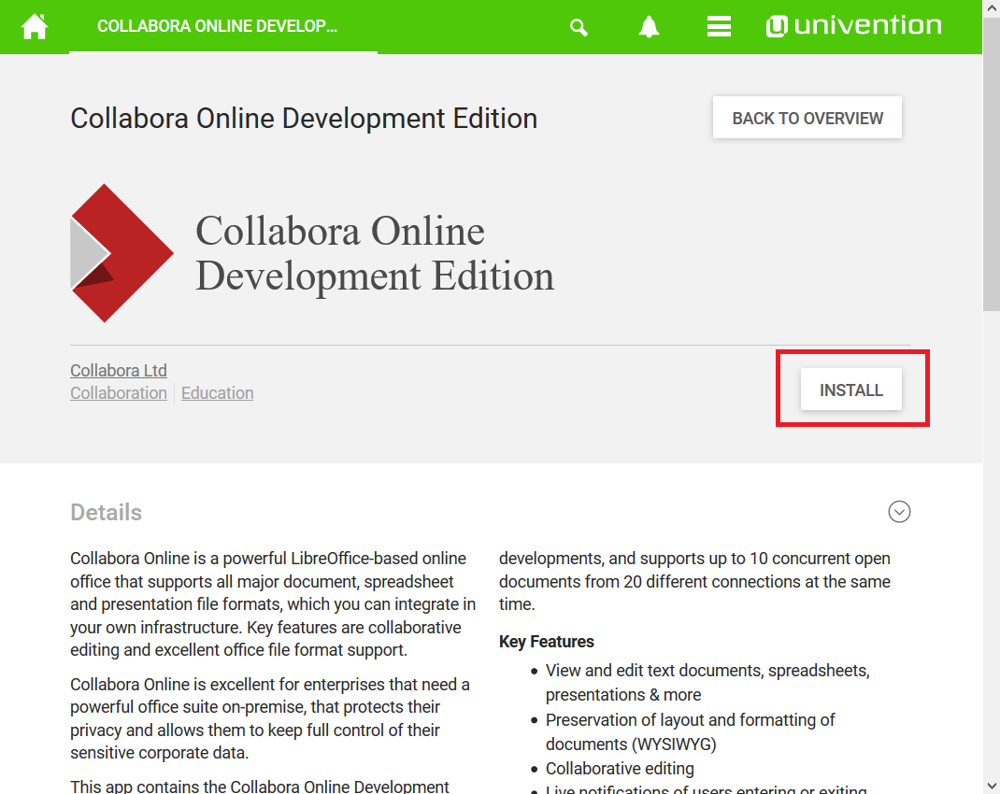
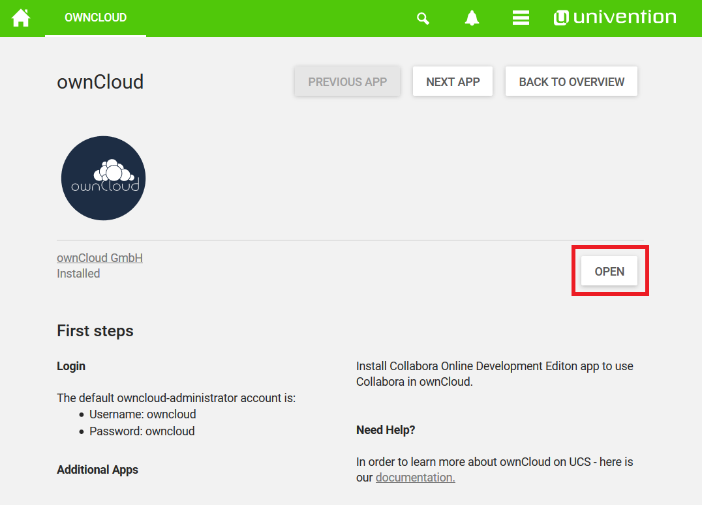
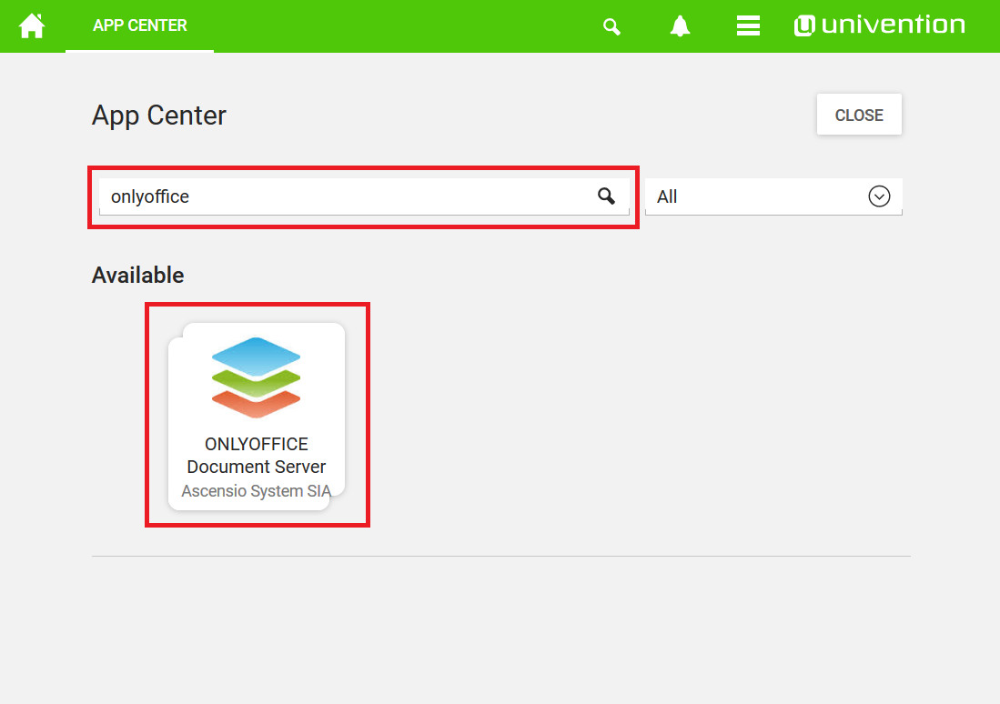
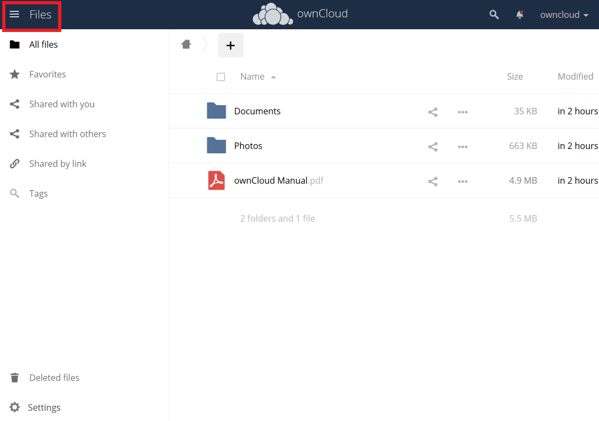
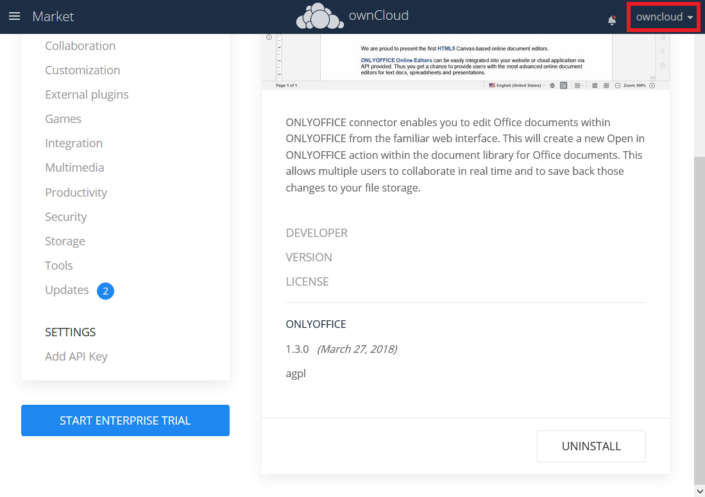
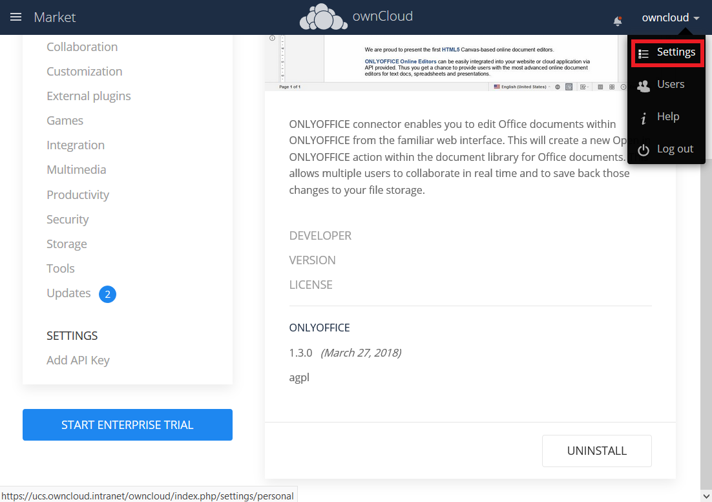
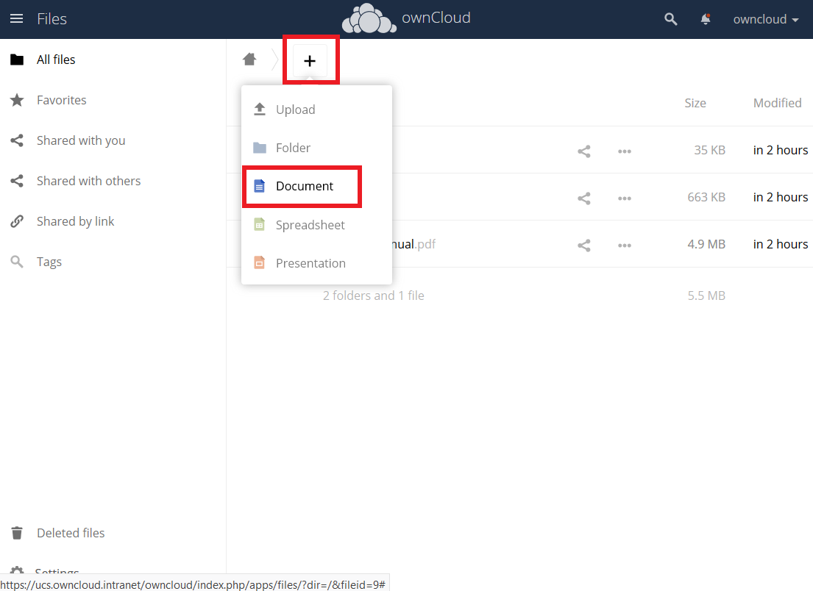

Working on Documents in the ownCloud Appliance
==============================================

Creating and editing documents in ownCloud can be achieved with either Collabora or OnlyOffice. It's your choice which one you prefer to use.

This guide covers the setup and update of the two office apps.

Here is an overview of the process:

1. Access the :ref:`Appcenter <appcenter-label>`
2. Install :ref:`Collabora <collabora-label>` or :ref:`OnlyOffice <onlyoffice-label>`
3. :ref:`Update <update-label>` the App

.. warning::  Access with **HTTPS** using **domain name** is required. Add the IP address and the domain name of your appliance to your `/etc/hosts` file, or have it added to your existing DNS server, if you don't want to use the Appliance as your DNS server.

.. tip::
If you encounter the error, "Failed to load the document. Please ensure the file type is supported and not corrupted, and try again.", when trying to open documents, either restart the Collabora Docker container or the appliance.

.. _appcenter-label:

Appcenter
---------

First you have to get to the Appcenter. Here are the steps to do that:

1. Connect to your appliance using IP address or domain name.

::

   https://172.16.40.100
   # or
   https://ucs-2341.CompanyName.com

2. Login into the management console

- Click on the **Domain and System** settings

.. figure:: ../images/appliance/ucs/onlyoffice/001-ucs-portal.png
   :alt: UCS Portal

- Type in the Administrator as username and the password you set.

.. figure:: ../images/appliance/ucs/onlyoffice/002-ucs-login.png
   :alt: UCS Administrator Login

3. Now you can access the **Appcenter**".

.. figure:: ../images/appliance/ucs/onlyoffice/003-ucs-favorites.png
   :alt: Appcenter

From here on it's your choice to install :ref:`Collabora <collabora-label>` or :ref:`OnlyOffice <onlyoffice-label>`.

.. _collabora-label:

How to Install Collabora
------------------------

1. Install Collabora in UCS.

.. figure:: ../images/appliance/ucs/collabora/004-ucs-app-collabora-install-admin.png
   :alt: Installation

.. figure:: ../images/appliance/ucs/onlyoffice/008-ucs-install-docker.png
   :alt: Docker Container Info

3. Enable Collabora in ownCloud.

.. figure:: ../images/appliance/ucs/collabora/005-ucs-app-collabora-install-back.png
   :alt: UCS User Interface

.. figure:: ../images/appliance/ucs/onlyoffice/011-ucs-onlyoffice-install-owncloud.png
   :alt: ownCloud App

.. figure:: ../images/appliance/ucs/onlyoffice/013-ucs-owncloud-login.png
   :alt: Login in ownCloud

.. note::
   Username and Password are owncloud

.. figure:: ../images/appliance/ucs/collabora/006-oc-settings.png
   :alt: ownCloud Settings

.. figure:: ../images/appliance/ucs/collabora/007-oc-settings-apps.png
   :alt: ownCloud Settings

.. figure:: ../images/appliance/ucs/collabora/008-oc-settings-show-dis-apps.png
   :alt: ownCcloud Apps

.. figure:: ../images/appliance/ucs/collabora/009-oc-enable-collabora.png
   :alt: ownCcloud Apps

.. figure:: ../images/appliance/ucs/collabora/010-oc-goto-collabora.png
   :alt: Collabora

.. figure:: ../images/appliance/ucs/collabora/011-oc-collabora-open-example.png
   :alt: Collabora

.. figure:: ../images/appliance/ucs/collabora/012-oc-collabora-example.png
   :alt: Collabora

Now you can use Collabora within ownCloud.
Start by creating a new Document.

.. _onlyoffice-label:

How to Install OnlyOffice
-------------------------

1. Search for "**OnlyOffice**" or select it from the application list in the Appcenter.

2. Install OnlyOffice.

.. figure:: ../images/appliance/ucs/onlyoffice/006-ucs-onlyoffice-install.png
   :alt: Installation of the OnlyOffice App

.. figure:: ../images/appliance/ucs/onlyoffice/007-ucs-onlyoffice-license.png
   :alt: License

.. figure:: ../images/appliance/ucs/onlyoffice/008-ucs-install-docker.png
   :alt: Docker Container Info

.. figure:: ../images/appliance/ucs/onlyoffice/009-ucs-onlyoffice-install-confirm.png
   :alt: Final Confirmation

After the installation is complete, return to the Appcenter overview

.. figure:: ../images/appliance/ucs/onlyoffice/010-ucs-onlyoffice-install-2oc.png
   :alt: Back to the overview

3. Install the ownCloud OnlyOffice connector App

- Go to ownCloud

.. figure:: ../images/appliance/ucs/onlyoffice/011-ucs-onlyoffice-install-owncloud.png
   :alt: ownCloud App

.. figure:: ../images/appliance/ucs/onlyoffice/013-ucs-owncloud-login.png
   :alt: Login in ownCloud

.. note::
   Username and Password are owncloud

- Market

.. figure:: ../images/appliance/ucs/onlyoffice/015-ucs-owncloud-market.png
   :alt: Market

- Tools

.. figure:: ../images/appliance/ucs/onlyoffice/016-ucs-onlyoffice-install-owncloud-market-tools.png
   :alt: Tools Category

- Install OnlyOffice

.. figure:: ../images/appliance/ucs/onlyoffice/017-ucs-onlyoffice-install-owncloud-market-tools-oo.png
   :alt: Select OnlyOffice App

.. figure:: ../images/appliance/ucs/onlyoffice/018-ucs-onlyoffice-install-owncloud-market-tools-oo-install.png
   :alt: Install the OnlyOffice App

4. Go to the OnlyOffice settings inside ownCloud.

.. figure:: ../images/appliance/ucs/onlyoffice/021-ucs-owncloud-settings-general.png
   :alt: General section

5. Enter the OnlyOffice server address in the following format and **save** it:

::

  https://<your-domain-name>/onlyoffice-documentserver/

.. figure:: ../images/appliance/ucs/onlyoffice/022-ucs-onlyoffice-configure.png
   :alt: OnlyOffice configuration

7. Now you can create a new document by clicking on the **Plus** button.

.. figure:: ../images/appliance/ucs/onlyoffice/026-ucs-onlyoffice-finished.png
   :alt: The setup is finished

.. note::
   PDF documents can also be viewed in OnlyOffice

.. figure:: ../images/appliance/ucs/onlyoffice/027-ucs-onlyoffice-pdf.png
   :alt: PDF

.. _update-label:

Updating
--------
When a new App release is available you should update the Office App. Here are the required steps:

- Select **Software update**
- Check if an Update is available
- Select on the App name
- Upgrade the App
