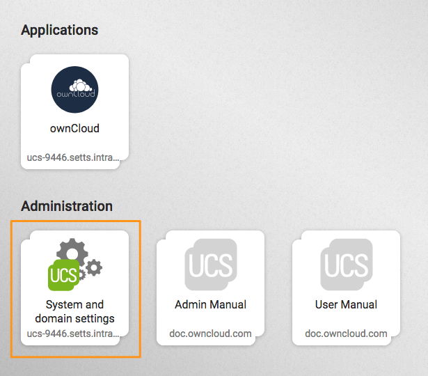
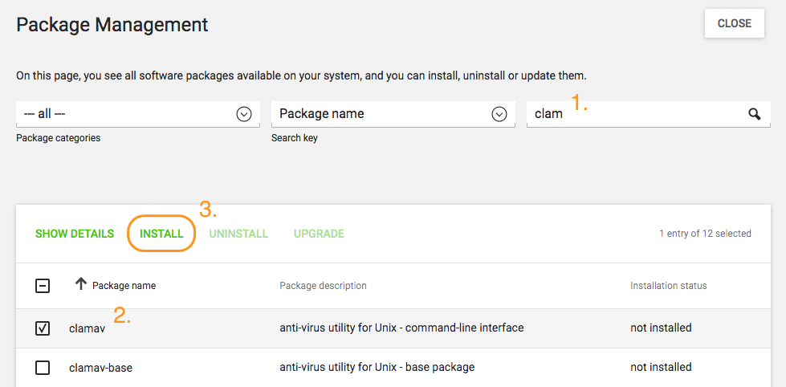

====================================================
Install Antivirus Software in the ownCloud Appliance
====================================================

This guide details how to enable a virus scanner in the ownCloud Appliance.
It is composed of two parts:

1. `Install ClamAV and related components`_
2. `Configure ownCloud to use ClamAV`_

Install ClamAV and Related Components
-------------------------------------

First, start the appliance and go to "**System and domain settings**".

When there, log in with the administrator account. 
After you have done that, click "**Software**" and open "**Package Management**", as in the screenshot below.

.. figure:: ../images/appliance/ucs/clamav/ucs-software-package-management.png
   :alt: UCS Portal: Software and Package Management.

From there, you first need to install ClamAV.
To do this, in the third field, next to the one containing the text "**Package name**", type in the phrase: "**clamav**" (1). 
Doing so filters the list of packages to only those matching that phrase. 
In the filtered list of packages, check the checkboxes next to "**clamav**" (2), "**clamav-freshclam**", and "**clamav-daemon**".

After doing that, click "**INSTALL**" (3) above the listed packages, next to "**SHOW DETAILS**", to install them.

After you do so, a confirmation dialog appears, as in the screenshot below, asking for confirmation to install the packages. 
Confirm the choice by again clicking "**INSTALL**".

.. figure:: ../images/appliance/ucs/clamav/confirm-clamav-installation.png
   :alt: s2q

The installation should only take a few minutes. 

Configure ownCloud to Use ClamAV
--------------------------------

You next need to configure ClamAV in your ownCloud instance.
Please refer to :ref:`the ClamAV documentation <configure_clamav_antivirus_scanner_label>` for instructions on how to do that. 
