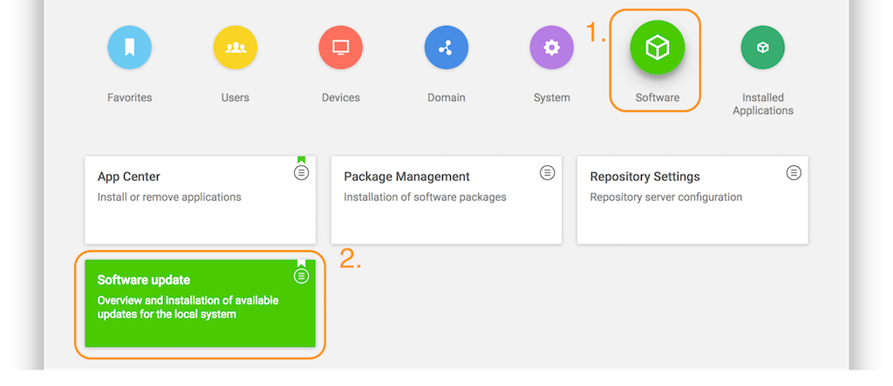
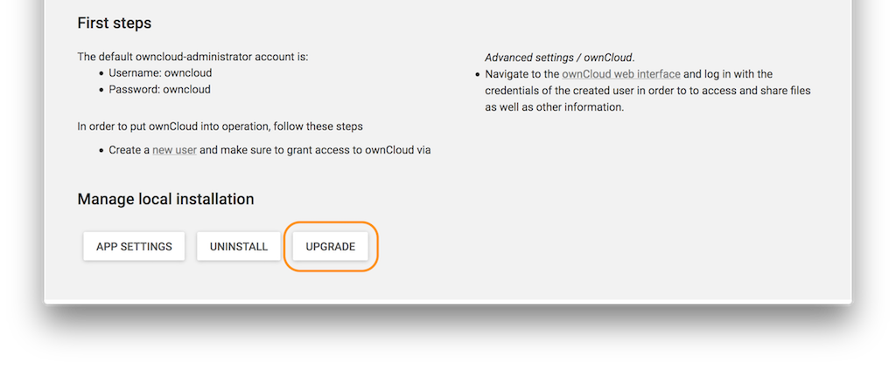
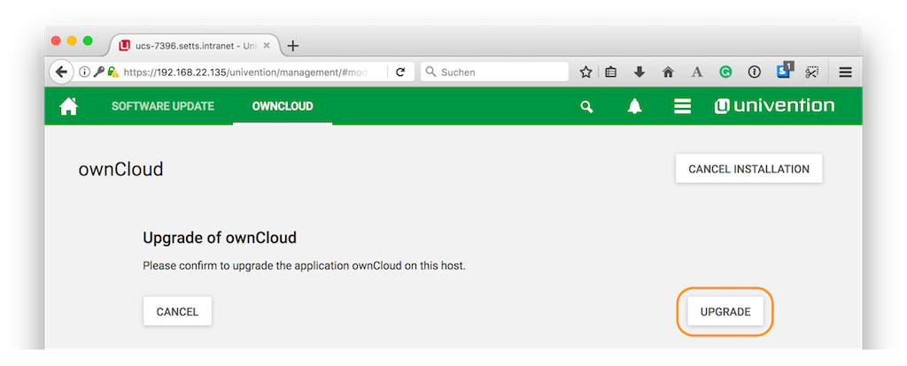

======================
How to Update ownCloud 
======================

There are three options to update an ownCloud installation hosted on an ownCloud X Appliance:

- `Use the Univention Management Console`_
- `Use the Command Line`_
- `Use the Web UI`_

Use the Univention Management Console
-------------------------------------

Using the Univention Management Console, there are two ways to upgrade an
existing ownCloud installation:

- `In-place Upgrade`_
- `Uninstall the Existing Version and Install the New Version`_

In-place Upgrade
~~~~~~~~~~~~~~~~

To perform an in-place upgrade, after logging in to the Univention server, under "**Administration**", click the first option labeled "**System and domain settings**".
This takes you to the Univention Management Console.
From there, click the "**Software**" shortcut (1), and then click "**Software update**" (2).

This will load the Software update management panel, after a short time scanning for available updates.
If an update is available, under "**App Center updates**" you will see "**There are App Center updates available**".
If one is, as in the image below, click "**ownCloud**" which takes you to the ownCloud application. 

.. image:: ../images/appliance/ucs/upgrade-owncloud/univention-software-update-dashboard.png

When there, part-way down the page you’ll see the "**Manage local installation**" section. 
Under there, click "**UPGRADE**".

Before the upgrade starts, a prompt appears titled "**App Installation notes**". 
This is nothing to be concerned about. 
So check the checkbox "**Do not show this message again**".
Then click "**CONTINUE**".

.. image:: ../images/appliance/ucs/upgrade-owncloud/owncloud-update-app-installation-notes.png

Next an upgrade confirmation page appears.
To accept the confirmation, click "**UPGRADE**" on the far right-hand side of the confirmation page.

This launches the upgrade process, which requires no manual intervention.
When the upgrade completes, the ownCloud app page will be visible again, but without the "**UPGRADE**" button.
Now, login to ownCloud by clicking the "**OPEN**" button, on the far right-hand side of the page.

Uninstall the Existing Version and Install the New Version
~~~~~~~~~~~~~~~~~~~~~~~~~~~~~~~~~~~~~~~~~~~~~~~~~~~~~~~~~~

Open your ownCloud X Appliance and go to the "**System and Domain Settings**" dashboard.
Then, after logging in, click "**Installed Applications**", and then click ownCloud. 

.. image:: ../images/appliance/ucs/upgrade-owncloud/installed-applications-owncloud.png

This takes you to the ownCloud app settings page.
From there, begin uninstalling ownCloud by clicking "**UNINSTALL**" under "**Manage local installations**"

.. image:: ../images/appliance/ucs/upgrade-owncloud/begin-owncloud-uninstall.png

This takes you to an uninstall confirmation page. 
On that page, click UNINSTALL on the lower left-hand side of the page.

.. image:: ../images/appliance/ucs/upgrade-owncloud/confirm-owncloud-uninstall.png

, responding to the required confirmations, until the process is finished.
Then, click on "**Close**" in the upper right corner.

.. note::  
   Your data and users will remain.

.. image:: ../images/appliance/ucs/upgrade-owncloud/app-center-search-for-owncloud.png

Following that, go to "**Software - Appcenter**", and search for "*ownCloud*". 
At the moment, two matching results will be returned.
Pick the one that does not contain a version number.

To confirm the version number, scroll to the bottom of the page, and in the More
information section, look for the version string, next to Installed version, as
in the screenshot below.

.. image:: ../images/appliance/ucs/upgrade-owncloud/owncloud-app-version-confirmation.png

If it is the right version, click "**INSTALL**".
Then the License Agreement is displayed.
If you agree to it, click "**ACCEPT LICENSE**".
This will display an installation confirmation screen.
To confirm the installation, click "**INSTALL**".

.. image:: ../images/appliance/ucs/upgrade-owncloud/owncloud-confirm-install.png

The installation will then be carried out.
When it is finished, you will have the latest version of ownCloud installed.

Use the Command Line
--------------------

This is a documentation on how to upgrade the ownCloud App from 9.1.4 to 10.0.3 in UCS.
First, login to your ownCloud X Appliance, either via ssh or directly on the server. 
Then, there are two commands that you will need to run, to upgrade to the latest version of ownCloud:
The process involves remove the old installation and install the new one in its place. 

::

  univention-app remove owncloud82
  univention-app install owncloud

.. note::  
   Your data and users will remain.

There are also some optional commands which you can run.
These are shown below.

::

  # When your system time is out of sync, which can cause errors on the update command.
  timedatectl set-ntp true 

  # When you change the scripts
  univention-app update
