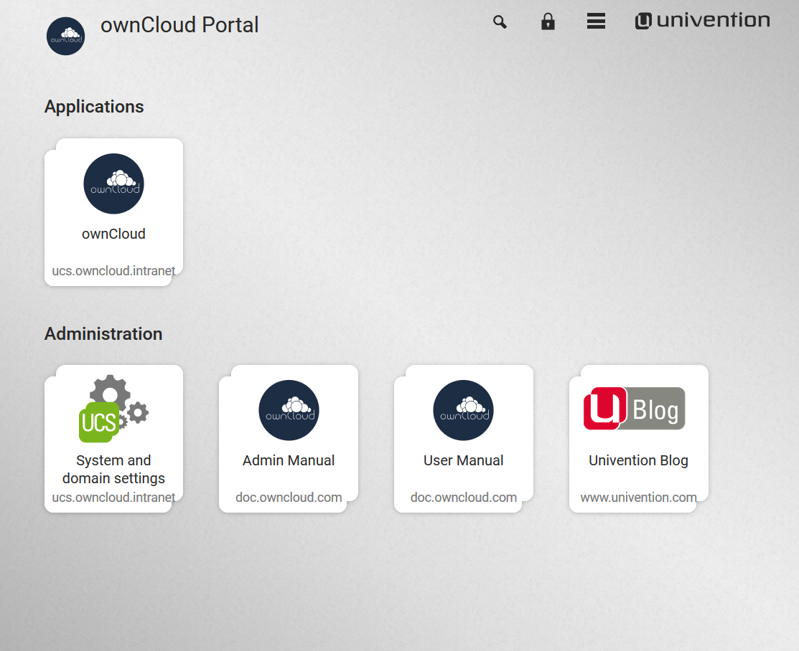

============================
How to Install the Appliance
============================

The install process is a little involved, but not too much. 
To keep it succinct, you need to:

- :ref:`Download <appliance-download-label>` and :ref:`Install <appliance-install-label>` the appliance 
- Step through :ref:`the configuration wizard <appliance-start-label>`
- :ref:`Activate <appliance-activate-label>` the configured appliance 

.. important:: 
   You need **Internet access** to use the appliance. The appliance has to be activated with a license that you will receive from Univention via email. This license has to be imported in the appliance via the **web interface**.
   The appliance also needs access to a DHCP server so that it can receive an IP address and be accessible.

After that, you can access the running instance of ownCloud and :ref:`further configure it <appliance-administer-label>` to suit your needs. 

.. _appliance-download-label:

Download the Appliance
----------------------

First off, you need to download the ownCloud X Appliance from `the ownCloud download page`_ and click "DOWNLOAD NOW".  
This will display a form, which you can see a sample of below, which you'll need to fill out. 
It will ask you for the following details:

- Email address
- Download version (*ESXi*, *VirtualBox*, *VMware*, *KVM*)
- Your first, last, and company names, and your country of origin

.. image:: ../images/appliance/download-form.png
   :alt: The ownCloud X Trial Appliance download form.

After you've filled out the form, click "**DOWNLOAD OWNCLOUD**" to begin the download of the virtual appliance.

.. note::
   The virtual appliance files are around 1.4GB in size, so may take some time, depending on your network bandwidth.

.. note::
   You can also download it from `the owncloud.org page`_.

.. _appliance-install-label:

Install the Appliance
---------------------

Once you've downloaded the virtual appliance file, import it into your virtualization software, accept the T's & C's of the license agreement, and launch it.
The example below shows this being done using VirtualBox.

.. image:: ../images/appliance/import-the-virtual-appliance.png
   :alt: Importing the ownCloud X Trial Appliance OVA file into VirtualBox and accepting the software license agreement terms and conditions.

.. note:: 
   If you try to install an ownCloud appliance in your domain after removing an existing one, please remember to remove the original one from you DNS configuration.

.. important:: 
   Don't Forget the **IP Address** and the **Administrator Password**. You will need them to use the Appliance.

.. _appliance-start-label:

Start the Appliance
-------------------

Once imported, start the appliance. 
Doing so launches the installer wizard which helps you specify the core configuration.
This includes:

**Localization settings:** Here, you can specify the language, timezone, and keyboard layout. 
Domain and network configuration: These settings can be either obtained automatically, via a DHCP lookup, or provided manually. 

**Domain setup:** This lets you manage users and permissions directly within the ownCloud installation in the virtual appliance, or to make use of an existing Active Directory or UCS domain.

**Account information:** This lets you specify your organisation's name, the email address (used for receiving the license which you'll need to activate the appliance), and the administrator password. Note, this password is for the administrator (or root user) of the virtual machine, not for the ownCloud installation.

**Host settings:** This lets you specify the fully-qualified domain name of the virtual appliance, as well as an LDAP Base DN. 

Once you've provided all of the required information, you can then finish the wizard, which will finish building the virtual appliance. Make sure that you double-check the information provided, so that you don't have to start over.

.. _appliance-activate-label:

Activate the Appliance
----------------------

When the wizard completes, the virtual machine will be almost ready to use.
You then need only retrieve the license file from the email which was sent to you and upload it.
The page to do that from can be found by opening your browser to the IP address of the virtual appliance, as you can see below.
The installer may instruct you to use ``https://`` to access the activation page. If this gives an error in the browser, then remove the ``https://``.

.. image:: ../images/appliance/activate-the-virtual-appliance.png
   :alt: Activate the ownCloud X Trial Appliance.

.. _appliance-administer-label:

Administer the Appliance
------------------------

Once activated, you should be redirected to the portal, which you can see below.

If you want to create new users and groups, or download apps from the Univention appcenter click on the "**System and domain settings**". Login as the "**Administrator**" using the password that you supplied during the configuration wizard earlier.

.. image:: ../images/appliance/login-to-the-virtual-appliance.png
   :alt: Administer the ownCloud X Trial Appliance.

.. note:: 
   If you are not redirected to the appliance login page, you can open it using the following url: ``https://<ip address of the virtual machine>/univention-management-console``.

After you've done so, you will now be at the Univention management console, which you can see below.

.. image:: ../images/appliance/univention-management-console.png
   :alt: The Univention Management Console.

The management console allows you to manage the virtual appliance (1), covering such areas as: *users*, *devices*, *domains*, and *software*.
You will also be able to access the ownCloud web interface (2). 

.. note:: 
   The default username for the ownCloud is: ``owncloud`` and so is the password.
   The password is **not** the password you supplied during the configuration wizard.

.. note:: 
	For security reasons ``rpcbind`` should be disabled in the appliance. An open, from the internet accessable portmapper service like ``rpcbind`` can be used by an attacker to perform DDoS-Reflection-Attacks. Furthermore, the attacker can obtain information about your system, for example running rpc-services, or existing network shares. The german IT securyty agency "BSI" reported that systems with an open ``rpcbind`` service were used to perform DDoS-Reflection-Attacks against other systems.
	If you want to create NFS shares on the appliance and give someone permission to access them, then you can enable ``rpcbind`` again.
.. Links
   
.. _VMware: https://www.vmware.com
.. _KVM: https://www.linux-kvm.org/page/Main_Page
.. _Xen: https://www.xenproject.org/developers/teams/hypervisor.html 
.. _Hyper-V: https://www.microsoft.com/en-us/cloud-platform/server-virtualization
.. _the press release: https://owncloud.com/enterprise-appliance-production-faq/
.. _purchase the license key: https://owncloud.com/contact
.. _the ownCloud download page: https://owncloud.com/download
.. _an A record: https://support.dnsimple.com/articles/differences-between-a-cname-alias-url/
.. _the owncloud.org page: https://owncloud.org/download/#owncloud-server-appliance
