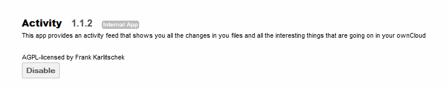
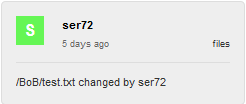
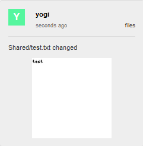
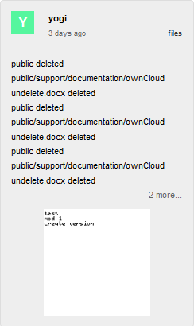
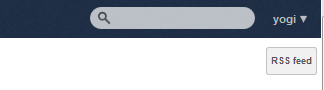

========
Activity
========

The ownCloud Activity app shows an activity feed where users can see what they did in the past and what happened to
their files and what others did with their shared files.

The Activity Stream introduces a central interface where all events that happen in a user’s ownCloud instance are shown.

The following can be seen in the new interface:

*   Creation, edit or deletion of files along with a thumbnail and date and path
*   If someone shared a file with you
*   If someone created, edited or deleted something in a folder you shared to them.

All the events are presented with endless scrolling and also in an RSS feed which a user can subscribe to.

Configuration
=============

The Activity App is enabled by default.  To verify or to disable, navigate to the APPS page and search for ``Activity``.

Utilization
===========

The Activities can be viewed by selecting
Activity
in the App bar on the left side of the ownCloud browser interface

|1000000000000050000000DB83B8FA5B_png|

This will bring up the Activity interface showing all the activities which occurred for this user’s instance.

Sample Activities
-----------------

This section will show how the different activities may appear within this interface

Create file
~~~~~~~~~~~

The following shows a file entitled
DeleteMe.txt
being created 3 days ago.

|10000000000000F300000068AF0ECD53_png|

Delete File
~~~~~~~~~~~

The following shows a file entitled ``DeleteMe.txt`` being deleted 3 days ago.

|10000000000000F5000000675DC5F68C_png|

Edit a file
~~~~~~~~~~~

The following shows a file ``Shared/test.txt`` being edited mere seconds ago.

|10000000000000F1000000F6704F46D3_png|

Share a file with a user
~~~~~~~~~~~~~~~~~~~~~~~~

The following shows the file ``shareMe`` being shared with another user.

|10000000000000F1000000F56125BDBA_png|

File shared to user
~~~~~~~~~~~~~~~~~~~

The following shows the file ``Shared/test.txt`` being shared with this user almost an hour ago.

|10000000000000F60000006754ED2A1E_png|

File created by another user in Shared folder
~~~~~~~~~~~~~~~~~~~~~~~~~~~~~~~~~~~~~~~~~~~~~

The following is shown when another user creates a file in your shared folder.

|10000000000000F500000067A8845EF8_png|

Shared file modified
~~~~~~~~~~~~~~~~~~~~

The following shows a file ``BoB/test.txt`` modified by a user who this file was shared to.

|10000000000000F6000000685DFB3767_png|

Combined activities
~~~~~~~~~~~~~~~~~~~

The following shows what “combined” activities may look like on the activity interface.

|10000000000000F40000019A110DD159_png|

.. |10000000000000F1000000F56125BDBA_png| image:: images/10000000000000F1000000F56125BDBA.png
    :width: 2.5102in
    :height: 2.552in

.. |10000000000000F500000067A8845EF8_png| image:: images/10000000000000F500000067A8845EF8.png
    :width: 2.552in
    :height: 1.0728in

.. |1000000000000050000000DB83B8FA5B_png| image:: images/1000000000000050000000DB83B8FA5B.png
    :width: 0.8335in
    :height: 2.2811in

.. |10000000000000F60000006754ED2A1E_png| image:: images/10000000000000F60000006754ED2A1E.png
    :width: 2.5626in
    :height: 1.0728in

.. |10000000000000F5000000675DC5F68C_png| image:: images/10000000000000F5000000675DC5F68C.png
    :width: 2.552in
    :height: 1.0728in

.. |10000000000000F300000068AF0ECD53_png| image:: images/10000000000000F300000068AF0ECD53.png
    :width: 2.5311in
    :height: 1.0835in

RSS Feed
========

To subscribe to the RSS Feed, navigate to the ``Activity`` page and select ``RSS feed`` in the upper right of the
browser.

|10000000000001440000005A2989832F_png|

The resulting page will look something like this:

|10000000000002B1000002258C08D304_png|

To subscribe, select the ``Subscribe Now`` button.  The RSS Feed may be viewed via the browser’s capabilities.

.. |10000000000002B1000002258C08D304_png| image:: images/10000000000002B1000002258C08D304.png
    :width: 6.5in
    :height: 5.1791in

