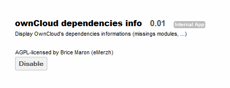

===============================
Finding Deployment Dependencies
===============================

The ownCloud Dependencies App provides a list of modules required to run the current setup of ownCloud.
All of the modules listed should be installed on the base operating system prior to using ownCloud.

Configuration
=============

By default, the ownCloud Dependencies App is disabled.
To enable, navigate to the Apps page and select “ownCloud dependencies info” and enable.

Utilization
===========

Once this app is enabled, navigate to the Admin page and scroll to “Dependencies status”.
This section will show a list of all modules required to execute this ownCloud
setup as well as what part of ownCloud uses the given module.

.. image:: images/100000000000013C0000017D4FC6CEF5.png
    :width: 3.2917in
    :height: 3.9689in

Modules in green are required and have been installed.  Modules in red are
required yet have not been installed.  It is recommended to install these
modules prior to using ownCloud.

