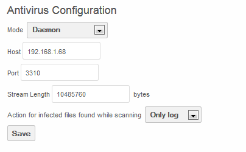
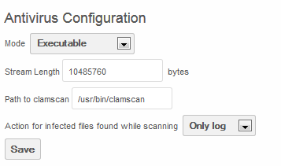
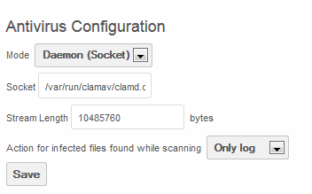

=====================
File Antivirus Engine
=====================

ownCloud integrates with ClamAV, an open source (GPL) antivirus engine, to provide an antivirus solution for files which are uploaded to the ownCloud server.
Via this method, ownCloud/ClamAV can detect Trojans, viruses, malware and other malicious threats.
Files are scanned for virus upon initial upload to the ownCloud server.

The ownCloud antivirus app is supported on ownCloud instances which are installed on a Linux operating system.

The antivirus app can run in one of three modes:

*   Executable – ClamAV is running on the same server as the ownCloud instance.
    For executable mode, the ClamAV process is started and stopped with each file upload.
*   Daemon – ClamAV is running on a different server from the ownCloud instance
*   Daemon (Socket) – ClamAV is running on the same server as the ownCloud instance. In this mode, the ClamAV process is running in the background at all times.
    It is a bit quicker for scanning than executable mode, but requires system administrator skills and root access.

In addition, there are two possible actions which may occur when an infected file is found:

*   Only Log – A log entry is created when an infected file is found.
*   Delete File – The infected file is deleted.

Configuration
=============

Enable The app
--------------

To enable the Antivirus App, navigate to the Apps page and select “Antivirus App for Files” and enable.

|10000000000001800000009A9494E037_png|

Install ClamAV
--------------

ClamAV must be installed on the server (either the local for Executable or Daemon Socket mode or a remote server for Daemon mode).

To install, use the repository’s installation method to install “clamav”.
For example::

  apt-get install clamav

For daemon mode, the ClamAV daemon must also be installed (either on the local machine for Daemon Socket or the remote machine for daemon mode)::

  apt-get install clamav-daemon

Configure Logging
-----------------

Set log level to Everything in the Admin page.

|10000000000001AC000000477C76808F_png|

Executable Mode
---------------

To run in executable mode, ClamAV must be installed on the local server.
From the Admin page, configure Antivirus as follows:

|1000000000000165000000D3FF2168AB_png|

The Stream Length is defined as the ClamAV StreamMaxLengeth Size.
The default value, according to the ClamAV web site is 10M which equates to 10485760 bytes as shown in the above example.

The Path to clamscan is the path for the executable clamscan file.
By default it installs in /usr/bin/clamscan.

When files are uploaded, they will be scanned and, if clean, the following logs will appear::

  {"app":"files_antivirus","message":"Scanning file : \/Lab.txt","level":0,"time":"2013-12-17T15:24:05+00:00"}
  {"app":"files_antivirus","message":"Exec scan: \/Lab.txt","level":0,"time":"2013-12-17T15:24:05+00:00"}
  {"app":"files_antivirus","message":"Result CLEAN!","level":0,"time":"2013-12-17T15:24:09+00:00"}

Daemon Mode
-----------

When running in Daemon Mode, install ClamAV and clamAV-Daemon on a remote server.

The port, upon which ClamAV listens must be configured.
To do this, add the following line in ``/etc/clamav/clamd.conf``::

  TCPSocket 3310

Then restart the Clamd service::

  /etc/init.d/clamav-daemon restart

Back on the ownCloud server, navigate to the Admin page and configure the Antivirus Configuration as follows:

|1000000000000194000000FAD39BC0D8_png|

Where the host is the IP of the server running the ClamAV Daemon and the Port is what was configured in the above step.

Upon upload of files to the ownCloud server, the following logs will appear indicating the files are clean::

  {"app":"files_antivirus","message":"Scanning file : \/Lab.txt","level":0,"time":"2013-12-17T17:39:35+00:00"}
  {"app":"files_antivirus","message":"Response :: stream: OK\n","level":0,"time":"2013-12-17T17:39:48+00:00"}

Daemon Socket mode
------------------

To run in Daemon socket mode, install clamav and clamav-daemon on the ownCloud server.

Configure the Admin page as such:

|1000000000000160000000DBB2FB0223_png|

Where Socket is the location of the Clamd executable.

Upon upload of a clean file to the ownCloud server, the following logs will appear::

  {"app":"files_antivirus","message":"Scanning file : \/Lab.txt","level":0,"time":"2013-12-17T18:19:08+00:00"}
  {"app":"files_antivirus","message":"Response :: stream: OK\n","level":0,"time":"2013-12-17T18:19:08+00:00"}

.. |10000000000001AC000000477C76808F_png| image:: images/10000000000001AC000000477C76808F.png
    :width: 4.4583in
    :height: 0.7398in

.. |10000000000001800000009A9494E037_png| image:: images/10000000000001800000009A9494E037.png
    :width: 4in
    :height: 1.6043in

