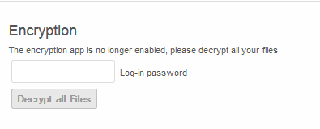
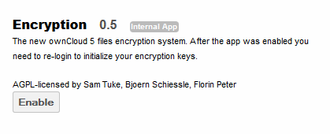
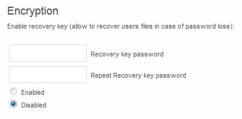
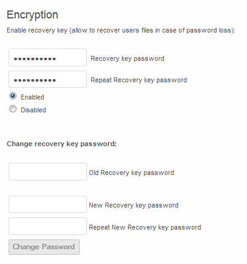
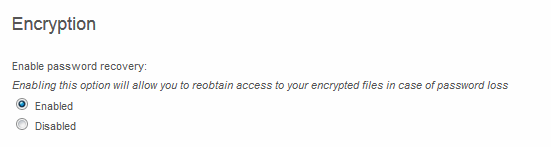

==========
Encryption
==========

ownCloud contains an encryption app which, when enabled, encrypts all files stored in ownCloud.
The encryption is done automatically once the admin enables the app.
All encryption and decryption occur on the ownCloud server, which allows the
user to continue to use other apps to view and edit the data.

The user’s password is used as the key to decrypt their data.
This means that if the user loses their login password, data will be lost.
To protect against password loss, the recovery key may be used as described in a later section.

What gets encrypted?
====================

All files stored in ownCloud will be encrypted with the following exceptions:

*   Old versions (versions created prior to enabling the encryption app)
*   Old files in the trash bin (files deleted prior to enabling the encryption app)
*   Existing files on external storage.
    Only new files placed on the external storage mount after encryption was enabled are encrypted.
*   Image thumbnails from the gallery app
*   Search index form the full text search app.

Decrypting the data
===================

If the encryption app is disable, users will get the following message alerting
them how to decrypt their files.

.. image:: images/100000000000023B000000125381F51B.png
    :width: 5.948in
    :height: 0.1874in

Navigating to the Personal settings page, the user can enter their password and
decrypt all files.

Configuration
=============

To enable the encryption app, navigate to the Apps page and select Encryption, then enable.

Once the app is enabled, the following message will appear for all users
currently logged into the web browser as they navigate to a new page within the
ownCloud web browser

It is necessary to logout of ownCloud and re-login to initialize the encryption keys.

Recovery Key
------------

Enabling the recovery key globally is done by the admin.
Each user then has the option as to whether they wish to do so for their own account.
If enabled, the admin will be able to reset the user’s encryption password
using a predefined recovery password.  This allows for the recovery of a user’s
files in the event of a password loss.  If recovery key is not enabled, there
is no way to restore files if the login password is lost.

Admin level
~~~~~~~~~~~

To enable the recovery key, the Admin must first enable this feature in the Admin page.

Once enabled, the Admin may change the recovery key password at any time.

User level
~~~~~~~~~~

The user can then navigate to the Personal page and enable password recovery.

Recovery
~~~~~~~~

In order for the admin to recover the user’s files in the event of a lost
password, the admin should navigate to the “Users” tab and enter the Recovery
Key Password into the “Admin Recovery Password” field at the top of the page.

.. image:: images/10000000000003730000002B6865E951.png

This will allow the admin to generate a new encryption password for the user.

*   For local user management, this will generate both a new log-in password as well
    as a new encryption password for the data.
*   If LDAP authentication is in use, the admin would need to set the new log-in password
    in the LDAP server, and then enter the same password in the user management page for
    the encryption key. It is important that both the password in the LDAP server and the
    password entered in the user management page are identical.

File Systems
============

Once enabled, all files within ownCloud are encrypted, with the exceptions mentioned above.
This includes files in local storage, as well as files contained within external storage mounts.

The encryption app creates several key files/folders when enabled.
``~/data/public-keys`` contains the public keys for all users, and
``~/data/owncloud_private_keys`` contains system wide private keys utilized for
public link shares as well as the recovery key.

.. code-block:: console

  root@server:/var/www/owncloud/data# ls
  files_encryption/  mount.json  owncloud.log           public-keys/ yogi/
  index.html         oc6admin/   owncloud_private_key/  user1/

The encryption app stores key information in the ``~/data/<user>/files_encryption`` directory.

.. code-block:: console

  root@server:/var/www/owncloud/data/user1/encryption# ls
  keyfiles/ user1.private.key share-keys/

As mentioned previously, the private key is generated from the user’s password.

Each file that the user owns will have a corresponding keyfile maintained in the keyfiles directory.

.. code-block:: console

  root@server:/var/www/owncloud/data/user1/files_encryption/keyfiles# ls
  documents/ ownCloud undelete.docx.key photos/
  music/     ownCloudUserManual.pdf.key test encryption.txt.key

In addition a share key will be generated for each file in the event that there
is an external storage mount by the admin for multiple users or groups.

.. code-block:: console

  root@server:/var/www/owncloud/data/user1/files_encryption/share-keys# ls
  documents/
  music/
  ownCloud undelete.docx.recovery_5dcce10a.shareKey
  ownCloud undelete.docx.user1.shareKey
  ownCloudUserManual.pdf.recovery_5dcce10a.shareKey
  ownCloudUserManual.pdf.user1.shareKey
  photos/
  test encryption.txt.recovery_5dcce10a.shareKey
  test encryption.txt.user1.shareKey
  ...

When viewing a file directly on the ownCloud data directory, it will show up as encrypted.

.. code-block:: console

  root@server:/var/www/owncloud/data/user1/files# more test\ encryption.txt
  2JnmDdDh//8FVcDhLrnD1WH0JjhrzKpFKV6V61pAfUCu9IJX00iv007Yw3Tf/QBbtJFpQFxx
  
However, viewing the same file via the browser, the actual contents of the file are displayed.

.. image:: images/edit_encrypted_file.png

