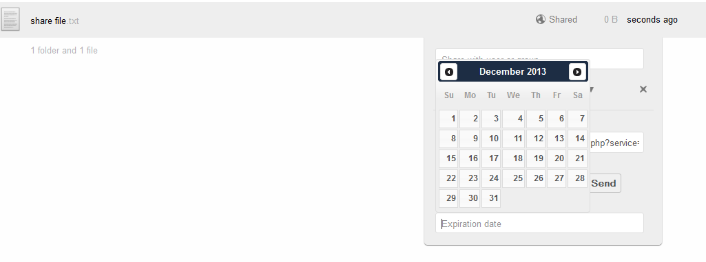
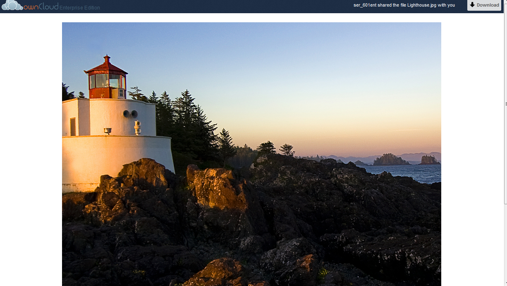
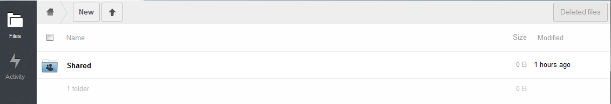
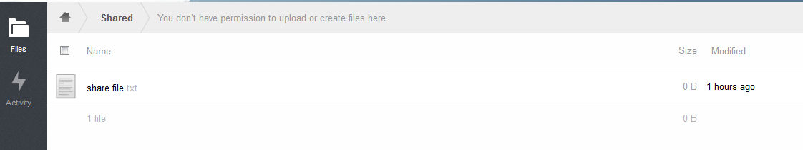

=======
Sharing
=======

ownCloud allows users to share files and folders with both other ownCloud
users, as well as publicly via a link.  Sharing may be done either via the web
interface or via the Sharing API.  This document will discuss the web interface
and sharing. For information on the Sharing API, please refer to that document.

Configuration
=============

Enable the app
--------------

The Share Files app is enabled by default. To verify this and/or disable this functionality,
navigate to the APPS page in the web interface and select “Share Files”

|1000000000000167000000B43E4BF478_png|

Configuring the permitted functionality
---------------------------------------

There are several functions which may be enabled or disabled at the admin’s discretion.
To configure these functions, navigate to the Admin page in the web interface and scroll to the “Sharing” section.

|10000000000001CF00000176B0BE1EBC_png|

The above parameters are self-explanatory and may be enabled or disabled as required.

.. |10000000000001CF00000176B0BE1EBC_png| image:: images/10000000000001CF00000176B0BE1EBC.png
    :width: 4.8228in
    :height: 3.8957in

.. |1000000000000167000000B43E4BF478_png| image:: images/1000000000000167000000B43E4BF478.png
    :width: 3.7398in
    :height: 1.8752in

Utilization
===========

An ownCloud user may share files or entire folders with other individuals.
The method of sharing is the same.

Share with another ownCloud user
--------------------------------

Hover over the line containing the file or folder to be shared.
And then select Share.
The following dialog appears.

|10000000000003EC000000AB60616FA7_png|

In the “share with user or group” text box, enter the user to share with, or the group to share with.
Note, as letters are typed, the users and groups who match the typed string will appear.
As a short cut, simply select the desired user/group

Setting Permissions on the share
--------------------------------

When a file or folder is shared, the permissions may be modified stating what the other user may do with the file/folder.
Once the share with user or group has been entered, the dialog will expand as follows.

|1000000000000404000000FCFC13E732_png|

If the shared with user has an email address configured, the sharing user may choose to notify the shared with user of the share.
To do this, select the checkbox next to “notify by email”.
It is important to note, this checkbox appears whether or not the shared with user has email configured.

When sharing a file/folder, it is obvious that the file may be viewed or downloaded.
However, if the shared with user is allowed to modify the file in any way, the “can edit” box should be checked.
The sharing user may allow the shared with user to update, delete, or re-share the file.
Note, by default, all permissions are set.

It should be noted that when sharing a folder, an additional permission, “create” is available.
When enabled, the shared to users can create new files and folders within the shared folder.

Share as a link
---------------

In the event that an ownCloud user desires to share a file with a non-ownCloud user, the file may be shared as a link.
To share as a link, hover over the line containing the file and select Share.
Then select the check box next to “Share link”

|10000000000003E8000001524A147A04_png|

The link is then shown in the text box.
The link may be copied and pasted into an email and sent to the other user.
Alternatively, if email is setup within ownCloud, the sharing user may input the shared with user’s email address in the text box and select send.
The shared user will then receive an email from the ownCloud server with the link.

There may be circumstances where the file owner wants some security on the link so it cannot be accessed by anyone other than the desired person.
To do this, the link may be Password Protected by selecting the “Password Protect” checkbox and entering a desired password.

|1000000000000403000001632F0B76F6_png|

Setting Expiration Date
-----------------------

ownCloud allows the sharing user to expire a file or folder share at a given date.
This expiration applies to all shares within the folder as well.
So, if a user expires a folder share, all files within the folder will no longer be shared.

To set an expiration, select the Set expiration date checkbox and then select the expiration date.
(The calendar will appear when the mouse is clicked in the Expiration date text box.

|10000000000004010000017E4A6552BC_png|

.. |10000000000003E8000001524A147A04_png| image:: images/10000000000003E8000001524A147A04.png
    :width: 6.5in
    :height: 2.1965in

.. |1000000000000404000000FCFC13E732_png| image:: images/1000000000000404000000FCFC13E732.png
    :width: 6.5in
    :height: 1.5929in

.. |1000000000000403000001632F0B76F6_png| image:: images/1000000000000403000001632F0B76F6.png
    :width: 6.5in
    :height: 2.2465in

.. |10000000000003EC000000AB60616FA7_png| image:: images/10000000000003EC000000AB60616FA7.png
    :width: 6.5in
    :height: 1.1071in

Retrieving shared data
======================

User/group shares
-----------------

When the shared with user logs into their ownCloud instance they will see a “Shared” folder.

|100000000000046C000000C2D3E5CF30_png|

Within that Shared folder are all files and folders which have been shared to that user by any other ownCloud user.

|1000000000000462000000D44541CF9A_png|

Share as link
-------------

To view a file/folder which was shared as a link, simply enter the link into the browser.

|10000000000004CA000002B52116BE0C_png|

To download the file/folder select the Download button on the upper right of the page.
If this link was password protected, the user will be prompted with a password prior to this page appearing.

|100000000000045800000197FE462F2B_png|

.. |100000000000045800000197FE462F2B_png| image:: images/100000000000045800000197FE462F2B.png
    :width: 6.5in
    :height: 2.3791in

