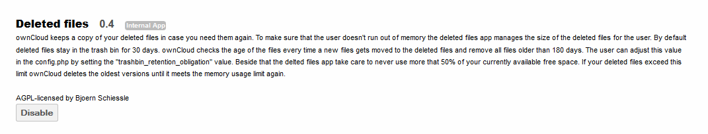
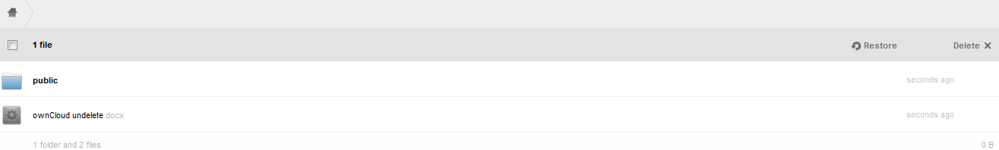

=============
Deleted Files
=============

The ownCloud server stores deleted files in a temporary area in the event that the file was inadvertently deleted and/or needs to be restored.

Expiry of deleted files
=======================

There are two instances in which ownCloud will automatically permanently remove a deleted file.

Disk Utilization
----------------

To prevent a user from running out of disk space, the ownCloud deleted files app will not utilize more than 50% of the currently available free space for deleted files.
If the deleted files exceed this limit, ownCloud deletes the oldest files until it gets below this limit.

Age
---

By default, deleted files remain in the trash bin for 30 days.
This can be configured using the trashbin_retention_obligation parameter
in the ``config.php`` file.
Files older than the configured value (or default 30 days) will be permanently deleted.
ownCloud checks the age of the files each time a new file is moved to the deleted files bin.

Configuration and storage
==========================

Configuration
-------------

By default, the ownCloud deleted files app is enabled.
To verify or disable, navigate to the apps
page and select Deleted Files.

|100000000000042F000000CC3EDDE79E_png|

Storage
-------

Once a file has been deleted by the user, it is moved to the ``~/data/<user>/files_trashbin/files`` folder.

|10000000000002B3000000365E1CD00D_png|

The remaining directories retain information on encryption key files, and versions.

.. |10000000000002B3000000365E1CD00D_png| image:: images/10000000000002B3000000365E1CD00D.png
    :width: 6.5in
    :height: 0.5075in

Utilization
===========

The deleted files app, when enabled, automatically moves deleted files to the Deleted Files folder and leaves them available for restore or permanent deletion

Delete a file
-------------

To delete a file, either select the file check box and select Delete
on the upper right of the screen, or the “x” to the right of the file.

|1000000000000530000001410CF0028A_png|

To delete multiple files simultaneously, select the check box on all the desired files, then select Delete
on the upper right of the screen.

View Deleted Files
------------------

To view a list of the deleted files, select the Deleted files
button on the upper right of the browser.

|1000000000000532000000285DDBBF37_png|

Once selected, a list of all deleted files will appear.

Restore files
-------------

As with deleting files, there are two ways to restore a file.
Either select the check box next to the file (or for bulk restore – files) and select restore
on the upper right.
Or hover over the file and select restore
.

|1000000000000527000000A7AB409FE0_png|
|100000000000052500000088DBB95005_png|

Permanently Delete Files
------------------------

Files in the Deleted Files
folder can be permanently deleted.
To do this, either select the check box next to the file (or for bulk deletion – files) and select Delete in the upper right corner.
Or hover over the file and select the “x”.

Nested files and restore
------------------------

If, for instance, the directory structure within ownCloud is
*~/public/support/documentation/ownCloud undelete*
.

|1000000000000525000000BE30CF0423_png|

Delete entire directory structure
~~~~~~~~~~~~~~~~~~~~~~~~~~~~~~~~~

When the public folder is deleted, all child folders/files will also be deleted.

|100000000000052F000000C2867B7294_png|

Suppose the file “ownCloud undelete.docx” was still required.
A restore of the file will place it in the ‘root’ directory of the Files folder.

Delete only the file
~~~~~~~~~~~~~~~~~~~~

If the file “ownCloud undelete.docx”
was accidentally deleted, it may be restored following the steps described in section
.
The restore will place the file back into the directory structure from where it came.

Delete the file then the directory structure
~~~~~~~~~~~~~~~~~~~~~~~~~~~~~~~~~~~~~~~~~~~~

If the file “ownCloud undelete.docs”
is deleted, then the entire directory structure is deleted, the file will appear in the ‘root’ of the Deleted Files folder.

|1000000000000523000000C6F786381C_png|

A restore of “ownCloud undelete.docx”
will place it in the user’s ownCloud root directory.

|100000000000053100000142D9A4C916_png|

Shared files and restore
------------------------

When a
shared file is deleted, the file will be deleted from the shared to user as well.
Upon restore of the file by the file owner, the file is no longer shared.

Restore files with Versions
---------------------------

When a file which has versions has been deleted, and then restored, the versions will exist upon restoration.

.. |1000000000000525000000BE30CF0423_png| image:: images/1000000000000525000000BE30CF0423.png
    :width: 6.5in
    :height: 0.9374in

.. |100000000000052F000000C2867B7294_png| image:: images/100000000000052F000000C2867B7294.png
    :width: 6.5in
    :height: 0.95in

.. |100000000000052500000088DBB95005_png| image:: images/100000000000052500000088DBB95005.png
    :width: 6.5in
    :height: 0.6717in

.. |1000000000000532000000285DDBBF37_png| image:: images/1000000000000532000000285DDBBF37.png
    :width: 6.5in
    :height: 0.1957in

.. |1000000000000530000001410CF0028A_png| image:: images/1000000000000530000001410CF0028A.png
    :width: 6.5in
    :height: 1.5701in

.. |1000000000000527000000A7AB409FE0_png| image:: images/1000000000000527000000A7AB409FE0.png
    :width: 6.5in
    :height: 0.8228in

.. |100000000000053100000142D9A4C916_png| image:: images/100000000000053100000142D9A4C916.png
    :width: 6.5in
    :height: 1.5752in

