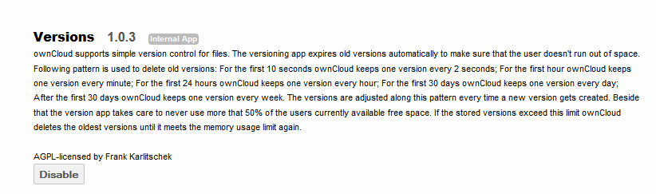
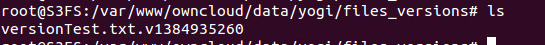
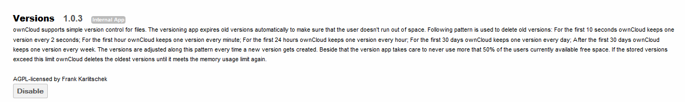
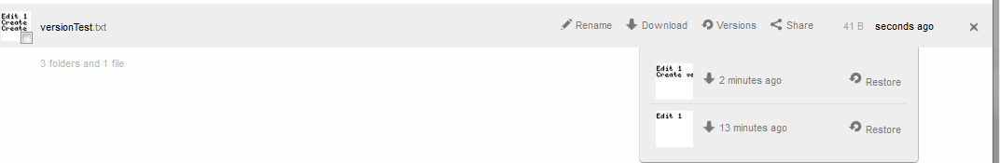
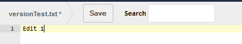

========
Versions
========

The ownCloud Versions app maintains older versions of a file which have been
modified by an ownCloud user.

Expiry of versions
==================

The versions app expires old versions automatically to make certain that the
user doesn’t run out of space.  The following algorithm is used to delete old
versions:

*   ownCloud keeps one new version every 2 seconds for the first 10 seconds
*   ownCloud keeps one new version every minute for the first hour
*   ownCloud keeps one new version every hour for the first 24 hours
*   ownCloud keeps one new version every day for the first 30 days
*   ownCloud keeps one new version every week thereafter.

The versions are adjusted along this algorithm every time a new version is created.

Space limitations
=================

In addition to the expiry of versions, ownCloud’s versions app makes certain
never to use more than 50% of the user’s currently available free space.  If
stored versions exceed this limit, ownCloud will delete the oldest versions
first until it meets this limit.

Configuration and storage
=========================

Configuration
-------------

By default, the ownCloud versions app is enabled.
To verify or disable, navigate to the apps
page and select Versions.

|1000000000000336000000F38C3FAF84_png|

Storage
-------

Previous versions of files are stored in the ``data/<user>/files_versions`` folder.

|100000000000021C0000004CACBF786C_png|

This directory is automatically created when the first file version is created.

The naming convention of the files in this directory are::

  <file_name>.v<unix_timestamp>

|10000000000002210000002DE3BE7515_png|

.. |100000000000021C0000004CACBF786C_png| image:: images/100000000000021C0000004CACBF786C.png
    :width: 5.6252in
    :height: 0.7917in

Utilization
===========

The versions app, when enabled, automatically creates a new version each time an existing, non-empty file is saved.

Initial File creation
---------------------

Create a file on the ownCloud server – either directly via the browser, an upload, or a file sync from the client.
In this example, the file versionText.txt was created via the web browser.

|1000000000000427000000324F58266D_png|

Note
~~~~

Since this file was initially created via the web browser, it is an empty file.

Edit the file
-------------

Edit the file through the web browser.

|100000000000019E0000004CD2A0F407_png|

And save.

Notes
~~~~~

Editing an empty file, as in this instance, for the first time, does not create a new version.

Create version
--------------

Edit the non-zero byte file either via the web browser, via the sync client or via an upload.

|1000000000000194000000498325A766_png|

And save.

Notes
~~~~~

When performing an upload of a file which already exists on the server, a dialog box appears asking whether to keep the existing file or the new file.

|10000000000001C1000000FE663748B2_png|

In order to create a version, the New File must be selected.
If the Existing File is selected, the file is not replaced hence no new version is created.

Accessing Versions
------------------

In order to view what versions exist for a given file, hover over the line containing the file and select Versions
on the right side.

|1000000000000430000000AF9D6E724E_png|

In this case, there are two previous versions of versionTest.txt
.
The thumbnail and creation time can be used to identify what was in the file in that version.

Reverting to a different version
--------------------------------

To revert to a previous version, simply select the restore next to the version as seen in
.

Notes
~~~~~

In the instance where a file is reverted to another version, the “existing” version of the file is versioned and can be reverted at a later date.

Sharing and Versions
--------------------

If user-A shares a file with user-B, user-B may revert the file to any previous version.
If user-B modifies the file, a new version is created.

.. |10000000000001C1000000FE663748B2_png| image:: images/10000000000001C1000000FE663748B2.png
    :width: 4.6772in
    :height: 2.6457in

.. |1000000000000194000000498325A766_png| image:: images/1000000000000194000000498325A766.png
    :width: 4.2083in
    :height: 0.7602in

.. |1000000000000427000000324F58266D_png| image:: images/1000000000000427000000324F58266D.png
    :width: 6.5in
    :height: 0.3055in

