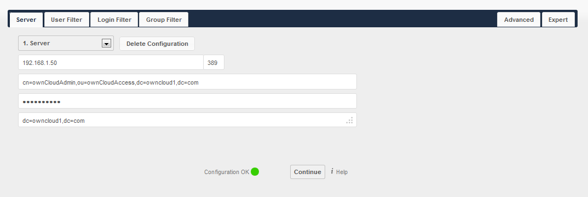
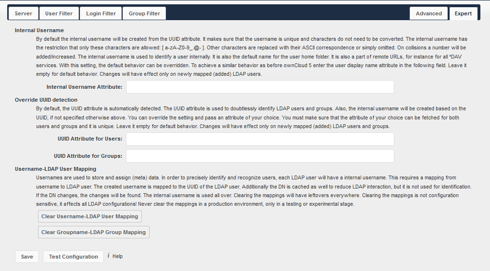
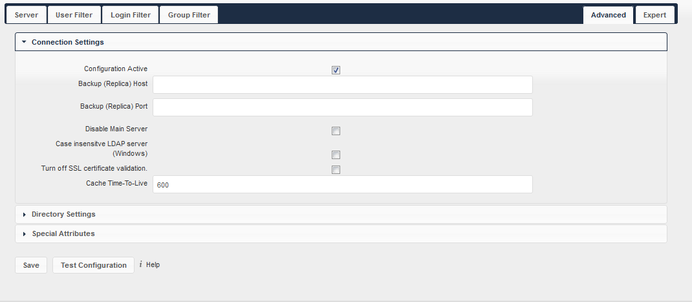
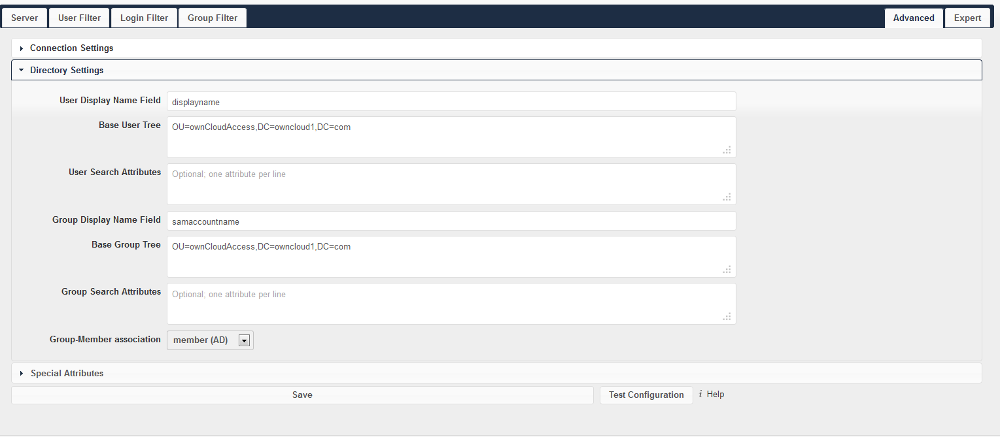

===========================
LDAP user and group backend
===========================

ownCloud ships an LDAP backend, which allows full use of ownCloud for user logging with LDAP credentials including:

*   LDAP group support
*   File sharing with users and groups
*   Access via WebDAV and of course ownCloud Desktop Client
*   Versioning, external Storages and all other ownCloud features.

Configuration
=============

Enable LDAP app
---------------

From the APPs page, select “LDAP user and group backend” and select enable

|1000020100000359000000A8B848DE68_png|

Configuring LDAP
----------------

The configuration of the LDAP feature is performed on the Admin page of the ownCloud web browser.
The configuration follows a wizard-like approach split into four tabs.
The first tab must be completed correctly to allow access to subsequent tabs.
Although the configuration in the remaining tabs is detected automatically, it should be reviewed by the admin to verify correctness.
An indicator exists on the all pages
to show whether the configuration is valid, incomplete, or incorrect.

Configuration settings are saved automatically when the cursor is no longer focused on the input element.

Server Tab
~~~~~~~~~~

The server tab contains basic information on the LDAP server.
It makes certain that ownCloud can connect to the desired LDAP and read data from it.
At a minimum, the admin must provide a hostname for the LDAP server.
If anonymous access to the LDAP server is not allowed, the admin will be required to enter an account Distinguished Name (DN) and password.
ownCloud will auto-detect the port and base DN.

Server
^^^^^^

ownCloud can be configured to connect to multiple LDAP servers.
Using this control you can pick a configuration you want to edit or to add a new one.
The button
Delete Configuration deletes the current configuration.

Host
^^^^

The hostname of the LDAP server.
It can also be a ``ldaps://`` URI.
It is possible to pass a port number which will speed up port detection.
This is especially useful if a custom port is used.
ownCloud will subsequently move the port value to the port field.

Examples::

  directory.my-company.com
  ldaps://directory.my-company.com
  directory.my-company.com:9876

Port
^^^^

This is the port which ownCloud should utilize to connect to the LDAP server.
Upon initial configuration, this field is disabled.
ownCloud will auto-detect the port if it is running on a standard port (389).
After ownCloud detects the port, the field will be enabled for admin input.
A successfully discovered port will be inserted by ownCloud.

User DN
^^^^^^^

The name as DN of a user who is able to do searches in the LDAP directory.
For anonymous access, leave this field blank.
It is recommended to have a special system user for ownCloud.
This information is provided by the LDAP admin.

Password
^^^^^^^^

The password for the user given above.
For anonymous access, leave this blank.
This information is provided by the LDAP admin.

Base DN
^^^^^^^

The base DM of the LDAP from where all users and groups can be reached.
It is possible to provide separated base DN’s for users and groups in the advanced tab.
This is a mandatory field.
ownCloud will attempt to determine the proper value of this field based on the provided User DN or Host values.

|100000000000043200000169BCD20493_png|

User Filter
~~~~~~~~~~~

The settings in the User Filter tab determine which LDAP users will appear and will be able to log into ownCloud.
This may be configured using the wizard or entered via a raw LDAP filter.

Only those object classes
^^^^^^^^^^^^^^^^^^^^^^^^^

ownCloud will determine the available object classes.
ownCloud will automatically select the object that contains the highest number of users.
It is possible to select multiple object classes.

Only from those groups
^^^^^^^^^^^^^^^^^^^^^^

This is used if the LDAP server supports the member-of-overlay in LDAP filters.
It allows the admin to define the users from one or more certain groups that are allowed to appear and log into ownCloud.
No value is selected by default.
It is possible to select multiple groups.

If the LDAP server does not support member-of-overlay in LDAP filters, the field is disabled.

Edit raw filter instead
^^^^^^^^^^^^^^^^^^^^^^^

Selecting this text will toggle the filter mode.
Instead of the wizard’s assistance, the admin may enter the raw LDAP filter in this field.

Example::

  objectClass=inetOrgPerson

x users found
^^^^^^^^^^^^^

Indicates the approximate number of users allowed to access ownCloud.
This number will update after any changes made to the LDAP configuration.

|100000000000042500000163D2B339D5_png|

Login Filter
~~~~~~~~~~~~

The settings in the login filter tab determine which user information will be compared to login credentials entered by the user.
It is possible to allow multiple user details.
It is also possible to enter a raw LDAP filter.

LDAP Username
^^^^^^^^^^^^^

If checked, the login credentials will be compared to the username in the LDAP directory.
The corresponding attribute, usually ``uid`` or ``samaccountname`` will be automatically detected by ownCloud.

LDAP Email Address
^^^^^^^^^^^^^^^^^^

If checked, the login credentials will be compared to an email address in the LDAP directory.
ownCloud will exmaine the ``mailPrimaryAddress`` and ``mail`` attributes in the LDAP for the email address.

Other attributes
^^^^^^^^^^^^^^^^

This field allows the admin to select additional attributes for comparison.
The list is generated automatically based on the attributes contained in the user object of the LDAP server.

Enter raw filter instead
^^^^^^^^^^^^^^^^^^^^^^^^

Selecting this text will toggle the filter mode.
Instead of the wizard’s assistance, the admin may enter the raw LDAP filter in this field.

The ``%uid`` placeholder will be replaced with the login name entered by the user upon login.

Examples:

* Username only::

    uid=%iud

* Username or email address::

    (|(uid=%uid)(mail=%uid))

|10000000000004170000016ACB5E15AE_png|

Group Filter
~~~~~~~~~~~~

The settings in this tab determine which groups will be available in ownCloud.
This tab does not restrict logins in any manner as that was handled in the prior tabs.
It is possible to enter a raw LDAP filter as well.

By default, there are no groups available in ownCloud.
The admin must enable this manually.

Only those object classes
^^^^^^^^^^^^^^^^^^^^^^^^^

ownCloud will automatically determine which object classes are available in the LDAP.
ownCloud will only list object classes that return at least one group object.
It is possible to enter multiple object classes.

Only from those groups
^^^^^^^^^^^^^^^^^^^^^^

This setting allows the admin to select which groups are available within ownCloud.
ownCloud will generate a list of available groups found in the LDAP server for the admin to select.
It is possible to enter multiple groups.

Edit raw filter instead
^^^^^^^^^^^^^^^^^^^^^^^

Selecting this text will toggle the filter mode.
Instead of the wizard’s assistance, the admin may enter the raw LDAP filter in this field

Y groups found
^^^^^^^^^^^^^^

Indicates the approximate number of groups available in ownCloud.
This number will update after any changes made to the LDAP configuration.

|100000000000043000000164DA0CE8C9_png|

Advanced Tab
~~~~~~~~~~~~

The LDAP Advanced settings section allows the admin to define less common
options.  These options are not required for a working connection however, they
can have a positive effect on the performance.

The Advanced Settings tab has three sections

* Connection settings
* Directory settings
* Special attributes

Connection Settings
^^^^^^^^^^^^^^^^^^^

Configuration Active
""""""""""""""""""""

Allows the admin to enable or disable the current configuration.
A disabled configuration will not connect to the LDAP server.

By default, this is disabled.
It is enabled automatically, when using the wizard and configuration is valid and tests successfully.

Backup (Replica) Host
"""""""""""""""""""""

This is used to define a backup LDAP server.  ownCloud automatically attempts
to connect to the backup server when the primary server cannot be accessed.  It
is important that the backup server is an exact replica of the primary server
as all the object UUIDs must match.

Backup (Replica) Port
"""""""""""""""""""""

This identifies the port on which ownCloud will connect to the backup LDAP server.
If no port is provided, ownCloud will utilize the same port as the primary LDAP server.

Disable Main Server
"""""""""""""""""""

This is used to disable the primary LDAP server so ownCloud will connect only to the backup server.
This can be useful for planned maintenance on the primary server.

Case insensitive LDAP server (Windows)
""""""""""""""""""""""""""""""""""""""

Check this if the LDAP server is running on a windows host.
Not usually necessary.

Turn off SSL certificate validation
"""""""""""""""""""""""""""""""""""

Disables the check for a valid SSL certificate.
It is recommended to use for testing only if needed, but not use in production.

Cache Time-To-Live
""""""""""""""""""

ownCloud caches the information it receives from the LDAP server.  This is
necessary as the ownCloud server attempts to validate the user with every page
request or WebDAV interaction.  This time is in seconds.

Note if it is required to have the most up-to-date information from the LDAP,
it is recommended not to turn off the cache totally, however, to define a
lifetime of a small duration (15 seconds)

|100000000000042E000001D3EEB9978B_png|

Directory Settings
^^^^^^^^^^^^^^^^^^

User Display Name Field
"""""""""""""""""""""""

The attribute that should be used as display name in ownCloud.

Base User Tree
""""""""""""""

The Base DN of LDAP, from where all users can be reached.
It needs to be given completely despite to the Base DN from the Basic Settings.
You can specify multiple base trees, one in each line.

User Search Attributes
""""""""""""""""""""""

These attributes are used when a search for users with a search string is done.
This happens in the share dialogue.
By default the user display name attribute as specified above is used.
Multiple attributes can be given, one in each line.

Note: if an attribute is not available for a given user object, the user will neither be listed nor able to login.

Group Display Name Field
""""""""""""""""""""""""

The attribute that should be used as an ownCloud group name.
ownCloud allows a limited set of characters (regex notation)::

  [a-zA_Z0-9,-_@]

Every other character will be replaced in ownCloud.
Once a group bane is assigned, it will not be changed.

Base Group Tree
"""""""""""""""

The base DN of LDAP from where all groups can be reached.
It needs to be given completely despite to the Base DN from the Basic Settings.
You can specify multiple base trees, one in each line.

Group Search Attributes
"""""""""""""""""""""""

These attributes are used when a search for groups with a search string is done.
This happens in the share dialogue for instance.
By default the group display name attribute as specified above is being used.
Multiple attributes can be given, one in each line.

Group Member association
""""""""""""""""""""""""

The attribute that is used to indicate group memberships.

|10000201000005F90000029D8BA200FB_png|

Special Attributes
^^^^^^^^^^^^^^^^^^

Quota Field
"""""""""""

This field is used to set a LDAP attribute to define the user quota.
The attribute should retain a readable value, for example::

  2 GB

Quota Default
"""""""""""""

This is used to override the ownCloud default quota for LDAP users who do not have an attribute set in the above parameter.

Example::

  15GB

Email Field
"""""""""""

ownCloud will read the attribute configured here and configure the user’s email.

User Home Folder Naming Rule
""""""""""""""""""""""""""""

By default, ownCloud creates a user directory which contains all files and meta data based on the ownCloud user name.
To override this setting and name it after a different attribute, configure that attribute here.
The attribute can also return an absolute path (such as ``/mnt/storage43/alice``).

|100000000000041D0000017D8D1BC4D9_png|

Expert Tab
----------

Internal Username
~~~~~~~~~~~~~~~~~

The internal username is the identifier in ownCloud for LDAP users.
By default it will be created from the UUID attribute.  By using the UUID
attribute it is made sure that the username is unique and characters do not
need to be converted.  The internal username has the restriction that only
these characters are allowed (regex notation)::

  [a-zA-Z0-0_.@-]

Other characters are replaced with their ASCII correspondence or are simply
omitted

The LDAP backend ensures that there are no duplicate internal usernames in
ownCloud, i.e. that it is checking all other activated user back ends
(including local ownCloud users). On collisions a random number (between 1000
and 9999) will be attached to the retrieved value. For example, if ``alice``
exists, the next username may be ``alice_1337``.

The internal username is also the default name for the user home folder in
ownCloud. It is also a part of remote URLs, for instance for all \*DAV
services. With this setting the default behavior can be overridden.

Leave it empty for default behavior. Changes will have effect only on newly
mapped (added) LDAP users.

Override UUID detection
~~~~~~~~~~~~~~~~~~~~~~~

By default ownCloud auto-detects the UUID attribute.
The UUID attribute is used to doubtlessly identify LDAP users and groups.
Also, the internal username will be created based on the UUID, if not specified from above.

You can override the setting and pass an attribute of your choice. You must
make sure that the attribute of your choice can be fetched for both users and
groups and it is unique. Leave it empty for default behavior. Changes will have
effect only on newly mapped (added) LDAP users and groups. It also will have
effect when a user’s or group’s DN changes and an old UUID was cached: It will
result in a new user.

Because of this, the setting should be applied before putting ownCloud in
production use and cleaning the bindings (see below).

Username-LDAP User Mapping
~~~~~~~~~~~~~~~~~~~~~~~~~~

ownCloud uses the usernames as key to store and assign data.  In order to
precisely identify and recognize users, each LDAP user will have an internal
username in ownCloud.  This requires a mapping from ownCloud username to LDAP
user.  The created username is mapped to the UUID of the LDAP user.
Additionally the DN is cached as well to reduce LDAP interaction, but is not
used for identification.  If the DN changes, the change will be detected by
ownCloud by checking the UUID value.

The same is valid for groups.

The internal ownCloud name is used all over in ownCloud.
Clearing the mappings will have leftovers everywhere.
Never clear the mappings in a production environment.
Only clear mappings in a test or experimental stage.

|10000000000003FB000002359BAFB40E_png|

.. |100000000000042500000163D2B339D5_png| image:: images/100000000000042500000163D2B339D5.png
    :width: 6.5in
    :height: 2.1752in

.. |10000000000004170000016ACB5E15AE_png| image:: images/10000000000004170000016ACB5E15AE.png
    :width: 6.5in
    :height: 2.2465in

.. |100000000000043000000164DA0CE8C9_png| image:: images/100000000000043000000164DA0CE8C9.png
    :width: 6.5in
    :height: 2.1583in

.. |1000020100000359000000A8B848DE68_png| image:: images/1000020100000359000000A8B848DE68.png

.. |100000000000041D0000017D8D1BC4D9_png| image:: images/100000000000041D0000017D8D1BC4D9.png
    :width: 6.5in
    :height: 2.352in

