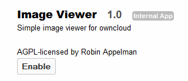

============
File Viewers
============

ownCloud provides apps which allow users to view/edit
text files and view images which exist on the ownCloud server.

Configuration
=============

Text Editor
-----------

The Text Editor App allows users to view and edit text files.
To enable this app, navigate to the Apps page and select “Text Editor” then Enable.

|100000000000012C0000009C444B4720_png|

Image Viewer
------------

The image viewer app allows users to preview image files within the ownCloud web interface.
To enable, navigate to the Apps page and select “Image Viewer” then enable.

|10000000000001400000008A557EF7E3_png|

.. |100000000000012C0000009C444B4720_png| image:: images/100000000000012C0000009C444B4720.png
    :width: 3.1252in
    :height: 1.6252in

Utilization
===========

When the apps are enabled, select the file name on the web interface Files tab and either the text editor or the image will appear.

|10000000000001E50000006E3ECDC427_png|

|100000000000044C000002B0B421E27E_png|

When the apps are disabled, selecting the file name on the web interface will prompt the user to download the specified file.

.. |100000000000044C000002B0B421E27E_png| image:: images/100000000000044C000002B0B421E27E.png
    :width: 6.5in
    :height: 4.0654in

.. |10000000000001E50000006E3ECDC427_png| image:: images/10000000000001E50000006E3ECDC427.png
    :width: 5.052in
    :height: 1.1457in

