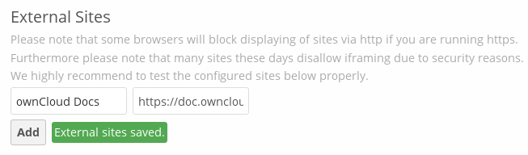

======================
Linking External Sites
======================

You can embed external Web sites inside your ownCloud pages with the External 
Sites app, as this screenshot shows.

.. figure:: ../images/external-sites-1.png
   :scale: 60%

   *Click to enlarge*

This is a useful tool for quick access to important Web pages such as the 
ownCloud manuals, and informational pages for your company.

The External sites app is included in all versions of ownCloud. Go to **Apps >  
Not Enabled** to enable it. Then go to your ownCloud Admin page to create your 
links, which are saved automatically. Hover your cursor to the right of your 
links to make the trashcan icon appear when you want to remove them.

   *Click to enlarge*
   
The links appear in the ownCloud dropdown menu on the top left after 
refreshing your page, and have globe icons.

.. figure:: ../images/external-sites-3.png

Your links may or may not work correctly due to the various ways that Web 
browsers and Web sites handle HTTP and HTTPS URLs, and because the External 
Sites app embeds external links in IFrames. Modern Web browsers try very hard 
to protect Web surfers from dangerous links, and safety apps like 
`Privacy Badger <https://www.eff.org/privacybadger>`_ and ad-blockers may block 
embedded pages. It is strongly recommended to enforce HTTPS on your ownCloud 
server; do not weaken this, or any of your security tools, just to make 
embedded Web pages work. It is recommended to link only to pages that do not 
require logins, because of the risk of clickjacking in IFrames.