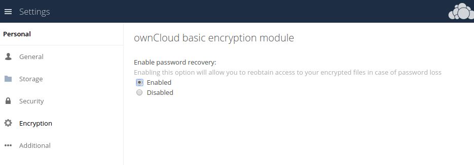

========================
Encryption Configuration
========================

Background information
----------------------

The primary purpose of the ownCloud server-side encryption is to protect users' files when they're located on remote storages, such as Dropbox and Google Drive, and to do it smoothly and seamlessly from within ownCloud.

From ownCloud 9.0, server-side encryption for local and remote storages can operate independently of each other. 
By doing so, you can encrypt a remote storage *without* also having to encrypt your home storage on your ownCloud server.

.. note:: Starting with ownCloud 9.0 we support Authenticated Encryption for all newly encrypted files. See https://hackerone.com/reports/108082 for more technical information about the impact.
   
For maximum security make sure to configure external storage with "*Check for changes: Never*." 
This will let ownCloud ignore new files not added via ownCloud. 
By doing so, a malicious external storage administrator cannot add new files to the storage without your knowledge. 
However, this is not wise *if* your external storage is subject to legitimate external changes.

ownCloud's server-side encryption encrypts files stored on the ownCloud server and files on remote storages that are connected to your ownCloud server. 
Encryption and decryption are performed on the ownCloud server. 
All files sent to remote storage will be encrypted by the ownCloud server and decrypted before serving them to you or anyone whom you have shared them with.

.. note:: Encrypting files increases their size by roughly 35%. Remember to take this into account when you are both provisioning storage and setting storage quotas. Secondly, user quotas are based on the *unencrypted* file size — **not** the encrypted size.

When files on an external storage are encrypted in ownCloud, you cannot share them directly from the external storage services, only through ownCloud sharing. 
This is because the key to decrypt the data **never** leaves the ownCloud server.

ownCloud's server-side encryption generates a strong encryption key, which is unlocked by users' passwords. 
As a result, your users don't need to track an extra password. 
All they need to do is log in as they normally would. 
ownCloud, transparently, encrypts only the contents of files, and not filenames and directory structures.

.. important:: 
   You should regularly backup all encryption keys to prevent permanent data loss. 

The encryption keys are stored in the following directories:

================================ ==============================================
Directory                        Description
================================ ==============================================
``data/<user>/files_encryption`` Users' private keys and all other keys 
                                 necessary to decrypt the users' files.
``data/files_encryption``        Private keys and all other keys necessary to 
                                 decrypt the files stored on a system wide 
                                 external storage.
================================ ==============================================
  
.. note::
   You can move the keys to a different location. To do so, refer to the `Move Key Location`_ section of the documentation.
  
When encryption is enabled, all files are encrypted and decrypted by the 
ownCloud application, and stored encrypted on your remote storage.
This protects your data on externally hosted storage. 
The ownCloud admin and the storage admin will see only encrypted files when browsing backend storage.  
  
.. warning:: Encryption keys are stored only on the ownCloud server,
   eliminating exposure of your data to third-party storage providers. The
   encryption application does **not** protect your data if your ownCloud
   server is compromised, and it does not prevent ownCloud administrators from
   reading users' files. This would require client-side encryption, which this
   application does not provide. If your ownCloud server is not connected to
   any external storage services, it is better to use other encryption
   tools, such as file-level or whole-disk encryption. 
   
.. important:: 
   SSL terminates at or before Apache on the ownCloud server. Consequently, all
   files are in an unencrypted state between the SSL connection termination and
   the ownCloud code that encrypts and decrypts them. This is, potentially,
   exploitable by anyone with administrator access to your server. For more
   information, read: `How ownCloud uses encryption to protect your data
   <https://owncloud.org/blog/how-owncloud-uses-encryption-to-protect-your-data/>`_.
  
Encryption Types
----------------

ownCloud provides two encryption types:

- **User-Key:** every user has their own private/public key pairs, and the private key is protected by the user's password.

- **Master Key:** there is only one key (or key pair) and all files are encrypted using that key pair.
  
Before Enabling Encryption
--------------------------

Plan very carefully before enabling encryption, because it is **not reversible** via the ownCloud Web interface. 
If you lose your encryption keys, your files are **not recoverable**. 
Always have backups of your encryption keys stored in a safe location, and consider enabling all recovery options.

You have more options via the ``occ`` command (see :ref:`occ_encryption_label`)
   
.. warning:: You can't manage encryption without access to the command line. 
   If your ownCloud installation is on a hosted environment and you don't have
   access to the command line, you won’t be able to run :doc:`occ commands
   <../server/occ_command>`. In this case, **don't enable encryption**! 

.. _occ_encryption_label:

Enabling Master Key Based Encryption from the Command-Line
----------------------------------------------------------

To enable master key based encryption:

1. Enable the default encryption module app, using the following command

::

  occ app:enable encryption

2. Then enable encryption, using the following command 

:: 

  occ encryption:enable

3. Then enable the master key, using the following command

::

  occ encryption:select-encryption-type masterkey

.. note::

   The master key mode has to be set up in a newly created instance.
  
4. Encrypt all data

::
  
  occ encryption:encrypt-all

.. note::
   
   This is not typically required, as the master key is often enabled at install time. 
   As a result, when enabling it, there should be no data to encrypt. 
   But, in case it's being enabled after install, and the installation does have files which are unencrypted, encrypt-all can be used to encrypt them.

View Current Encryption Status
------------------------------

Get the current encryption status and the loaded encryption module::

 occ encryption:status

This is equivalent to checking **Enable server-side encryption** on your Admin page::

 occ encryption:enable
 Encryption enabled

 Default module: OC_DEFAULT_MODULE

Recreating an Existing Master Key
---------------------------------

If the master key needs replacing, for example, because it has been compromised, an occ command is available.
The command is :ref:`encryption:recreate-master-key <encryption_label>`.
It replaces existing master key with new one and encrypts the files with the new key.

Decrypt Master-Key Encryption
-----------------------------

You must first put your ownCloud server into single-user mode to prevent any user activity until encryption is completed

::

 occ maintenance:singleuser --on
 Single user mode is currently enabled

Decrypt all user data files, or optionally a single user::
 
 occ encryption:decrypt-all [username]

Disabling Encryption
--------------------

To disable encryption, put your ownCloud server into single-user mode, and then disable your encryption module with these commands::

 occ maintenance:singleuser --on
 occ encryption:disable
 
Take it out of single-user mode when you are finished, by using the following command::

 occ maintenance:singleuser --off
 
.. important:: 
   You may only disable encryption by using the `occ Encryption
   Commands`_. Make sure you have backups of all encryption keys, including
   those for all your users. 

Enabling User-Key Based Encryption From the Command-line
--------------------------------------------------------

To enable User-Key based encryption:

To be safe, put your server in single user mode, to avoid any issues on a running instance

::

  occ maintenance:singleuser --on

1. Enable the default encryption module app, using the following command

::

  occ app:enable encryption

2. Then enable encryption, using the following command 

:: 

  occ encryption:enable

3. Then enable the user-key, using the following command

::

  occ encryption:select-encryption-type user-key

  
4. Encrypt all data

::
  
  occ encryption:encrypt-all

Now you can turn off the singleuser mode

::

  occ maintenance:singleuser --off

.. _enable-file-recovery-key:

How To Enable Users File Recovery Keys
--------------------------------------

Once a user has encrypted their files, if they lose their ownCloud password, then they lose access to their encrypted files, as their files will be unrecoverable. 
It is not possible, when user files are encrypted, to reset a user’s password using the standard reset process. 

If so, you'll see a yellow banner warning: 

  Please provide an admin recovery password; otherwise, all user data will be lost.

To avoid all this, create a Recovery Key. 
To do so, go to the Encryption section of your Admin page and set a recovery key password.

.. figure:: images/encryption10.png

You then need to ask your users to opt-in to the Recovery Key. 
For the users to do this, they need to go to the "**Personal**" page and enable the recovery key.
This signals that they are OK that the admin might have a way to decrypt their data for recovery reasons.
If they do *not* do this, then the Recovery Key won't work for them.

For users who have enabled password recovery, give them a new password and recover access to their encrypted files, by supplying the Recovery Key on the Users page.

.. figure:: images/encryption8.png

You may change your recovery key password.

.. figure:: images/encryption12.png
   

.. note::
   Sharing a recovery key with a user group is **not** supported.
   This is only supported with :ref:`the master key <occ_encryption_label>`.
   
Changing The Recovery Key Password
----------------------------------

If you have misplaced your recovery key password and need to replace it, here’s what you need to do:

1. Delete the recovery key from both ``data/owncloud_private_keys`` and ``data/public-keys``
2. Edit your database table ``oc_appconfig`` and remove the rows with the config keys ``recoveryKeyId`` and ``recoveryAdminEnabled`` for the appid ``files_encryption``
3. Login as admin and activate the recovery key again with a new password. This will generate a new key pair
4. All users who used the original recovery key will need to disable it and enable it again. This deletes the old recovery share keys from their files and encrypts their files with the new recovery key

.. NOTE:: 
   You can only change the recovery key password if you know the original. This is by design, as only admins who know the recovery key password should be able to change it. If not, admins could hijack the recovery key from each other
   
.. WARNING:: 
   Replacing the recovery key will mean that all users will lose the possibility to recover their files until they have applied the new recovery key

.. _enable_encryption_label:

Decrypt User-Key Encryption
---------------------------

You must first put your ownCloud server into single-user mode to prevent any user activity until encryption is completed

::

 occ maintenance:singleuser --on
 Single user mode is currently enabled

Decrypt all user data files, or optionally a single user::
 
 occ encryption:decrypt-all [username]

Disabling Encryption
--------------------

You may disable encryption only with ``occ``. 
Make sure you have backups of all the encryption keys, including those for all users. 
When you do, put your ownCloud server into single-user mode, and then disable your encryption module with this command:

::

 occ maintenance:singleuser --on
 occ encryption:disable

.. warning:: 
   Encryption cannot be disabled without the user’s password or :ref:`file recovery key <enable-file-recovery-key>`.
   If you don't have access to at least one of these then there is no way to decrypt all files. 
 
Then, take it out of single-user mode when you are finished with this command:

::

 occ maintenance:singleuser --off
 
It is possible to disable encryption with the file recovery key, *if* every user uses them.
If so, :ref:`"decrypt all" <encryption_label>` will use it to decrypt all files.

.. note::
   It is **not** planned to move this to the next user login or a background job. 
   If that was done, then login passwords would need to be stored in the
   database, which could be a security issue.

Move Key Location
-----------------

View current location of keys::

 occ encryption:show-key-storage-root
 Current key storage root:  default storage location (data/) 

Move keys to a different root folder, either locally or on a different server. 
The folder must already exist, be owned by root and your HTTP group, and be restricted to root and your HTTP group. 
This example is for Ubuntu Linux. 
Note that the new folder is relative to your ``occ`` directory::

 mkdir /etc/keys
 chown -R root:www-data /etc/keys
 chmod -R 0770 /etc/keys
 occ encryption:change-key-storage-root ../../../etc/keys
 Start to move keys:
    4 [============================]
 Key storage root successfully changed to ../../../etc/keys

Files Not Encrypted
-------------------

Only the data in the files in ``data/user/files`` are encrypted, and not the filenames or folder structures. These files are never encrypted:

- Existing files in the trash bin & Versions. Only new and changed files after 
  encryption is enabled are encrypted.
- Existing files in Versions
- Image thumbnails from the Gallery app
- Previews from the Files app
- The search index from the full-text search app
- Third-party app data

There may be other files that are not encrypted; only files that are exposed to third-party storage providers are guaranteed to be encrypted.

LDAP and Other External User Back-ends
--------------------------------------

If you use an external user back-end, such as an LDAP or Samba server, and you change a user's password on that back-end, the user will be prompted to change their ownCloud login to match on their next ownCloud login. 
The user will need both their old and new passwords to do this. 
If you have enabled the recovery key then you can change a user's password in the ownCloud Users panel to match their back-end password and then — of course — notify the user and give them their new password.

Encrypting External Mountpoints
-------------------------------

You and your users can encrypt individual external mount points. 
You must have external storage enabled on your Admin page, and enabled for your users.
Encryption settings can be configured in the mount options for an external storage mount; see :ref:`external_storage_mount_options_label` (:doc:`external_storage_configuration_gui`)

Sharing Encrypted Files
-----------------------

After encryption is enabled, your users must also log out and log back in to generate their personal encryption keys. 
They will see a yellow warning banner that says "*Encryption App is enabled, but your keys are not initialized. Please log-out and log-in again.*" 

Also, share owners may need to re-share files after encryption is enabled. 
Users who are trying to access the share will see a message advising them to ask the share owner to re-share the file with them. 

For individual shares, un-share and re-share the file. 
For group shares, share with any individuals who can't access the share. 
This updates the encryption, and then the share owner can remove the individual shares.

.. figure:: images/encryption9.png

How To Enable Encryption From the Web-UI
----------------------------------------

1. First, you must enable the encrypton app, and then select an encryption type. 
Go to the **Apps** section of your Admin page, click on **Show disabled Apps** and enable **Default encryption module**. 

2. After that go to the encryption section of your Admin page, and check the checkbox "Enable server-side encryption".

3. Then select an encryption Type. Masterkey and User-key are the options. Masterkey is recommended. 

4. Now you **must** log out and then log back in to initialize your encryption keys.
