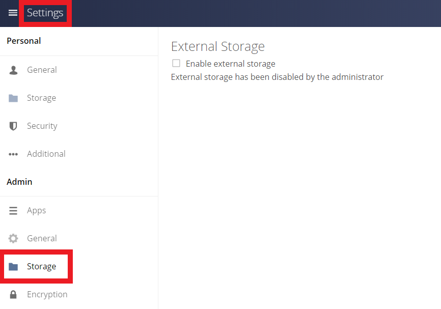
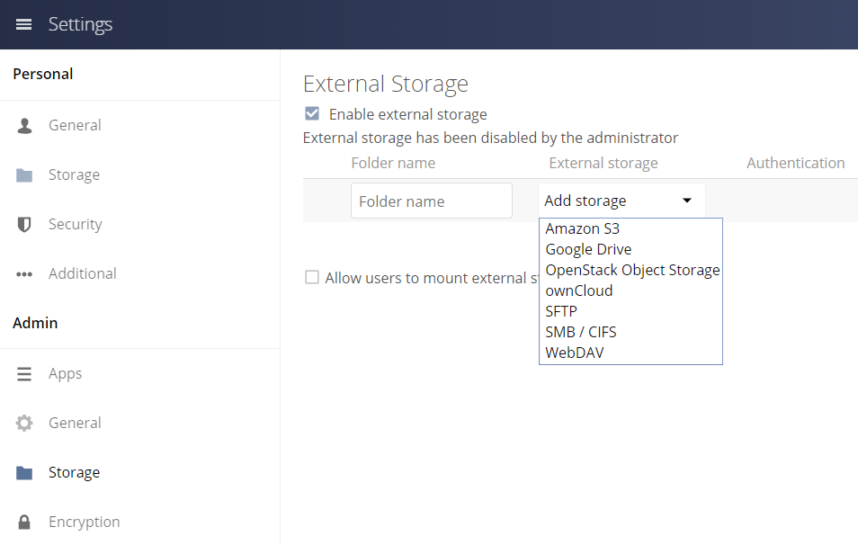
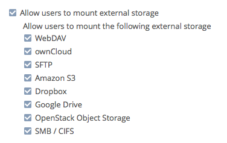
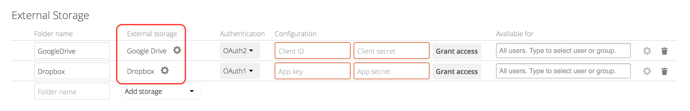
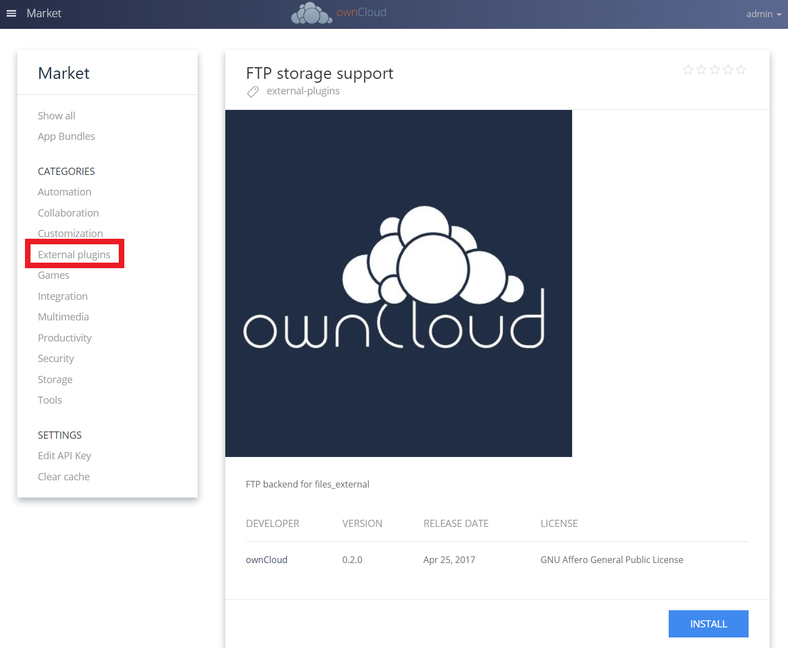

==================================
Configuring External Storage (GUI)
==================================

The External Storage Support application enables you to mount external storage 
services and devices as secondary ownCloud storage devices. You may also allow 
users to mount their own external storage services.

ownCloud 9.0 introduces a new set of :ref:`occ commands for managing external storage <files_external_label>`.

Also new in 9.0 is an option for the ownCloud admin to enable or disable sharing 
on individual external mountpoints (see 
:ref:`external_storage_mount_options_label`). Sharing on such mountpoints is 
disabled by default.

Enabling External Storage Support
---------------------------------

Tick the check box under Settings > Storage > "Enable External Storage".

Storage Configuration
---------------------

To create a new external storage mount, select an available backend from the
dropdown **Add storage**. Each backend has different required options, which 
are configured in the configuration fields.

Each backend may also accept multiple authentication methods. These are selected 
with the dropdown under **Authentication**. Different backends support different 
authentication mechanisms; some specific to the backend, others are more 
generic. See :doc:`external_storage/auth_mechanisms` for more detailed 
information.

When you select an authentication mechanism, the configuration fields change as 
appropriate for the mechanism. The SFTP backend, for one example, supports 
**username and password**, **Log-in credentials, save in session**, and **RSA 
public key**.

.. figure:: external_storage/images/auth_mechanism.png
   :alt: An SFTP configuration example.

Required fields are marked with a red border. When all required fields are 
filled, the storage is automatically saved. A green dot next to the storage row 
indicates the storage is ready for use. A red or yellow icon indicates 
that ownCloud could not connect to the external storage, so you need to 
re-check your configuration and network availability.

If there is an error on the storage, it will be marked as unavailable for ten 
minutes. To re-check it, click the colored icon or reload your Admin page.

User and Group Permissions
--------------------------

A storage configured in a user's Personal settings is available only to the user 
that created it. A storage configured in the Admin settings is available to 
all users by default, and it can be restricted to specific users and groups in 
the **Available for** field.

.. figure:: external_storage/images/applicable.png
   :alt: User and groups selector

.. _external_storage_mount_options_label:

Mount Options
-------------

Hover your cursor to the right of any storage configuration to expose
the settings button and trashcan. Click the trashcan to delete the
mountpoint. The settings button allows you to configure each storage mount
individually with the following options:

* Encryption
* Previews
* Enable Sharing
* Filesystem check frequency (Never, Once per direct access)

The **Encryption** checkbox is visible only when the Encryption app is enabled. 

**Enable Sharing** allows the ownCloud admin to enable or disable sharing on individual mountpoints.
When sharing is disabled the shares are retained internally, so that you can re-enable sharing
and the previous shares become available again. Sharing is disabled by default.

.. figure:: external_storage/images/mount_options.png
   :alt: Additional mount options exposed on mouseover.

Using Self-Signed Certificates
------------------------------

When using self-signed certificates for external storage mounts the certificate
must be imported into ownCloud. Please refer to :doc:`../server/import_ssl_cert`
for more information.

Available storage backends
--------------------------

The following backends are provided by the external storages app. Other apps
may provide their own backends, which are not listed here.

.. toctree::
    :maxdepth: 1

    external_storage/amazons3
    external_storage/dropbox
    external_storage/ftp
    external_storage/google
    external_storage/local
    external_storage/openstack
    external_storage/owncloud
    external_storage/sftp
    external_storage/smb
    external_storage/webdav

.. note:: A non-blocking or correctly configured SELinux setup is needed
   for these backends to work. Please refer to the :ref:`selinux-config-label`.

Allow Users to Mount External Storage
-------------------------------------

Check "*Allow users to mount external storage*" to allow your users to mount storages on external services.
Then enable the backends you want to allow.

.. warning:: 
   Be careful with the choices that you enable, as it allows a user to make potentially arbitrary connections to other services on your network!

Setting Up Google Drive and Dropbox Connections
~~~~~~~~~~~~~~~~~~~~~~~~~~~~~~~~~~~~~~~~~~~~~~~

When an external storage is created which uses either Google Drive or Dropbox, a link to the respective configuration page is available, next to the service name. 

In the screenshot above, you can see that two external storage connections have been created, but not configured. 
One goes to Google Drive, the other to Dropbox. 
If you click the cog icon next to the name of either, the respective app configuration page will open in a new tab, or a new window. 
From there, you can manage the configuration and obtain the respective credentials needed for configuring the connection.

Detecting Files Added to External Storages
------------------------------------------

We recommend configuring the background job **Webcron** or
**Cron** (see :doc:`../server/background_jobs_configuration`)
to enable ownCloud to automatically detect files added to your external 
storages. 

.. Note:: You cannot scan/detect changed files on external storage mounts when you select
   the **Log-in credentials, save in session** authentication mechanism. However, there is
   a workaround, and that is to use Ajax cron mode. See :ref:`password_auth_workaround_label`
   for more information.

ownCloud may not always be able to find out what has been
changed remotely (files changed without going through ownCloud), especially
when it's very deep in the folder hierarchy of the external storage.

You might need to setup a cron job that runs ``sudo -u www-data php occ files:scan --all``
(or replace "--all" with the user name, see also :doc:`../server/occ_command`)
to trigger a rescan of the user's files periodically (for example every 15 minutes), which includes
the mounted external storage.

FTP
---

If you want to mount a FTP Storage, please install the app ``FTP Storage Support`` from ownCloud market.

.. Links

.. _the FTP Storage Support app: https://marketplace.owncloud.com/apps/files_external_ftp
