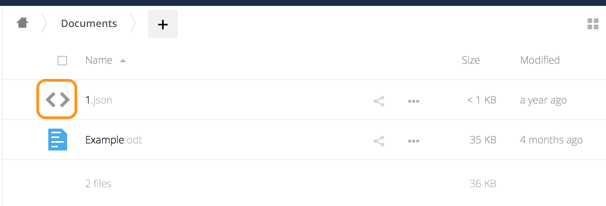

====================
Mimetypes Management
====================

ownCloud allows you to create aliases for mimetypes and map file extensions to a mimetype. 
These allow administrators the ability to change the existing icons that ownCloud uses to represent certain file types and folders, as well as to use custom icons for mimetypes and file extensions which ownCloud doesn't natively support. 
This is handy in a variety of situations, such as when you might want a custom audio icon for audio mimetypes, instead of the default file icon.

Mimetype Aliases
----------------

ownCloud's default mimetype configuration is defined in ``owncloud/resources/config/mimetypealiases.dist.json``, which you can see a snippet of below. 
The mimetype’s on the left, and the icon used to represent that mimetype is on the right.

.. code-block:: json
   
   {
    "application/coreldraw": "image",
    "application/font-sfnt": "image",
    "application/font-woff": "image",
    "application/illustrator": "image",
    "application/epub+zip": "text",
    "application/javascript": "text/code",
   }

Stepping through that file, you can see that:

- the image icon is used to represent Corel Draw, SFNT and WOFF font files, and Adobe Illustrator files.
- ePub files are represented by the text file icon.
- JavaScript files are represented by the text/code icon.

Changing Existing Icons and Using Custom Icons
~~~~~~~~~~~~~~~~~~~~~~~~~~~~~~~~~~~~~~~~~~~~~~

If you want to change one or more of the existing icons which ownCloud uses, or if you want to expand the available list, here’s how to do so. 

First, create a copy of ``resources/config/mimetypealiases.dist.json``, naming it ``mimetypealiases.json`` and storing it in ``config/``.
This is required for two reasons:

1. It will take precedence over the default file.
2. The original file will get replaced on each ownCloud upgrade.

Then, either override one or more existing definitions or add new, custom, aliases as required. 

.. note::
   Please refer to `the ownCloud theming documentation <https://doc.owncloud.com/server/latest/developer_manual/core/theming.html>`_ for where to put the new image files.

Some common mimetypes that may be useful in creating aliases are:

========================= =======================
Mimetype                  Description
========================= =======================
``image``                 Generic image
``image/vector``          Vector image
``audio``                 Generic audio file
``x-office/document``     Word processed document
``x-office/spreadsheet``  Spreadsheet
``x-office/presentation`` Presentation
``text``                  Generic text document
``text/code``             Source code
========================= =======================

Once you have made changes to ``config/mimetypealiases.json``, use :doc:`the occ command <../../configuration/server/occ_command>` to propagate the changes throughout your ownCloud installation. 
Here is an example for Ubuntu Linux::

  $ sudo -u www-data php occ maintenance:mimetype:update-js
  
Example - Changing the JSON File Icon
~~~~~~~~~~~~~~~~~~~~~~~~~~~~~~~~~~~~~

Let’s step through an example, from start to finish, of changing the icon that ownCloud uses to represent JSON files, which you can see above.

1. From the root directory of your ownCloud installation, copy ``resources/config/mimetypealiases.dist.json`` to ``/config/mimetypealiases.json``.

2. Update the alias for ``application/json``, which you should find on line 8, to match the following, and save the file:

.. code-block:: json
   
   "application/json": "text/json",

3. Copy a new SVG icon to represent JSON files to ``core/img/filetypes``, calling it ``text-json.svg``.

.. note:: 
   The name and location of the file are important.
   The location is because the ``core/img/filetypes`` directory stores the mimetype file icons.
   The name is important as it’s a rough mapping between the alias name and the icon’s file name, i.e., ``text/json`` becomes ``text-json``.

4. Run the following command to update the mimetype alias database.

.. code-block:: console
   
  $ sudo -u www-data php occ maintenance:mimetype:update-js
  
After doing so, whenever you view a folder that contains JSON files or upload one, your new icon file will be used to represent the file, as in the image below.

.. figure:: ../../images/configuration/mimetypes/json-alias-after.png
   :alt: A replaced icon for JSON files

Mimetype Mapping
----------------

ownCloud allows administrators to map a file extension to a mimetype, e.g., such as mapping files ending in ``mp3`` to ``audio/mpeg``. 
Which then, in turn, allows ownCloud to show the audio icon.

The default file extension to mimetype mapping configuration is stored in ``resources/config/mimetypemapping.dist.json``. 
This is similar to ``resources/config/mimetypealiases.dist.json``, and also returns a basic JSON array.

.. code-block:: json
   
   {
    "3gp": ["video/3gpp"],
    "7z": ["application/x-7z-compressed"],
    "accdb": ["application/msaccess"],
    "ai": ["application/illustrator"],
    "apk": ["application/vnd.android.package-archive"],
    "arw": ["image/x-dcraw"],
    "avi": ["video/x-msvideo"],
    "bash": ["text/x-shellscript"],
    "json": ["application/json", "text/plain"],
   }

In the example above, you can see nine mimetypes mapped to file extensions.
Each of them, except the last (``json``), maps a file extension to a mimetype. 
Now take a look at the JSON example.

In this case, ownCloud will first check if a mimetype alias is defined for ``application/json``, in ``mimetypealiases.json``.
If it is, it will use that icon.
If not, then ownCloud will fall back to using the icon for ``text/plain``. 

If you want to update or extend the existing mapping, as with updating the mimetype aliases, create a copy of ``resources/config/mimetypemapping.dist.json`` and name it ``mimetypemapping.json`` and storing it in ``config/``.
Then, in this new file, make any changes required. 

.. note::
   Please refer to `the ownCloud theming documentation <https://doc.owncloud.com/server/latest/developer_manual/core/theming.html>`_ for where to put the new image files.

Icon retrieval
--------------

When an icon is retrieved for a mimetype, if the full mimetype cannot be found, the search will fallback to looking for the part before the slash. 
Given a file with the mimetype ``image/my-custom-image``, if no icon exists for the full mimetype, the icon for ``image`` will be used instead. 
This allows specialized mimetypes to fallback to generic icons when the relevant icons are unavailable.
