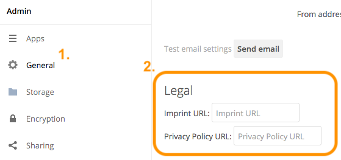

Legal Settings Configuration
============================

Because of one or more legal frameworks around the world, some ownCloud instances may need to have links to Imprint and Privacy Policies on all pages; both in the WebUI and within email templates.
Some of the more global legal frameworks prominent are:

- `The GDPR`_
- `The Australian Privacy Act 1988`_
- `The Canadian Personal Information Protection and Electronic Data Act (PIPEDA)`_
- `The California Online Privacy Protection Act (CalOPPA)`_
- `The Children’s Online Privacy Protection Rule (COPPA)`_

ownCloud Administrators may also be required to display a legal disclosure document, both in the WebUI and within email templates.
A legal disclosure document is a legally mandated statement of the ownership and authorship of the ownCloud installation.

.. note::
  You can also think of it as a rather fancy "*About Us*" page or an enhanced "*Terms and Conditions*" page.
  In Germany, this is known as an "*Impressum*".

If you’re required to have one or more of these, you can specify the link to
them in two ways.

Using the Web UI
----------------

In the Web UI, under "*Settings -> Admin -> General*", under the heading "*Legal*", you can provide a link to an Imprint and a Privacy Policy URL, as you can see in the screenshot below.

.. note::
   The values entered will auto-save.

Using the Command Line
----------------------

From the command line, you can use the ``occ config:app:get`` and ``occ config:app:set`` commands, as in the code sample below.

::

  # Get the current values, if any, for the Imprint and Privacy Policy URLs
  php occ config:app:get core legal.imprint_url
  php occ config:app:get core legal.privacy_policy_url

  # Set the Imprint and Privacy Policy URLs
  php occ config:app:set core legal.imprint_url --value=new_value
  php occ config:app:set core legal.privacy_policy_url --value=new_value

For more information about these commands, refer to :ref:`the config command reference in the occ commands documentation <config_commands_label>`.

.. Links

.. _The GDPR: https://www.eugdpr.org/
.. _The Australian Privacy Act 1988: https://www.oaic.gov.au/privacy-law/privacy-act/
.. _The Canadian Personal Information Protection and Electronic Data Act (PIPEDA): https://www.priv.gc.ca/en/privacy-topics/privacy-laws-in-canada/the-personal-information-protection-and-electronic-documents-act-pipeda/
.. _The California Online Privacy Protection Act (CalOPPA): http://consumercal.org/california-online-privacy-protection-act-caloppa/
.. _The Children’s Online Privacy Protection Rule (COPPA): http://www.coppa.org/
