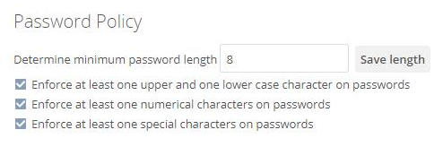

===============
Password Policy
===============

.. _password_policy_label:

.. figure:: ../../../images/configuration/server/security/password-policy-app.png
   :alt: The Password Policy application

From the 2.0.0 release of `the Password Policy app`_, ownCloud administrators (both enterprise **and** community edition) have the option of installing and enabling the application.
The Password Policy application enables administrators to define password requirements for user passwords and public links.

Some of policy rules apply to both user passwords and public links, and some
apply to just one or the other.
The table below shows where each option can be used.

+-----------------------------------------------------------+----------------+--------------+
| Setting                                                   | User Passwords | Public Links |
+===========================================================+================+==============+
| Specify valid password requirements                       |       *        |      *       |
+-----------------------------------------------------------+----------------+--------------+
| Disallow usage of a number of previous passwords          |       *        |              |
+-----------------------------------------------------------+----------------+--------------+
| Specify a password expiration period                      |       *        |              |
+-----------------------------------------------------------+----------------+--------------+
| Forced password change on first login                     |       *        |              |
+-----------------------------------------------------------+----------------+--------------+
| Disallowing passwords that match a configurable .         |       *        |              |
| number of previous passwords (defaults to the previous 3) |                |              |
+-----------------------------------------------------------+----------------+--------------+
| Users can be notified a configurable number of days       |       *        |              |
| before their password expires                             |                |              |
+-----------------------------------------------------------+----------------+--------------+
| Users will be notified when their password has expired.   |       *        |              |
+-----------------------------------------------------------+----------------+--------------+
| Specify expiration dates for public link shares           |                |      *       |
+-----------------------------------------------------------+----------------+--------------+
| Specify the number of days until link expires if a        |                |      *       |
| password is set                                           |                |              |
+-----------------------------------------------------------+----------------+--------------+
| Specify the number of days until link expires if a        |                |      *       |
| password is *not* set                                     |                |              |
+-----------------------------------------------------------+----------------+--------------+

.. note::
   Active user sessions will **not** end when passwords expire.
   However, a password change will be forced when the user session expires (e.g., on logout).
   OAuth2 tokens for app or client authentication, and App passwords are not affected.

.. note::
   Installing and enabling the application also extends the occ command to support :ref:`the user\:expire-password command <user-expire-password_label>`.

.. caution::
   After enabling the "*days until user password expires*" policy setting in the web UI, administrators need to run the ``occ user:expire-password`` command to set an initial password change date for all existing users.

The Security App
~~~~~~~~~~~~~~~~

.. caution::
   Do not configure password policies using the Security and Password Policy apps simultaneously.
   Please use either one or the other.
   However, the brute-force protection part of the Security app can and should be used in parallel with the Password Policy app.

You can, *alternatively*, use `the Security app`_.
It supports configuring a basic password policy, which includes:

#. Setting a password length
#. Whether to enforce at least one upper and lower case character, a numerical character, and a special character.

.. tip::
   In the next release, the Security app's feature-set will be reduced to provide only brute-force protection capabilities and be renamed "*Brute-Force Protection*".

.. Links

.. _the Password Policy app: https://marketplace.owncloud.com/apps/password_policy
.. _the Security app: https://marketplace.owncloud.com/apps/security
