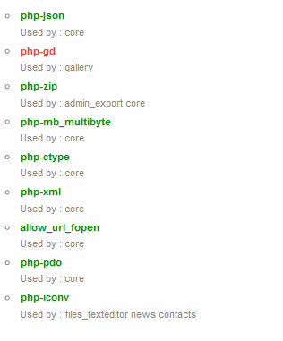

Utilization
===========

Once this app is enabled, navigate to the Admin page and scroll to “Dependencies status”.
This section will show a list of all modules required to execute this ownCloud setup as well as what part of ownCloud uses the given module.

|100000000000013C0000017D4FC6CEF5_png|

Modules in green are required and have been installed.
Modules in red are required yet have not been installed.
It is recommended to install these modules prior to using ownCloud.

