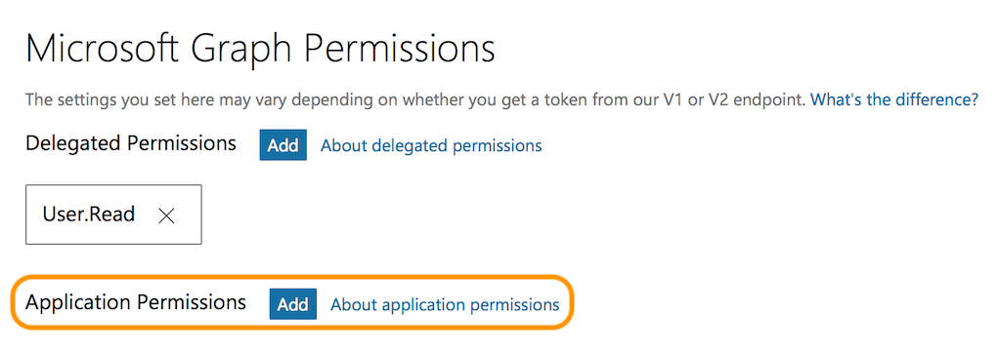
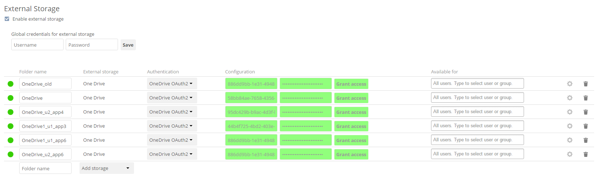

==============================================
How to Create and Configure Microsoft OneDrive
==============================================

To use Microsoft OneDrive as an external storage option in ownCloud, you need to do two things:

#. `Create an application configuration`_
#. `Configure a mount point in ownCloud`_

Create an Application Configuration
-----------------------------------

.. figure:: images/onedrive/register-an-application.png
   :alt: Register a new OneDrive application.

To create a new application: 

- Open https://apps.dev.microsoft.com/ in your browser of choice and click "*Create App*".
- Under "*Properties*", set the application's name. 
- Click "*Create*".

With the application created, you can then add a range of further settings.
However, only a few of them are required for use with ownCloud.

Application Password
~~~~~~~~~~~~~~~~~~~~

.. figure:: images/onedrive/set-application-name.png
   :alt: Set the application's name.

Under "*Application Secrets*", click "*Generate New Password*", which generates a password and displays it in a popup window.
It is required later during when configuring a mount point.

.. note:: 
   Copy the password to your preferred password manager, as it is only displayed **once**.

Redirect URLs
~~~~~~~~~~~~~

Under "*Platforms*", click "*Add Platform*" and choose "*Web*" in the popup window which appears. 
Only one redirect URL field is visible at first, so click "*Add URL*" to add another one.

With two fields available, add two redirect URLs; one for ``settings/admin`` and one for ``settings/personal``, as you can see in the image below.

.. figure:: images/onedrive/set-redirect-urls.png
   :alt: Set the redirect URLs.

Application Permissions
~~~~~~~~~~~~~~~~~~~~~~~

Under "*Microsoft Graph Permissions*", click "*Add*" next to "*Application Permissions*". 
This opens a popup window where you can choose the required permissions. 
Add a least the following four:

-  ``Files.Read.All``
-  ``Files.ReadWrite.All``
-  ``IdentityRiskEvent.Read.All``
-  ``User.Read.All``

With those settings added, click "*Save*", located right at the bottom of the page.

Configure a Mount Point in ownCloud
-----------------------------------

You can add as many OneDrive mount points as you want.
To do so: 

#. Add a new storage, selecting "One Drive" for external storage.
#. Set the credentials of your OneDrive application, and then accept the permissions.
#. If everything is accepted, the mount points should appear, with a green status icon on the far left-hand side.

To be able to use the occ command ``files\_onedrive:subscribe``, you need to have the variable ``overwrite.cli.url`` set in ``config/config.php``, as in this example:

.. code:: php

    'overwrite.cli.url' => 'https://docker.oc.solidgear.es:63984/index.php',

.. note::
   The HTTPS prefix, port, and ``/index.php`` suffix are mandatory.
