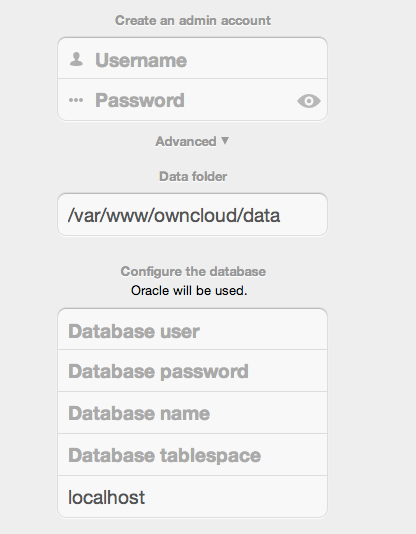

.. _db-oracle-database-setup:

=====================
Oracle Database Setup
=====================

.. toctree::
    :maxdepth: 2
    :hidden:

This document will cover the setup and preparation of the ownCloud server to support the use of Oracle as a backend database.  

Outline of Steps
================

This document will cover the following steps:

* Setup of the ownCloud user in Oracle: This involves setting up a user space in Oracle for setting up the ownCloud database.
* Installing the Oracle Instant Client on the Web server (facilitating the connection to the Oracle Database).
* Compiling and installing the Oracle PHP Plugin oci8 module
* Pointing ownCloud at the Oracle database in the initial setup process

The document assumes that you already have your Oracle instance running, and have provisioned the needed resources. It also assumes that you have installed ownCloud with all of the prerequisites.

Configuring Oracle
==================

Setting up the User Space for ownCloud
--------------------------------------

Step one, if it has not already been completed by your :abbr:`DBA (DataBase Administrator)`, provision a user space on the Oracle instance for ownCloud.  
This can be done by logging in as a DBA and running the script below:

::

  CREATE USER owncloud IDENTIFIED BY password;
  ALTER USER owncloud DEFAULT TABLESPACE users TEMPORARY TABLESPACE temp QUOTA unlimited ON users;
  GRANT create session, create table, create procedure, create sequence, create trigger, create view, create synonym, alter session TO owncloud;

Substitute an actual password for ``password``.  
Items like *TableSpace*, *Quota* etc., will be determined by your DBA (database administrator).

Add OCI8 Client Packages
------------------------

Installation of the OCI8 client is dependent on your distribution. 
Given that, please use the relevant section below to find the relevant instructions to install the client.

Ubuntu
^^^^^^

If you’re using Ubuntu, we recommend that you use `this very thorough guide` from the Ubuntu Community Wiki to install the OCI8 extension. 

.. note::
   This *should* work for other Debian-based distributions, however your mileage may vary.

RedHat / Centos / Fedora
^^^^^^^^^^^^^^^^^^^^^^^^

To install `the OCI8 extension` on a RedHat-based distribution, you first need to download two Oracle Instant Client packages:

- Instant Client Package - Basic (``oracle-instantclient12.2-basic-12.2.0.1.0-1.x86_64.rpm``)
- Instant Client Package - SDK (``oracle-instantclient12.2-devel-12.2.0.1.0-1.x86_64.rpm``)

Then, to install them, use the following commands: 

.. code-block:: console

   rpm --install oracle-instantclient12.2-basic-12.2.0.1.0-1.x86_64.rpm \
     oracle-instantclient12.2-devel-12.2.0.1.0-1.x86_64.rpm

Install the OCI8 PHP Extension
------------------------------

With the Oracle packages installed you're now ready to install PHP’s OCI8 extension.

.. note::
   Provide: ``instantclient,/usr/lib/oracle/12.2/client64/lib`` when requested, or let it auto-detect the location (if possible).

.. code-block:: console

   pecl install oci8

With the extension installed, you now need to configure it, by creating a configuration file for it. 
You can do so using the command below, substituting ``FILE_PATH`` with one from the list below the command.

.. code-block:: console
   
   cat << EOF > FILE_PATH
   ; Oracle Instant Client Shared Object extension
   extension=oci8.so
   EOF

Configuration File Paths
^^^^^^^^^^^^^^^^^^^^^^^^

Debian & Ubuntu
```````````````

=========== ==========================================
PHP Version Filename                                  
=========== ==========================================
5.6         ``/etc/php/5.6/apache2/conf.d/20-oci.ini``
7.0         ``/etc/php/7.0/apache2/conf.d/20-oci.ini``
7.1         ``/etc/php/7.1/apache2/conf.d/20-oci.ini``
=========== ==========================================

RedHat, Centos, & Fedora
````````````````````````

=========== ==========================================
PHP Version Filename
=========== ==========================================
5.6         ``/etc/opt/rh/rh-php56/php.d/20-oci8.ini``
7.0         ``/etc/opt/rh/rh-php70/php.d/20-oci8.ini``
=========== ==========================================

Validating the Extension
------------------------

With all that done, confirm that it’s been installed and available in your PHP distribution, run the following command:

.. code-block:: console
   
   php -m | grep -i oci8

When the process has completed, assuming that you don't encounter any errors, restart Apache and the extension is ready to use.

Configure ownCloud
==================

The next step is to configure the ownCloud instance to point to the Oracle Database, again this document assumes
that ownCloud has previously been installed.

Configuration Wizard
--------------------



Database user
^^^^^^^^^^^^^

This is the user space created in step 2.1.
In our Example this would be owncloud.


Database password
^^^^^^^^^^^^^^^^^

Again this is defined in the script from section 2.1 above, or pre-configured and provided to you by your DBA.

Database Name
^^^^^^^^^^^^^

Represents the database or the service that has been pre-configured on the TSN Listener on the Database Server.
This should also be provided by the DBA.
In this example, the default setup in the Oracle install was orcl (there is a TSN Listener entry for orcl on our database server).

This is not like setting up with MySQL or SQL Server, where a database based on the name you give is created.
The oci8 code will call this specific service and it must be active on the TSN Listener on your Oracle Database server.

Database Table Space
^^^^^^^^^^^^^^^^^^^^

Provided by the DBA.
In this example the users table space (as is seen in the user creation script above), was used.

Configuration File
------------------

Assuming all of the steps have been followed to completion, the first run wizard should complete successfully, and an operating instance of ownCloud should appear.

The configuration file should look something like this:

::

    <?php
    $CONFIG = array (
    'instanceid' => 'abcdefgh',
    'passwordsalt' => '01234567890123456789',
    'datadirectory' => '/var/data',
    'dbtype' => 'oci',
    'version' => '8.2.x.y',
    'dbname' => 'orcl',
    'dbhost' => '192.168.1.57',
    'dbtableprefix' => 'oc_',
    'dbuser' => 'owncloud1',
    'dbpassword' => '********',
    'installed' => true,
    );

Useful SQL Commands
-------------------

**Is my Database Reachable?**

On the machine where your Oracle database is installed, type::

  sqlplus username

::

  SQL> select * from v$version;

  BANNER
  --------------------------------------------------------------------------------
  Oracle Database 11g Express Edition Release 11.2.0.2.0 - 64bit Production
  PL/SQL Release 11.2.0.2.0 - Production
  CORE	11.2.0.2.0	Production
  TNS for Linux: Version 11.2.0.2.0 - Production
  NLSRTL Version 11.2.0.2.0 - Production

  SQL> exit

**Show Database Users**::

  Oracle    : SELECT * FROM all_users;

**Show available Databases**::

  Oracle    : SELECT name FROM v$database; (requires DBA privileges)

**Show ownCloud Tables in Database**::

  Oracle    : SELECT table_name FROM user_tables;

**Quit Database**::

  Oracle    : quit
  
.. Links

.. _the Oracle site: http://www.oracle.com/technetwork/database/features/instant-client/index-097480.html
.. _the OCI8 extension: https://secure.php.net/manual/en/book.oci8.php
.. _APCu: https://pecl.php.net/package/APCu
.. _Memcached: https://pecl.php.net/package/APCu
.. _Redis: http://redis.io/
.. _the Zend OPcache: https://secure.php.net/manual/en/book.opcache.php
.. _this very thorough guide: https://help.ubuntu.com/community/Oracle%20Instant%20Client
