===================================================
Distributing Your Branded iOS App (Enterprise Only)
===================================================

Creating and distributing your branded iOS ownCloud app involves a number of 
interdependent steps. First you must create three provisioning profiles, then 
use ownBrander to create your branded app, and then email your provisioning 
profiles to branding@owncloud.com. 

Prerequisites
-------------

* A Mac OS X computer with Xcode (free download) and Keychain Access (Utilities)
* An account on developer.apple.com
* An ownCloud Enterprise Subscription & the ownBrander app on 
  customer.owncloud.com
  
Procedure
---------

1. Create a digital signing infrastructure on developer.apple.com. Apple 
   requires that all iOS apps are digitally signed.

2. Create three provisioning profiles.

3. Create your branded iOS app on
   https://customer.owncloud.com/owncloud/index.php/apps/ownbrander, then email 
   your three provisioning profiles to branding@owncloud.com
   
4. Distribute your new branded app (ad hoc) to testers

5. When it passes testing, upload (production) to the Apple store with Xcode

Register on developer.apple.com
-------------------------------

See https://developer.apple.com/programs/ios/ for detailed information. It 
costs $99 per year.

Create Certificate Signing Request
----------------------------------

Create a `.certSigningRequest` (CSR) file on your Mac, using Keychain Access. 
Open Finder, and then open Keychain Access from the Utilities folder.
    
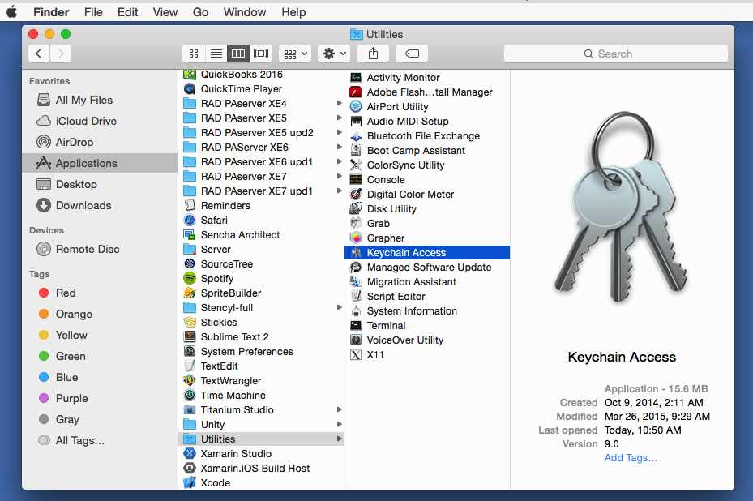
   
   *click to enlarge*

Next, open **Keychain Access > Certificate Assistant > Request a Certificate 
From a Certificate Authority**.
      
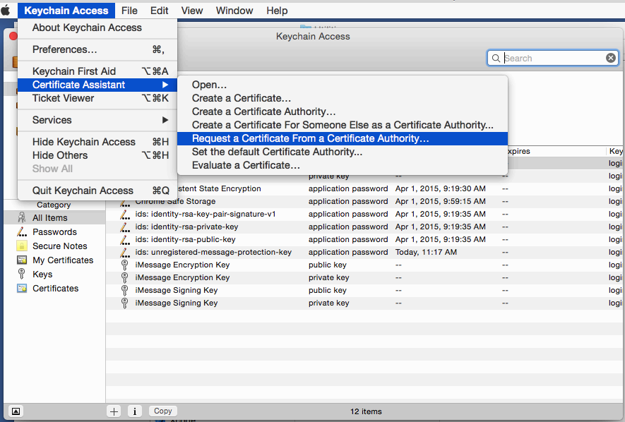
   
   *click to enlarge*
      
Enter the email address that you use in your Apple developer account, and enter 
a common name. The common name can be anything you want, for example a helpful 
descriptive name like "ios-acme". Check **Saved to disk** and **Let me specify 
key pair information**, then click **Continue**.

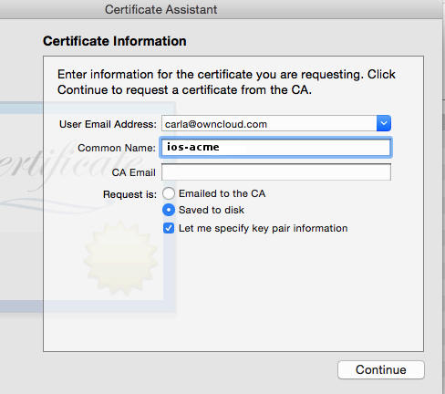
      
Give your CSR a helpful descriptive name, such as 
**ios-csr.certSigningRequest**, and choose the location to save it on your hard 
drive, then click **Save**.

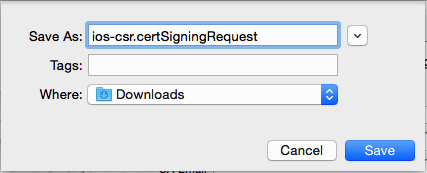
    
In the next window, set the **Key Size** value to **2048 bits** and 
**Algorithm** to **RSA**, and click **Continue**. This will create and save 
your certSigningRequest file (CSR) to your hard drive. 
      
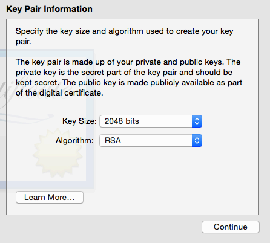

In the next screen your certificate creation is verified, and you can click a 
button to view it.  

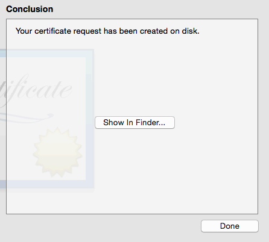
    
You also get a corresponding public and private key pair, which you can see in 
the **Login > Keys** section.
      
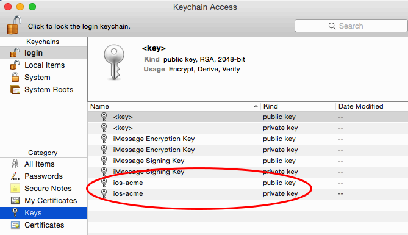

Create a Certificate Signing Request
------------------------------------

Login to the **Member Center** on `<https://developer.apple.com/>`_. 
Click **Certificates, Identifiers, & Profiles**.

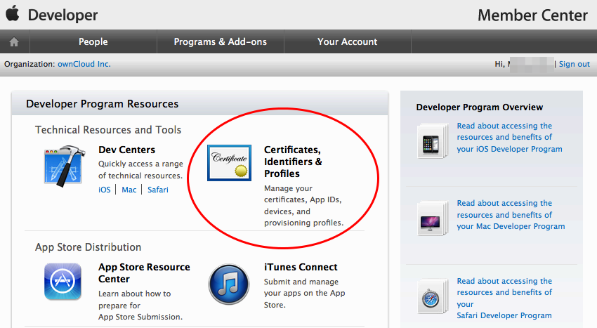
   
   *click to enlarge*
    
Then click **iOS Apps > Certificates**.

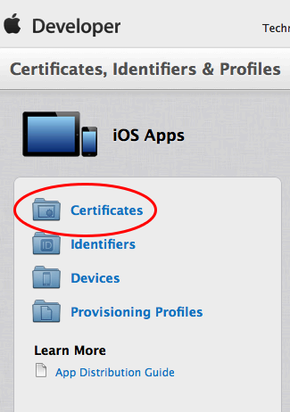

Next, click the add button (the little plus sign) in the 
top right corner of the **iOS Certificate** page.

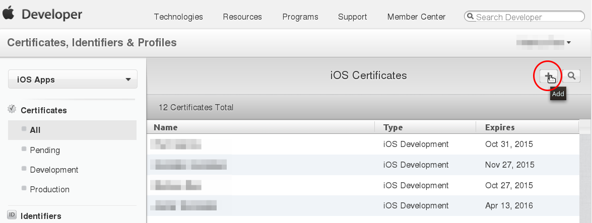
   
   *click to enlarge*

Under "What type of certificate do you need?" check **App Store and Ad Hoc**, 
then click the **Continue** button at the bottom of the page.

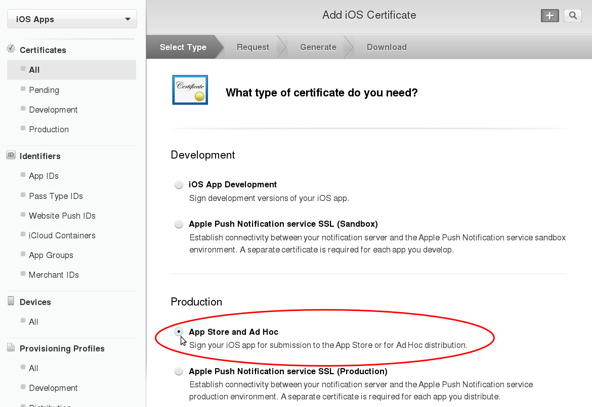
   
   *click to enlarge*

The next screen, **About Creating a Certificate Signing Request (CSR)** has 
information about creating a CSR in Keychain Access. You already did this, so 
go to the next screen. "Add iOS Certificate", to upload the CSR you already 
created, then click the **Generate** button.

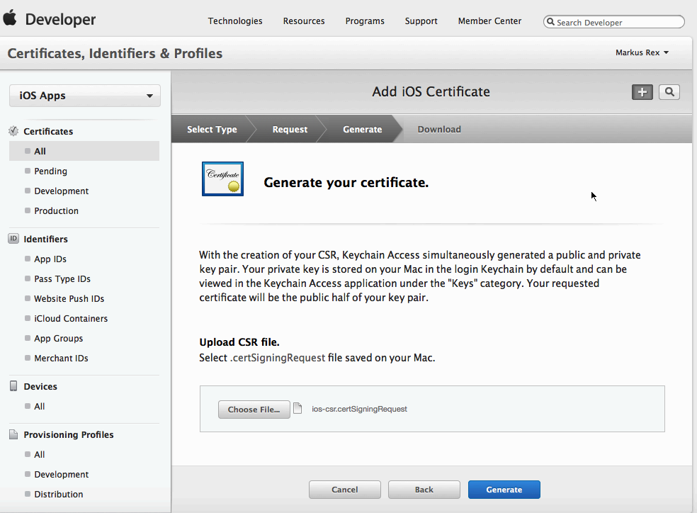
   
   *click to enlarge*
  
Your new CSR is named **ios_distribution.cer**. Download it to your Mac; then 
find it and double-click on it to install it properly in Keychain.

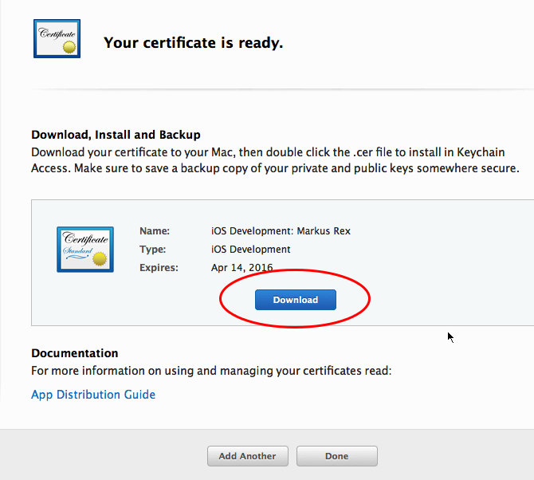
   
   *click to enlarge*
  
After installing it, you should see it stored with its corresponding private 
key in Keychain.

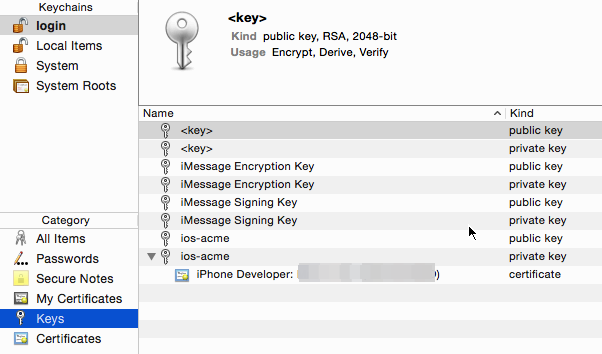
   
   *click to enlarge*
   
Remember to make backups of your keys and certificates and keep them in a safe 
place.   

Creating App IDs
----------------
   
Now you must create your App ID. Go to **Identifiers > App IDs** and click the 
plus button (top right) to open the "Register iOS App ID" screen. Fill in your 
**App ID Description**, which is anything you want, so make it helpful and 
descriptive. The **App ID Prefix** is your Apple Developer Team ID, and is 
automatically entered for you.

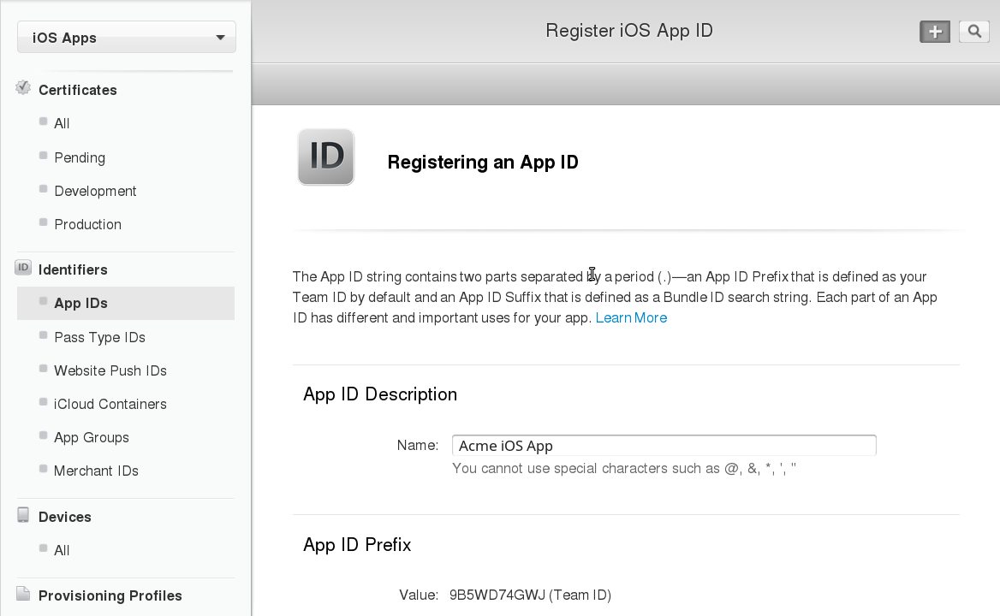
   
   *click to enlarge*

Scroll down to the **App ID Suffix** section and create your Bundle ID. Your 
Bundle ID is the unique identifier for your app. Make a note of it because you 
will need it as you continue through this process. The format for your Bundle ID 
is reverse-domain, e.g. *com.MyCompany.MyProductName*.

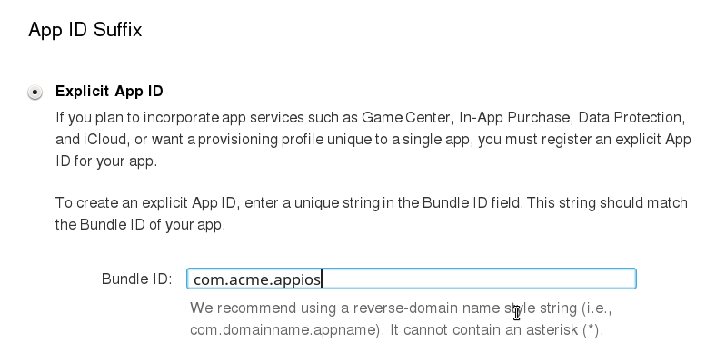
   
   *click to enlarge*
   
The next section, **App Services**, is where you select the services you want 
enabled in your app. You can edit this anytime after you 
finish creating your App ID. Make your selections and then click the 
**Continue** button at the bottom.  

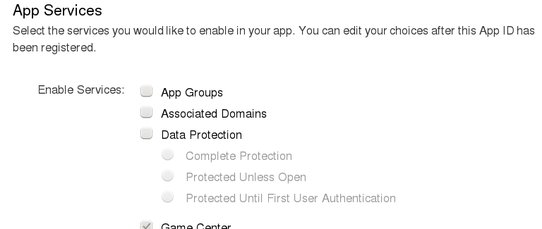
   
   *click to enlarge*   

Now you can confirm all of your information. If everything is correct click 
**Submit**; if you need to make changes use the **Back** button. 

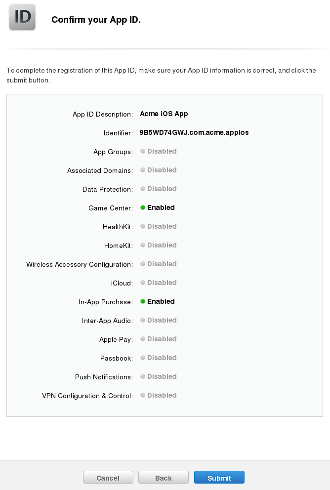
   
   *click to enlarge*

When you are finished you will see a confirmation.

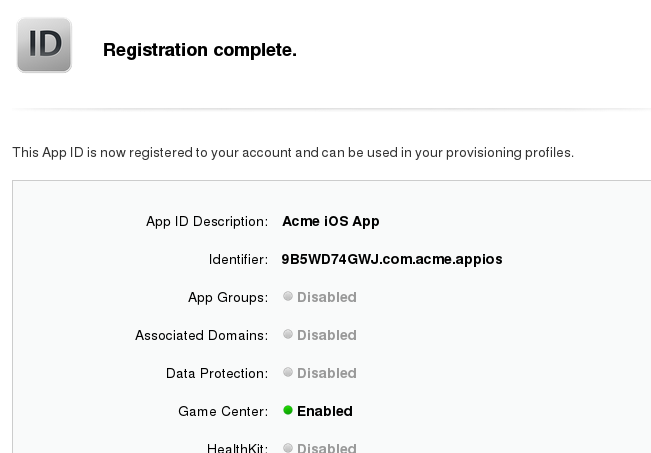
   
   *click to enlarge*

Creating App Groups
-------------------

The next step is to create an App Group and put your App ID in it. Go to 
**Identifiers > App Groups** and click the plus button (top right).

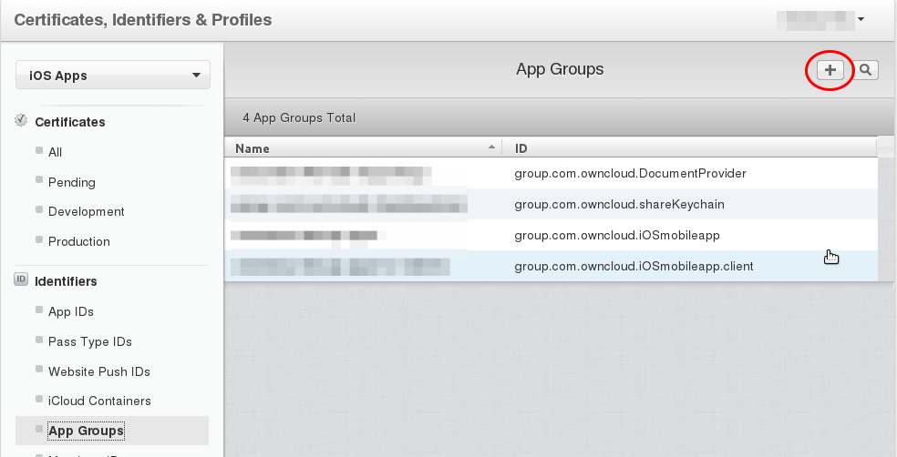
   
   *click to enlarge*
   
Create a description for your app group, and a unique identifier in the format 
*groups.com.MyCompany.MyAppGroup*. Then click **Continue**.    

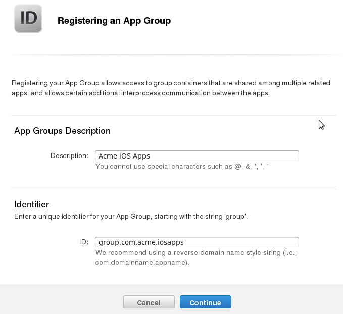
   
   *click to enlarge*

Review the confirmation screen, and if everything looks correct click the 
**Register** button.

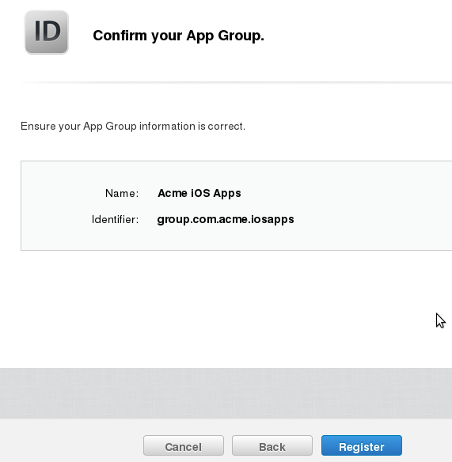
   
   *click to enlarge*

You'll see a final confirmation screen; click **Done**.

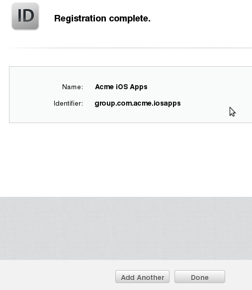
   
   *click to enlarge*

When you click on **App Groups** you will see your new app group.

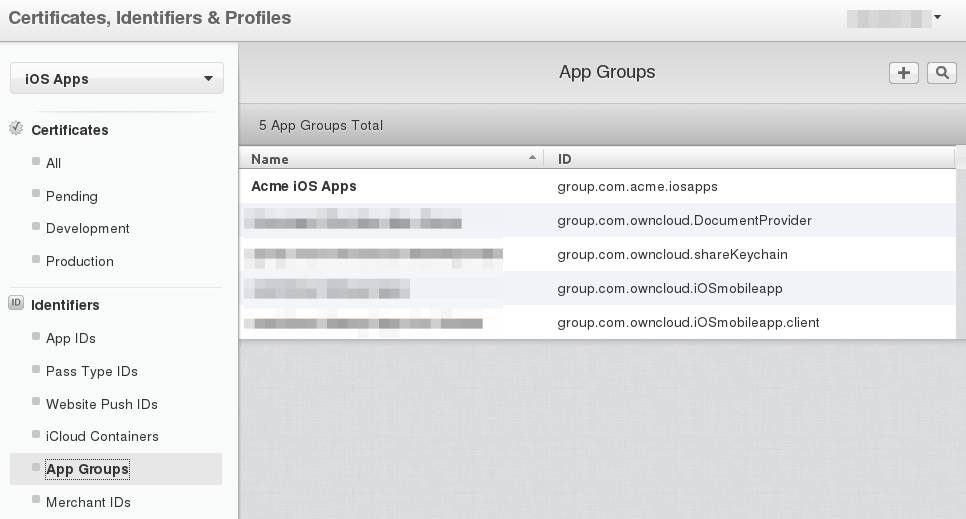
   
   *click to enlarge*
   
Now go back to **Identifiers > App IDs** and click on your App ID. This opens a 
screen that displays all your app information. Click the **Edit** button at the 
bottom. 

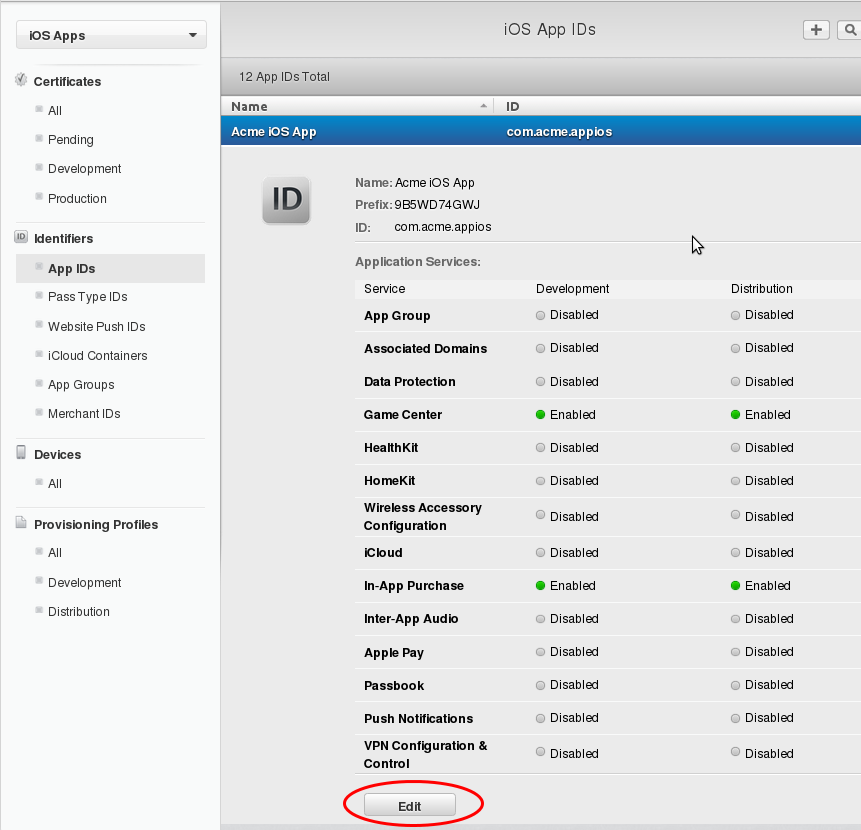
   
   *click to enlarge*
   
This opens the edit screen; check **App Groups**.

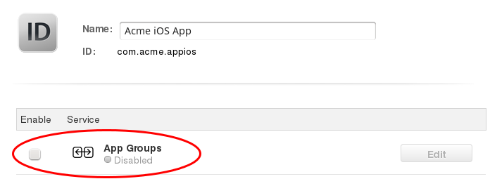
   
   *click to enlarge*

When you check  **App Groups** you'll get a popup warning you "If you wish 
to enable App Groups for any existing provisioning profiles associated with this 
App ID, you must also regenerate them." If you are following this guide for the 
first time, then you have not yet created provisioning profiles, so click 
**OK**.

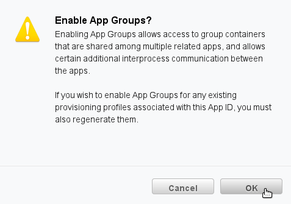
   
   *click to enlarge*
   
When you click **OK** the popup is dismissed, and you must click the **Edit** 
button.

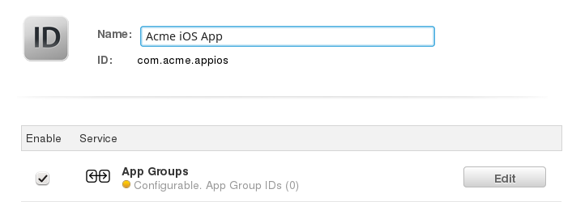
   
   *click to enlarge*
   
Select your app and click **Continue**   
   
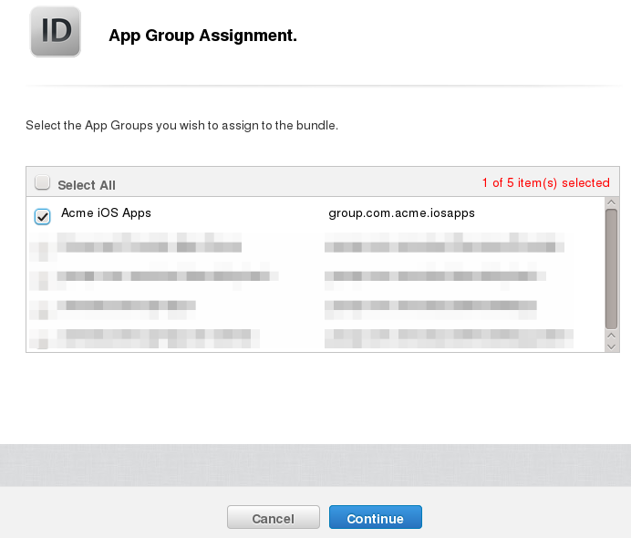
   
   *click to enlarge*   

Review the confirmation screen, and then click **Assign**.

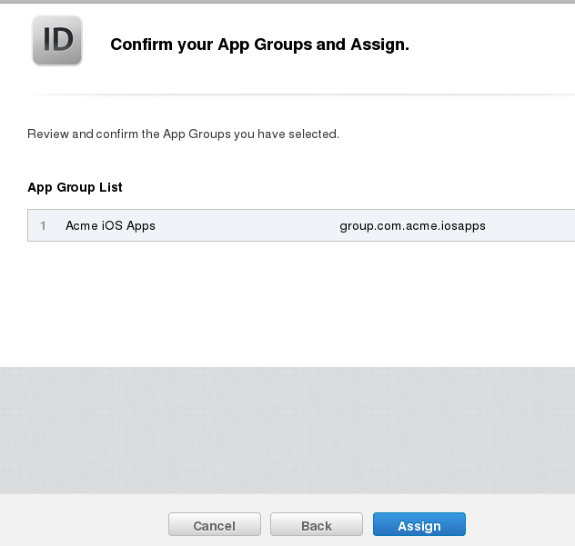
   
   *click to enlarge*   

You will see the message "You have successfully updated the App Groups 
associations with your App ID." Click **done**. If you go to **Identifiers > 
App IDs** and click on your app, you'll see an additional confirmation that you 
successfully assigned your app to your app group.

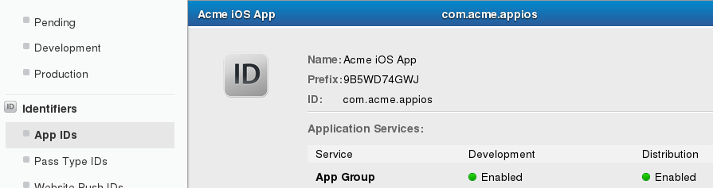
   
   *click to enlarge*

Creating a DocumentProvider BundleID
------------------------------------

Now you must return to **Identifiers > App IDs** and click the plus button to 
create a DocumentProvider Bundle ID. Follow the same naming conventions as for 
your App ID.

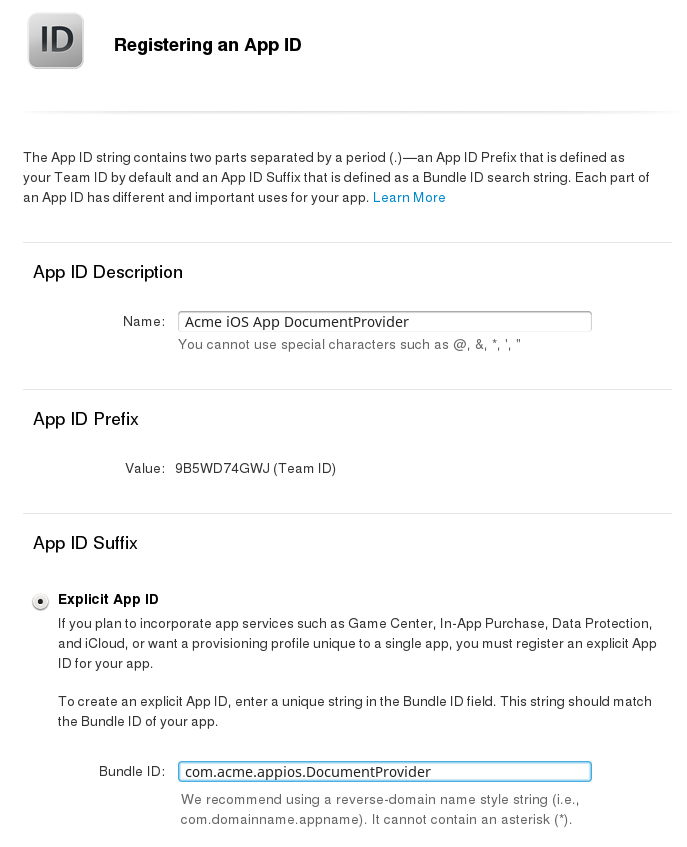
   
   *click to enlarge*

Confirm your new App ID and click **Submit**.

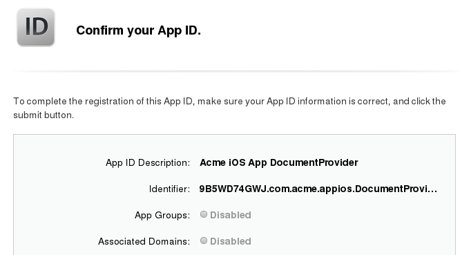
   
   *click to enlarge*
 
You will see one more confirmation; click **Done**. Now you need to add it 
to your App Group. Go to **Identifiers > App IDs** and click on your new 
DocumentProvider Bundle ID to open its configuration window, and then click the 
**Edit** button. 

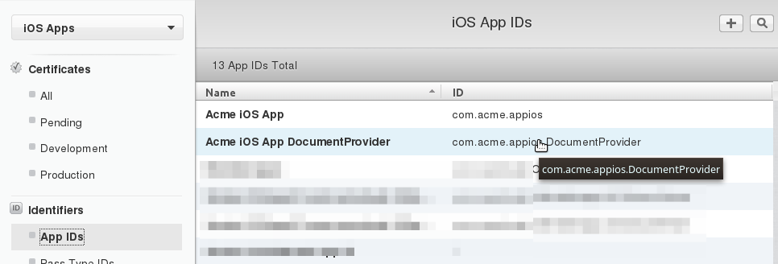
   
   *click to enlarge*

Select **App Groups** and click the **Edit** button.   

   
   *click to enlarge*
   
Select your group and click **Continue**.

   
   *click to enlarge*
   
On the confirmation screen click **Assign**, and you'll see the message "You 
have successfully updated the App Groups associations with your App ID."   

    * Identifiers > App IDs, create new bundleID.DocumentProviderFileProvider. 
    * Add to App Group

4. Create Provisioning Profiles
    * Provisioning Profiles > +, Ad Hoc, Select App ID from dropdown menu, 
      generate, download
    * Provisioning Profiles > +, Ad Hoc, Select the bundleID.DocumentProvider  
      from dropdown menu, generate, download, click Add Another
    * Provisioning Profiles > +, Ad Hoc, Select the  
      bundleID.DocumentProviderFileProvider from dropdown menu, generate, 
      download
    
5.  Register device UDIDs; you must register all devices that you will test 
    your ad hoc app on   
    
6.  Go to customer.owncloud.com and use the ownBrander app to create your 
    branded iOS ownCloud app. You will need the Application Name, Bundle ID, 
    and App Group from your developer.apple.com account. You will also need 
    several graphical images in specific sizes, which you can see in your 
    ownBrander wizard.
    
7.  When you have created your app, email your three provisioning profiles to 
    branding@owncloud.com. In 24-48 hours your new app will be on your files 
    page on customer.owncloud.com.

##########################
######  QUESTIONS ########
##########################

1. Can the customer test their ad hoc app on iOS simulators?
2. How do they find UDIDs?
3. How do they get to a production release?
4. How do they use Xcode to upload to the Apple Store?
5. How do they manage upgrades?

https://developer.apple.com/library/ios/documentation/IDEs/Conceptual/
AppDistributionGuide/Introduction/Introduction.html