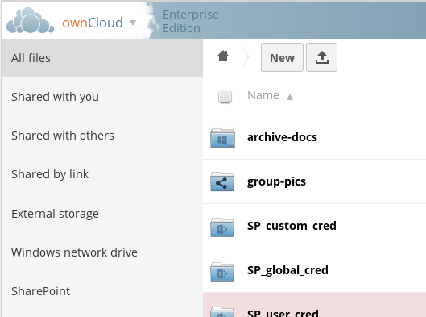
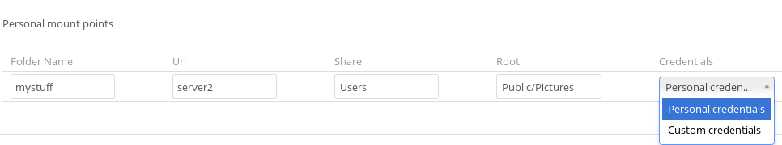
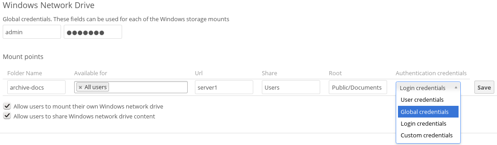

========================================================
Installing and Configuring the Windows Network Drive App
========================================================

The Windows Network Drive app creates a control panel on your Admin page for 
seamless mounting of SMB/CIFS file shares on ownCloud servers.

Any Windows file share, and Samba servers on Linux and other Unix-type operating 
systems use the SMB/CIFS file-sharing protocol. The files and directories on the 
SMB/CIFS server will be visible on your Files page just like your other ownCloud 
files and folders. They are labeled with a little four-pane Windows-style icon, 
and the left pane of your Files page includes a Windows Network Drive filter. 
Figure 1 shows a new Windows Network Drive share marked with red warnings. 
These indicate that ownCloud cannot connect to the share because it requires 
the user to login, it is not available, or there is an error in the 
configuration. 

   
   *Figure 1: Windows Network Drive share on your Files page.*

Files are synchronized bi-directionally, and you can create, upload, and delete 
files and folders. ownCloud server admins can create Windows Network Drive 
mounts, and optionally allow users to create their own personal Windows Network 
Drive mounts. 

Depending on the authentication method, passwords for each mount are encrypted 
and stored in the ownCloud database, using a long random secret key stored in 
``config.php``, which allows ownCloud to access the shares when the users who 
own the mounts are not logged in. Or, passwords are not stored and available 
only for the current session, which adds security.

Installation
------------

Enable the Windows Network Drive app on your ownCloud Apps page. Then there are 
a few dependencies to install.

You must install ``php-smbclient``. This should be included in most Linux distributions. See `eduardok/libsmbclient-php <https://github.com/eduardok/libsmbclient-php>`_ if your distribution does not include it; this provides source archives and instructions for installing binary packages.

You also need the Samba client installed on your Linux system. This is included in 
all Linux distributions; on Debian, Ubuntu, and other Debian derivatives this 
is ``smbclient``. On SUSE, Red Hat, CentOS, and other Red Hat derivatives it is 
``samba-client``. You also need ``which`` and ``stdbuf``, which should be included in most Linux distributions.

Creating a New Share
--------------------

When you create a new WND share you need the login credentials for the share, 
the server address, the share name, and the folder you want to connect to. 

1. First enter the ownCloud mountpoint for your new WND share. This must not be 
   an existing folder.
2. Then select your authentication method; See :doc:`enterprise_only_auth` for 
   complete information on the five available authentication methods.
   

   
   *Figure 2: WND mountpoint and authorization credentials.*    
   
3. Enter the address of the server that contains the WND share.
4. The Windows share name.
5. The root folder of the share. This is the folder name, or the 
   ``$user`` variable for user's home directories. Note that the LDAP 
   ``Internal Username Attribute`` must be set to the ``samaccountname`` for 
   either the share or the root to work, and the user's home directory needs 
   to match the ``samaccountname``. (See 
   :doc:`../configuration_user/user_auth_ldap`.)
6. Login credentials.
7. Select users or groups with access to the share. The default is all users.
8. Click the gear icon for additional mount options. Note that encryption is 
   enabled by default, while sharing is not. Sharing is not available for all 
   authorization methods; see :doc:`enterprise_only_auth`.

   *Figure 3: WND server, credentials, and additional mount options.*  

Your changes are saved automatically.

.. note:: When you create a new mountpoint using Login credentials you must log 
   out of ownCloud, and then log back in so you can access the share. You 
   only have to do this the first time.

Personal WND Mounts
-------------------

Users create their own personal WND mounts on their Personal pages. These are 
created the same way as Admin-created shares. Users have four options for 
login credentials: 

* Username and password
* Log-in credentials, save in session
* Log-in credentials, save in database
* Global credentials

libsmclient Issues
------------------

If your Linux distribution ships with ``libsmbclient 3.x``, which is included in 
the Samba client, you may need to set up the HOME variable in Apache to prevent 
a segmentation fault. If you have ``libsmbclient 4.1.6`` and higher it doesn't 
seem to be an issue, so you won't have to change your HOME variable.

To set up the HOME variable on Ubuntu, modify the ``/etc/apache2/envvars`` 
file::

  unset HOME
  export HOME=/var/www

In Red Hat/CentOS, modify the ``/etc/sysconfig/httpd`` file and add the 
following line to set the HOME variable in Apache::

  export HOME=/usr/share/httpd
 
By default CentOS has activated SELinux, and the ``httpd`` process can not make 
outgoing network connections. This will cause problems with the ``curl``, 
``ldap`` 
and ``samba`` libraries. You'll need to get around this in order to make 
this work. First check the status::

  getsebool -a | grep httpd
  httpd_can_network_connect --> off

Then enable support for network connections::

  setsebool -P httpd_can_network_connect 1

In openSUSE, modify the ``/usr/sbin/start_apache2`` file::
 
  export HOME=/var/lib/apache2

Restart Apache, open your ownCloud Admin page and start creating SMB/CIFS 
mounts.

==============================
Windows Network Drive Listener
==============================

The SMB protocol supports registering for notifications of file changes on remote Windows SMB storage servers. Notifications are more efficient than polling for changes, as polling requires scanning the whole SMB storage. ownCloud supports SMB notifications with an ``occ`` command, ``occ wnd:listen``.

.. Note:: The notifier only works with remote storages on Windows servers. It does not work reliably with Linux servers due to technical limitations.

Your ``smbclient`` versions needs to be 4.x, as older versions do not support notifications.

The ownCloud server needs to know about changes of files on integrated storages so that the changed files will be synced to the ownCloud server, and to desktop sync clients. Files changed through the ownCloud Web interface or sync clients are automatically updated in the ownCloud filecache, but this is not possible when files are changed directly on remote SMB storage mounts. 

To create a new SMB notification, start a listener on your ownCloud server with ``occ wnd:listen``. The listener marks changed files, and a background job updates the file metadata.

Setup Notifications for an SMB Share
------------------------------------

If you don't already have an SMB share, you must create one. Then start the listener with this command, like this example for Ubuntu Linux::

    sudo -u www-data php occ wnd:listen <host> <share> <username> [password]
    
The ``host`` is your remote SMB server, which must be exactly the same as the server name in your WND configuration on your ownCloud Admin page. ``share`` is the share name, and ``username`` and ``password`` are the login credentials for the share. By default there is no output. Enable verbosity to see the notifications::
 
  $ sudo -u www-data php occ wnd:listen -v server share useraccount
  Please enter the password to access the share: 
  File removed : Capirotes/New Text Document.txt
  File modified : Capirotes
  File added : Capirotes/New Text Document.txt
  File modified : Capirotes
  File renamed : old name : Capirotes/New Text Document.txt
  File renamed : new name : Capirotes/New Document.txt
  
Enable increased verbosity to see debugging messages, including which storages are updated and timing::
  
  $ sudo -u www-data php occ wnd:listen -vvv server share useraccount
  Please enter the password to access the share: 
  notification received in 1471450242
  File removed : Capirotes/New Document.txt
  found 1 related storages from mount id 1
  updated storage wnd::admin@server/share// from mount id 1 -> removed internal path : Capirotes/New Document.txt
  found 1 related storages from mount id 3
  updated storage wnd::administrador@server/share// from mount id 3 -> removed internal path : Capirotes/New Document.txt
  found 1 related storages from mount id 2

See :doc:`../configuration_server/occ_command` for detailed help with ``occ``.

One Listener for Many Shares
----------------------------

As the ownCloud server admin you can setup an SMB share for all of your users with a ``$user``
template variable in the root path. By using a ServiceUser you can listen to the common share path. The ServiceUser is any user with access to the share. You might create a special read-only user account to use in this case.

Example:

Share ``/home`` contains folders for every user, e.g. ``/home/alice``
and ``/home/bob``. So the admin configures the Windows Network Drive external storage with these values:

-  Folder name: home
-  Storage Type: Windows Network Drive
-  Authentication: Log-in credentials, save in database
-  Configuration
   ``host: "172.18.16.220", share: "home", remote subfolder: "$user", domain: ""``

Then starts the ``wnd:listen`` thread::

    sudo -u www-data occ wnd:listen 172.18.16.220 home ServiceUser Password

Changes made by Bob or Alice made directly on the storage are now detected by the ownCloud server.

Running the WND Listener as a Service
-------------------------------------

See `Configuring wnd:listen to run as a service <https://github.com/owncloud/documentation/wiki/Configuring-wnd:listen-to-run-as-a-service>`_ in the documentation wiki for tips on running the listenera as a service via cron, and by creating a Systemd startup script.