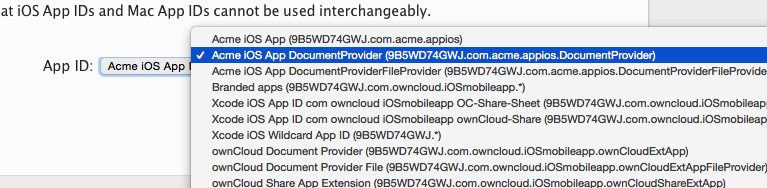

============================
Create Provisioning Profiles
============================

The next phase is to create three provisioning profiles. These are the profiles 
that you will email to branding@owncloud.com after building your branded app 
with the ownBrander app on `<https://customer.owncloud.com>`_. 
Go to **Provisioning Profiles > All**, then click the plus button (top right) 
to open the *Add iOS Provisioning Profile* screen. Select **Ad Hoc** and click 
**Continue**.

.. figure:: ../images/cert-35.png
   :scale: 70%
   
   *click to enlarge*
   
On the **Select App ID** screen select the first of the three App IDs that you 
created and click **Continue**. (The first one has the shortest name, if you 
followed the naming conventions in this manual.)

.. figure:: ../images/cert-36.png
   :scale: 70%
   
   *click to enlarge*

Select the certificate that you created at the beginning of this process and 
click **Continue**.

.. figure:: ../images/cert-38.png
   :scale: 70%
   
   *click to enlarge*

   
Select the devices that you want to install and test your app on, then click 
**Continue**.

.. figure:: ../images/cert-39.png
   :scale: 70%
   
Name your provisioning profile with a descriptive **bundleID** and click 
**Generate**. 

.. figure:: ../images/cert-40.png
   :scale: 70%
   
Then download your new profile to your Mac computer and click.

.. figure:: ../images/cert-41.png

Scroll to the bottom of the screen and click **Add Another** .
Select **Ad Hoc** and click **Continue**.

.. figure:: ../images/cert-35.png
   :scale: 70%
   
   *click to enlarge*

This time select the Select the **.DocumentProvider** app ID and click 
**Continue**.

Select the certificate that you created at the beginning of this process and 
click **Continue**.

.. figure:: ../images/cert-43.png
   :scale: 70%
   
   *click to enlarge*

Select the devices that you want to install and test your app on, then click 
**Continue**. These must be the same devices you selected for the first 
provisioning profile, and they will be selected by default.

.. figure:: ../images/cert-39.png
   :scale: 70%
   
Give this provisioning profile the same **bundleID** as your first profile 
plus **.DocumentProvider** and click **Generate**.   

.. figure:: ../images/cert-44.png
   :scale: 70%
   
Scroll to the bottom of the screen and click **Add Another** .
Select **Ad Hoc** and click **Continue**.

.. figure:: ../images/cert-35.png
   :scale: 70%
   
   *click to enlarge*   

This time select the Select the **.DocumentProviderFileProvider** app ID and 
click **Continue**.

   
Select the certificate that you created at the beginning of this process and 
click **Continue**.

.. figure:: ../images/cert-43.png
   :scale: 70%
   
   *click to enlarge*
   
Give this provisioning profile the same **bundleID** as your first profile 
plus **.DocumentProviderFileProvider** and click **Generate**. There is a 
50-character limit, but don't worry about counting characters because it will 
be automatically truncated if you go over.  

.. figure:: ../images/cert-47.png
   :scale: 70%
      
      
   
   
   
   
    * Provisioning Profiles > +, Ad Hoc, Select the  
      bundleID.DocumentProviderFileProvider from dropdown menu, generate, 
      download
    
5.  Register device UDIDs; you must register all devices that you will test 
    your ad hoc app on   
    
6.  Go to customer.owncloud.com and use the ownBrander app to create your 
    branded iOS ownCloud app. You will need the Application Name, Bundle ID, 
    and App Group from your developer.apple.com account. You will also need 
    several graphical images in specific sizes, which you can see in your 
    ownBrander wizard.
    
7.  When you have created your app, email your three provisioning profiles to 
    branding@owncloud.com. In 24-48 hours your new app will be on your files 
    page on customer.owncloud.com.

QUESTIONS    

1. Can the customer test their ad hoc app on iOS simulators?
2. How do they find UDIDs?
3. How do they get to a production release?
4. How do they use Xcode to upload to the Apple Store?
5. How do they manage upgrades?

https://developer.apple.com/library/ios/documentation/IDEs/Conceptual/
AppDistributionGuide/Introduction/Introduction.html