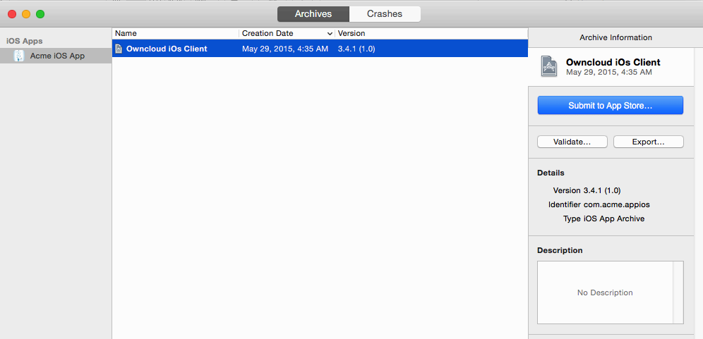
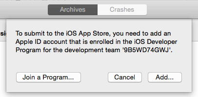
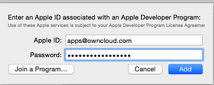
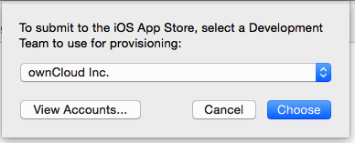

===================================
Publishing Your New Branded iOS App
===================================

At last, after following all the previous steps and passing beta testing, your 
branded iOS app is ready to publish for general distribution on iTunes. 
You need a Mac computer with Xcode installed (Xcode is a `free download 
<https://developer.apple.com/xcode/>`_).

Download your :file:`xcarchive.zip` file from your account on 
`<https://customer.owncloud.com>`_. Your friendly Mac will automatically unpack 
it and change the name to something like ``Owncloud iOs Client 29-05-15 
13.35.xcarchive``. Double-click on this file to automatically install it into 
Xcode. Go to Xcode and you will see it in the **Archives** listing.

Click **Submit to App Store**. If you have not already entered your 
Developer.apple.com login in Xcode you will be prompted to do it now. Click the 
**Add** button.

On the next screen enter your account login.

After your login is confirmed Xcode opens the Accounts screen. You can close 
this and go to the next step, where you must choose which developer account to 
use. Even if you have only one you must select it.

