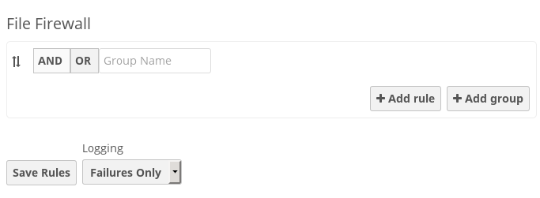

===========================
File Firewall GUI (ES only)
===========================

The File Firewall GUI enables you to create and manage firewall rule sets from 
your ownCloud admin page. The File Firewall gives you finer-grained control of 
access and sharing, with rules for allowing or denying access, and restrictions 
per group, upload size, client devices, IP address, and many more criteria.

This is how the File Firewall GUI looks when you have not created any rules 
(figure 1).

   
   *figure 1*
   
It also creates a corresponding text configuration file in 
:file:`owncloud/config/firewall.config.php`, which you can copy to other 
ownCloud servers. When you have no firewall rules it contains these lines::

 <?php
 $CONFIG = array (
   'debug' => '1',
   'rules' => '[{}]',
 );

Conditions and Operators
------------------------
 
File Firewall rules have *conditions* and  *operators*, which are combined to 
make *rules*. The *conditions* are::

* Regular Expression
* Request IP Range
* Max Upload Size
* File Mime Type
* Subnet
* Request Type
* Request URL
* Request Time
* Server App
* Server App File
* User Agent
* User Device
* User Logged In
* User Group

The *operators* are::

* and
* or
* equal
* not equal
* in
* not in
* less
* less or equal
* greater
* greater or equal
* between
* begins with
* doesn't begin with
* contains
* doesn't contain
* ends with
* doesn't end with
* is empty
* is not empty
* is null
* is not null

Limit Upload Size per ownCloud User Group
-----------------------------------------

The available operators for each condition are displayed in a dropdown menu. 
This simple example limits members of the ownCloud user group "Support" to 
5-megabyte uploads (figure 2).

.. figure:: /images/file-firewall-gui-2.png

   *figure 2*
   
Users in Support who try to upload files larger than 5MB will see a "Forbidden" 
banner (figure 3).

.. figure:: /images/file-firewall-gui-3.png

   *figure 3*

:file:`owncloud/config/firewall.config.php` now contains these lines 
(prettified to make them easier to read)::

 <?php
 $CONFIG = array (
  'debug' => '1',
  'rules' => '[
  {
    "name": "Support Upload Limit",
    "condition": "AND",
    "rules": [
      {
        "id": "userGroup",
        "field": "userGroup",
        "type": "string",
        "operator": "equal",
        "value": "support"
      },
      {
        "id": "sizeup",
        "field": "sizeup",
        "type": "string",
        "input": "text",
        "operator": "equal",
        "value": 5242880
      }
     ]
   }
  ]',
 );
 
Creating Rulesets
-----------------
   
Start with the **And|Or** buttons. The button with the white background is the 
active button. **And** means all the conditions must be true, or the whole rule 
fails. **Or** means only a single condition must be true.

The **Group Name** is whatever name you want for your ruleset.

Click the **Add rule** button to add a rule, select your condition and 
operator, and enter any required values. The "Support Upload Limit" ruleset has 
two rules. When you have entered your rules click the **Save rules** button, 
and you will see a confirmation that your rules have been saved.

You may drag the rules to re-order them. Each rule has a **Delete** button, and 
you can delete a whole ruleset by deleting all the individual rules. Deletions 
are saved when you click the **Save rules** button.

Restrict Remote Logins
----------------------

Applying rules per ownCloud user group is one of the most useful ways to use 
File Firewall. A common use case is using ownCloud as a LAN server, and 
allowing remote access only to special users. In this example we allow only 
Admins to log in remotely. When you have already created a ruleset, click the 
**Add Group** button to create a new ruleset.
