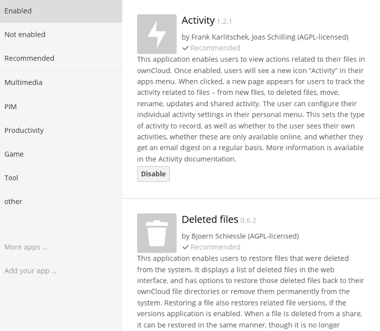

============================
Installing and Managing Apps
============================

After installing ownCloud, you may provide added functionality by installing applications.

Supported Apps
--------------

See :doc:`apps_supported` for a list of supported Enterprise edition apps.

Viewing Enabled Apps
--------------------

During the ownCloud installation, some apps are installed and enabled by default, and some are able to be installed and enabled later on. 
To see the status of your installation's applications, go to your Apps page.

There, you will see which apps are currently: *enabled*, *not enabled*, and *recommended*. 
You'll also see additional filters, such as Multimedia, Productivity, and Tool for finding 
more apps quickly.

Managing Apps
-------------

In the Apps page, you can enable or disable applications. 
Some apps have configurable options on the Apps page, such as **Enable only for specific groups**, but mainly they are enabled or disabled here and are configured on 
your ownCloud *Admin page*, *Personal page*, or in ``config.php``.

Adding Apps
-----------

Click the app name to view a description of the app and any of the app settings in the Application View field. 
Clicking the **Install** button installs the app. 
If the app is not part of your ownCloud installation, it will be downloaded from the ownCloud Marketplace, installed, and enabled. 

Sometimes the installation of a third-party app fails silently, possibly because ``'appcodechecker' => true,`` is enabled in ``config.php``. 
When ``appcodechecker`` is enabled it checks if third-party apps are using the private API, rather than the public API. 
If they are, then they will not be installed.

.. note:: If you would like to create or add your own ownCloud app, please 
   refer to the `developer manual
   <https://doc.owncloud.org/server/9.0/developer_manual/app/index.html>`_.

Using Custom App Directories
----------------------------

Use the **apps_paths** array in ``config.php`` to set any custom apps directory locations. 
The key **path** defines the absolute file system path to the app folder. 
The key **url** defines the HTTP web path to that folder, starting at the ownCloud web root. The key **writable** indicates if a user can install apps in that folder.

.. note:: 
   To ensure that the default **/apps/** folder only contains apps shipped with ownCloud, follow this example to setup an **/apps2/** folder which will be used to store all other apps.

.. code-block:: php

  <?php

    "apps_paths" => array (
        0 => array (
                "path"     => OC::$SERVERROOT."/apps",
                "url"      => "/apps",
                "writable" => false,
        ),
        1 => array (
                "path"     => OC::$SERVERROOT."/apps2",
                "url"      => "/apps2",
                "writable" => true,
        ),
    ),

Manually Installing Apps
------------------------

To install an app manually (locally), instead of by using the Appstore, copy the app into the ownCloud app folder (``/path/to/owncloud/apps``). 
The folder name of the app and the name of the app **must be identical**.