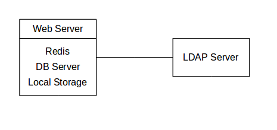
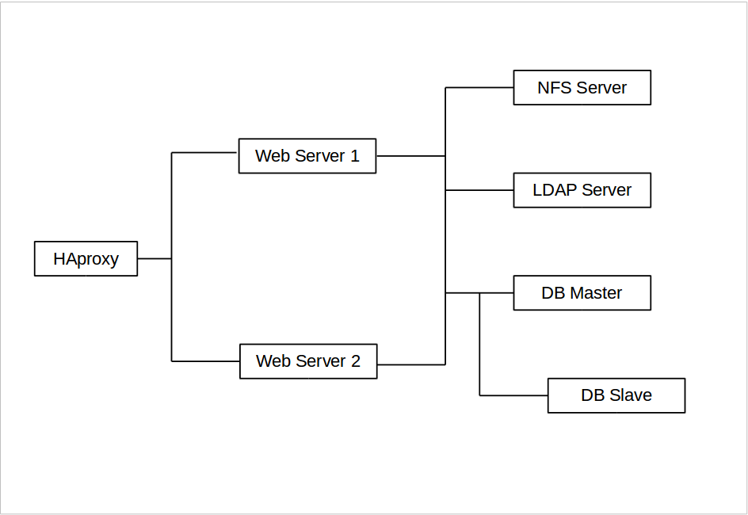
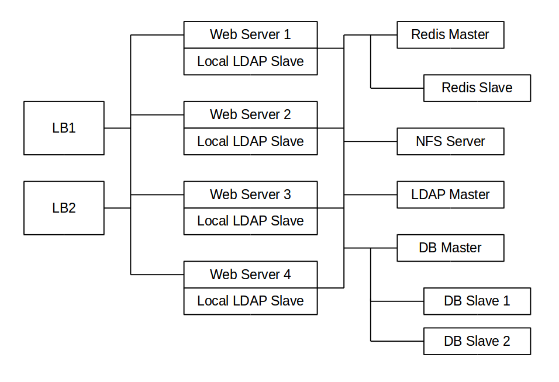

==========================
Deployment Recommendations
==========================

What is the best way to install and maintain ownCloud? 
It depends.
Why? 
Because every ownCloud customer has their own particular needs and IT infrastructure. 
ownCloud and the LAMP stack are highly-configurable. 
In this document, we present three typical scenarios and make best-practice recommendations for both software and hardware.

.. note:: 
   The recommendations put forward here are based on a standard ownCloud installation, one without any particular apps, themes, or code changes. But, server load is dependent upon on the number of clients, files, user activity, as well as other usage patterns. Given that, these recommendations are only a rule of thumb based on our experience, as well as that of one of our customers.

General Recommendations
-----------------------

.. note:: Whatever the size of your organization, always keep one thing in mind: the amount of data stored in ownCloud will only grow. Plan ahead.

Consider setting up a scale-out deployment, or using Federated Cloud Sharing to keep individual ownCloud instances to a manageable size.

* Operating system: Linux.
* Web server: Apache 2.4.
* Database: MySQL/MariaDB with InnoDB storage engine (MyISAM is not supported, see: :ref:`db-storage-engine-label`)
* PHP 5.6+.

For Small Workgroups or Departments
-----------------------------------

* Number of users
   Up to 150 users.

* Storage size
   100 GB to 10TB.

* High availability level
   Zero-downtime backups via Btrfs snapshots, component failure, leads to interruption of service. Alternate backup scheme on other filesystems: nightly backups with service interruption.
   
Recommended System Requirements
^^^^^^^^^^^^^^^^^^^^^^^^^^^^^^^

One machine running the application server, web server, database server and local storage.

Authentication via an existing LDAP or Active Directory server.

* Components
   One server with at least 2 CPU cores, 16GB RAM, local storage as needed.

* Operating system
   Enterprise-grade Linux distribution with full support from OS vendor. We 
   recommend Red Hat Enterprise Linux or SUSE Linux Enterprise Server 12.

* SSL Configuration
   The SSL termination happens in Apache. 
   A standard SSL certificate is needed, installed according to the Apache documentation.

* Load Balancer
   None. 

* Database
   MySQL, MariaDB or PostgreSQL. We currently recommend MySQL / MariaDB, as our customers have had good experiences when moving to a Galera cluster to scale the DB. (InnoDB storage engine, MyISAM is not supported, see: :ref:`db-storage-engine-label`)

* Backup
   Install ownCloud, ownCloud data directory and database on Btrfs filesystem. Make regular snapshots at desired intervals for zero downtime backups. Mount DB partitions with the "nodatacow" option to prevent fragmentation.
 
   Alternatively, make nightly backups with service interruption:
   
   * Shutdown Apache.
   * Create database dump.
   * Push data directory to backup.
   * Push database dump to backup.
   * Start Apache.
   
   Then optionally rsync to a backup storage or tape backup. (See the 
   `Maintenance`_ section of the Administration manual for tips on backups and restores.)

* Authentication
   User authentication via one or several LDAP or Active Directory servers. (See `User Authentication with LDAP`_ for information on configuring ownCloud to use LDAP and AD.)

* Session Management
   Local session management on the application server. PHP sessions are stored in a temporary filesystem mounted at the operating system-specific session storage location. You can find out where that is by running ``grep -R 'session.save_path' /etc/php5`` and then add it to the ``/etc/fstab`` file, for example: ``echo "tmpfs /var/lib/php5/pool-www tmpfs defaults,noatime,mode=1777 0 0" >> /etc/fstab``.

* Memory Caching
   A memory cache speeds up server performance. ownCloud supports four memory caches; refer to `Configuring Memory Caching`_ for information on selecting and configuring a memory cache.

* Storage
   Local storage.

* ownCloud Edition
   Standard Edition. (See `ownCloud Server or Enterprise Edition`_ for 
   comparisons of the ownCloud editions.)

For Mid-sized Enterprises
-------------------------

* Number of users
   150 to 1,000 users.
   
* Storage size
   Up to 200TB.
   
* High availability level
   Every component is fully redundant and can fail without service interruption. Backups without service interruption

Recommended System Requirements
^^^^^^^^^^^^^^^^^^^^^^^^^^^^^^^

* 2 to 4 application servers.
* A cluster of two database servers.
* Storage on an NFS server.
* Authentication via an existing LDAP or Active Directory server.
* Transactional file locking via a Redis Server

* Components
   * 2 to 4 application servers with four sockets and 32GB RAM.
   * 2 DB servers with four sockets and 64GB RAM.
   * 1 HAproxy load balancer with two sockets and 16GB RAM.
   * NFS storage server as needed.

* Operating system
   Enterprise grade Linux distribution with full support from OS vendor. Red Hat Enterprise Linux or SUSE Linux Enterprise Server 12 are recommended.

* SSL Configuration
   The SSL termination occurs in the HAProxy load balancer. A standard SSL certificate is needed, installed according to the `HAProxy documentation`_.

* Load Balancer
   HAProxy running on a dedicated server in front of the application servers. A sticky session needs to be used because of local session management on the application servers. 

* Database
   MySQL/MariaDB Galera cluster with master-master replication. (InnoDB storage engine, MyISAM is not supported, see: :ref:`db-storage-engine-label`)

* Backup
   Minimum daily backup without downtime. All MySQL/MariaDB statements should be replicated to a backup MySQL/MariaDB slave instance.
   
    * Create a snapshot on the NFS storage server. 
    * At the same time stop the MySQL replication.
    * Create a MySQL dump of the backup slave.
    * Push the NFS snapshot to the backup.
    * Push the MySQL dump to the backup.
    * Delete the NFS snapshot.
    * Restart MySQL replication.

* Authentication
   User authentication via one or several LDAP or Active Directory servers. (See `User Authentication with LDAP`_  for information on configuring ownCloud to use LDAP and AD.)
   
* LDAP 
   Read-only slaves should be deployed on every application server for optimal scalability

* Session Management
   Session management on the application server. PHP sessions are stored in a tmpfs mounted at the operating system-specific session storage location. You can find out where that is by running ``grep -R 'session.save_path' /etc/php5`` and then add it to the ``/etc/fstab`` file, for example: ``echo "tmpfs /var/lib/php5/pool-www tmpfs defaults,noatime,mode=1777 0 0" >> /etc/fstab``.

* Memory Caching
   A memory cache speeds up server performance. ownCloud supports four memory caches; refer to `Configuring Memory Caching`_ for information on selecting and configuring a memory cache.
   
* Storage
   Use an off-the-shelf NFS solution, such as IBM Elastic Storage or RedHat Ceph.
   
* ownCloud Edition
   Enterprise Edition. (See `ownCloud Server or Enterprise Edition`_ for comparisons of the ownCloud editions.)
  
* Transactional File Locking
   - It prevents concurrent processes from accessing the same files at the same time. 
   - It helps prevent side effects caused by concurrent operations.

For Large Enterprises and Service Providers
-------------------------------------------

* Number of users
   5,000 to >100,000 users.
   
* Storage size
   Up to 1 petabyte.
   
* High availability level
   Every component is fully redundant and can fail without service interruption. Backups without service interruption  
   
Recommended System Requirements
^^^^^^^^^^^^^^^^^^^^^^^^^^^^^^^

4 to 20 application/Web servers.

A cluster of two or more database servers.

Storage is an NFS server or an object store that is S3 compatible.

Cloud federation for a distributed setup over several data centers.

Authentication via an existing LDAP or Active Directory server, or SAML.

* Components
   * 4 to 20 application servers with four sockets and 64GB  RAM.
   * 4 DB servers with four sockets and 128GB RAM
   * 2 Hardware load balancer, for example, BIG IP from F5
   * NFS storage server as needed.

* Operating system
   RHEL 7 with latest service packs.

* SSL Configuration
   The SSL termination is done in the load balancer. A standard SSL certificate is needed, installed according to the load balancer documentation. 

* Load Balancer
   A redundant hardware load-balancer with heartbeat, for example, `F5 Big-IP`_. This runs two load balancers in front of the application servers.

* Database
   MySQL/MariaDB Galera Cluster with 4x master -- master replication. (InnoDB storage engine, MyISAM is not supported, see: :ref:`db-storage-engine-label`)

* Backup
   Minimum daily backup without downtime. All MySQL/MariaDB statements should be replicated to a backup MySQL/MariaDB slave instance.
   
    * Create a snapshot on the NFS storage server. 
    * At the same time stop the MySQL replication.
    * Create a MySQL dump of the backup slave.
    * Push the NFS snapshot to the backup.
    * Push the MySQL dump to the backup.
    * Delete the NFS snapshot.
    * Restart MySQL replication.
    
* Authentication
   User authentication via one or several LDAP or Active Directory servers, or SAML/Shibboleth. (See `User Authentication with LDAP`_ and `Shibboleth Integration`_.) 

* LDAP
   Read-only slaves should be deployed on every application server for optimal scalability.

* Session Management
   Redis should be used for the session management storage.

* Caching
   Redis for distributed in-memory caching (see `Configuring Memory 
   Caching`_).
   
* Storage
   An off-the-shelf NFS solution should be used. Examples are IBM Elastic Storage or RedHat Ceph. Optionally, an S3 compatible object store can also be used.

* ownCloud Edition
   Enterprise Edition. (See `ownCloud Server or Enterprise Edition`_ for comparisons of the ownCloud editions.)
   
Known Issues
------------

Deadlocks When Using MariaDB Galera Cluster
^^^^^^^^^^^^^^^^^^^^^^^^^^^^^^^^^^^^^^^^^^^

If you're using `MariaDB Galera Cluster`_ with your ownCloud installation, you may encounter deadlocks when you attempt to sync a large number of files. 
You may also encounter database errors, such as this one:

.. code-block:: console

  SQLSTATE[40001]: Serialization failure: 1213 Deadlock found when trying to get lock; try restarting transaction

The issue, `identified by Michael Roth`_, is caused when MariaDB Galera cluster sends write requests to all servers in the cluster; `here is a detailed explanation`_.
The solution is to send all write requests to a single server, instead of all of them.

References
----------

`Database High Availability`_
`Performance enhancements for Apache and PHP`_
`How to Set Up a Redis Server as a Session Handler for PHP on Ubuntu 14.04`_
   
.. Links

.. _Maintenance: 
   https://doc.owncloud.org/server/9.0/admin_manual/maintenance/index.html
.. _User Authentication with LDAP:
   https://doc.owncloud.org/server/10.0/admin_manual/configuration/user/    
   user_auth_ldap.html
.. _Configuring Memory Caching:   
   https://doc.owncloud.org/server/10.0/admin_manual/configuration/server/ 
   caching_configuration.html
.. _ownCloud Server or Enterprise Edition:  
   https://owncloud.com/owncloud-server-or-enterprise-edition/
.. _F5 Big-IP: https://f5.com/products/big-ip/
.. _Shibboleth Integration: 
   https://doc.owncloud.org/server/9.0/admin_manual/enterprise_user_management/
   user_auth_shibboleth.html
.. _Database High Availability: 
   http://www.severalnines.com/blog/become-mysql-dba-blog-series-database-high-
   availability
.. _Performance enhancements for Apache and PHP: 
   http://blog.bitnami.com/2014/06/performance-enhacements-for-apache-and.html  
.. _How to Set Up a Redis Server as a Session Handler for PHP on Ubuntu 14.04: 
   https://www.digitalocean.com/community/tutorials/how-to-set-up-a-redis-server
   -as -a-session-handler-for-php-on-ubuntu-14-04
.. _HAProxy documentation: http://www.haproxy.org/#docs
.. _identified by Michael Roth: https://github.com/owncloud/core/issues/14757#issuecomment-223492913
.. _MariaDB Galera Cluster: http://galeracluster.com
.. _here is a detailed explanation: http://severalnines.com/blog/avoiding-deadlocks-galera-set-haproxy-single-node-writes-and-multi-node-reads
