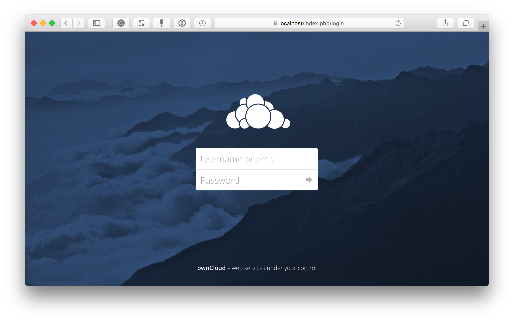

======================
Installing with Docker
======================

ownCloud can be installed using Docker, using `the official ownCloud Docker image <https://hub.docker.com/r/owncloud/server/>`_.
This official image is designed to work with a data volume in the host filesystem and with separate *MariaDB* and *Redis* containers.
The configuration:

- exposes ports 80 and 443, allowing for HTTP and HTTPS connections.
- mounts the data and MySQL data directories on the host for persistent storage.

Installation on a Local Machine
~~~~~~~~~~~~~~~~~~~~~~~~~~~~~~~

To use it, first create a new project directory and download ``docker-compose.yml`` from `the ownCloud Docker GitHub repository <https://github.com/owncloud-docker/server.git>`_ into that new directory.
Next, create a `.env` configuration file, which contains the required configuration settings.
Only a few settings are required, these are:

================== ============================== =============
Setting Name       Description                    Example
================== ============================== =============
``VERSION``        The ownCloud version           ``latest``
``DOMAIN``         The ownCloud domain            ``localhost``
``ADMIN_USERNAME`` The admin username             ``admin``
``ADMIN_PASSWORD`` The admin user's password      ``admin``
``HTTP_PORT``      The HTTP port to bind to       ``80``
``HTTPS_PORT``     The HTTP port to bind to       ``443``
================== ============================== =============

Then, you can start the container, using your preferred Docker command-line tool.
The example below shows how to use `Docker Compose <https://docs.docker.com/compose/>`_.

.. note::
   You can find instructions for using plain docker `in the GitHub repository <https://github.com/owncloud-docker/server#launch-with-plain-docker>`_.

.. code-block:: console

   # Create a new project directory
   mkdir owncloud-docker-server

   cd owncloud-docker-server

   # Copy docker-compose.yml from the GitHub repository
   wget https://raw.githubusercontent.com/owncloud-docker/server/master/docker-compose.yml

   # Create the environment configuration file
   cat << EOF > .env
   VERSION=10.0.2
   DOMAIN=localhost
   ADMIN_USERNAME=admin
   ADMIN_PASSWORD=admin
   HTTP_PORT=80
   HTTPS_PORT=443
   EOF

   # Build and start the container
   docker-compose up -d

When the process completes, then check that all the containers have successfully
started, by running ``docker-compose ps``.
If they are all working correctly, you should expect to see output similar to
that below:

.. code-block:: console

            Name                     Command               State                     Ports
   -------------------------------------------------------------------------------------------------------
   server_db_1         /usr/bin/entrypoint /bin/s ...   Up      3306/tcp
   server_owncloud_1   /usr/local/bin/entrypoint  ...   Up      0.0.0.0:443->443/tcp, 0.0.0.0:80->80/tcp
   server_redis_1      /bin/s6-svscan /etc/s6           Up      6379/tcp

In it, you can see that the database, ownCloud, and Redis containers are running, and that ownCloud is accessible via ports 443 and 8080 on the host machine.

.. note::
   Just because all the containers are running, it takes a few minutes for ownCloud to be fully functional.
   If you run ``docker-compose logs --follow owncloud`` and see a significant amount of information logging to the console, then please wait until it slows down to attempt to access the web UI.

Logging In
^^^^^^^^^^

To log in to the ownCloud UI, open ``https://localhost`` in your browser of
choice, where you see the standard ownCloud login screen, as in the image
below.

The username and password are the admin username and password which you stored in ``.env`` earlier.

.. note::
   The first time that you access the login page via HTTPS, a browser
   warning appears, as the SSL certificate in the Docker setup is self-signed.
   However, the self-signed certificate can be overwritten with a valid cert, within the host volume.

Stopping the Containers
^^^^^^^^^^^^^^^^^^^^^^^

Assuming you used docker-compose, as in the previous example, to stop the containers use ``docker-compose stop``.
Alternatively, use ``docker-compose down`` to stop and remove containers, along with the related networks, images, and volumes.
