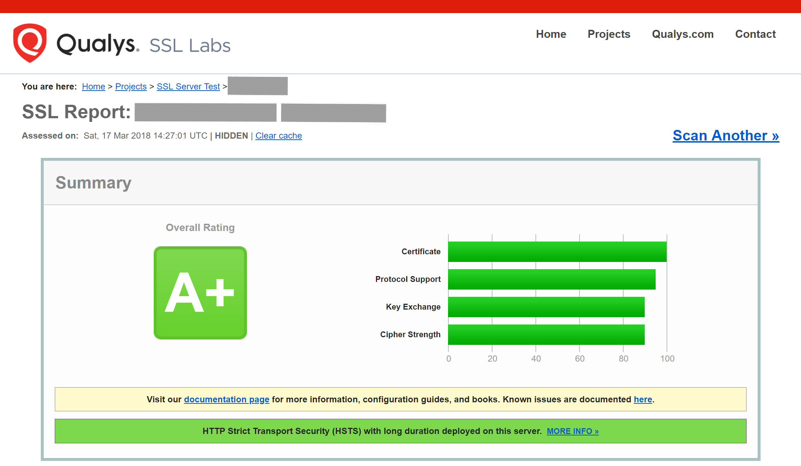

Using Let's Encrypt certificates
==============================

This page covers how to configure your web server for use with `Let's Encrypt`_, as the certificate authority for an ownCloud server.
Note that Let's Encrypt is *not officially supported*, and this page is *community-maintained*.
Thank you, contributors!

-  For ease of handling,  SSL-specific directives have been moved into a separately included file.
   This can help for first-time certificate issuance as well as for reusing configurations.
-  The examples shown are based on Ubuntu 16.04.
-  Read the `Certbot user guide`_ for details of the commands.
-  Let's Encrypt CA issues short-lived certificates valid for 90 days. Make sure you renew the certificates at least
   once in this period, because expired certificates need reissuing. A certificate is due for renewal earliest 30
   days before expiring. Certbot can be forced to renew via options at any time as long the certificate is valid.

Excellent introductions to strong SSL security measures can be found here: `Apache`_ and `NGINX`_.

Requirements
------------

-  You require a domain name with a valid `A record`_ pointing back to your servers IP address.
   In case your server is behind a firewall, take the necessary measures to ensure that your server is accessible, worldwide,
   from the internet, by adding the required firewall and port forward rules.

Installation of Let's Encrypt Certbot client
--------------------------------------------

The latest `Certbot`_ client can be installed via source from `GitHub`_ , or close to latest via `ppa`_.

.. notes::
   Please replace ``/opt/letsencrypt`` with the relevant path, in the following two examples.

**Option 1: via GitHub**

::

  sudo apt-get update
  sudo apt-get install -y git
  sudo git clone https://github.com/certbot/certbot /opt/letsencrypt

To run Certbot use the following command:

::

  sudo /opt/letsencrypt/certbot-auto

Without explicitly denying by command, Certbot will auto-update on each run.

**Option 2: via ppa**

::

  sudo apt-get install software-properties-common
  sudo add-apt-repository ppa:certbot/certbot
  sudo apt-get update
  sudo apt-get install certbot

To update Certbot, you need to run the following commands manually:

::

  sudo apt-get update
  sudo apt-get upgrade
  sudo apt-get dist-upgrade

To run Certbot use the following command:

::

  sudo /usr/bin/certbot

**Register your email address**

Run Certbot once to prepare the environment.
Use the command based on your installation method.

::

  sudo /opt/letsencrypt/certbot-auto register -email <your-email-address>

.. note::
   You should register your email address for urgent renewal and security notifications.

Onetime preparations
--------------------

Create a Let's Encrypt challenge directory
~~~~~~~~~~~~~~~~~~~~~~~~~~~~~~~~~~~~~~~~~~

It is assumed that your webserver root is ``/var/www``.
Use its path if it is different from this.

::

  cd /var/www
  sudo mkdir letsencrypt
  sudo chown root:www-data letsencrypt

Create Let's Encrypt config files
~~~~~~~~~~~~~~~~~~~~~~~~~~~~~~~

- Create following files in the Let's Encrypt directory. They will help to maintain your certificates.
- Replace the path to Certbot and the Certbot script name based on your installation.
- Make all files executable except ``cli.ini`` by running ``sudo chmod +x <script-name>``.

.. note::
   All scripts have to be executed with ``sudo``.

::

    cd /etc/Let's Encrypt

**cli.ini**

This file defines some settings used by Certbot.
Use the email address you registered with.
Comment / un-comment the post-hook parameter according which web server you use.

.. code-block:: bash

  rsa-key-size = 4096
  email = <your-email-address>
  agree-tos = True
  authenticator = webroot
  webroot-path = /var/www/letsencrypt/
  post-hook "service nginx reload"
  # post-hook "apache2ctl graceful"

**list.sh**

This script lists all your issued certificates.

.. code-block:: bash

  #!/bin/bash

  LE_PATH="/opt/letsencrypt"
  LE_CB="certbot-auto"

  $LE_PATH/$LE_CB certificates

**renew.sh**

This script:

#. Renews all your issued certificates.
#. Updates Certbot, when using Git as the installation source.
#. Reloads the web server configuration automatically if a certificate has been renewed.

.. code-block:: bash

  #!/bin/bash

  LE_PATH="/opt/letsencrypt"
  LE_CB="certbot-auto"

  $LE_PATH/$LE_CB renew

**renew-cron.sh**

This script:

- Renews all your issued certificates but does not upgrade Certbot.
- Reloads the web server configuration automatically if a certificate has been renewed.

.. note::
   It is intended for use via Cron.

.. code-block:: bash

  #!/bin/bash

  LE_PATH="/opt/letsencrypt"
  LE_CB="certbot-auto"

  $LE_PATH/$LE_CB renew --no-self-upgrade --noninteractive

**delete.sh**

This script deletes an issued certificate.
Use the ``list.sh`` script to list issued certificates.

.. code-block:: bash

  #!/bin/bash

  LE_PATH="/opt/letsencrypt"
  LE_CB="certbot-auto"

  read -p "Which certificate do you want to delete: " -r -e answer
  if [ -n $answer ]; then
    $LE_PATH/$LE_CB delete --cert-name $answer
  fi

**<your-domain-name>.sh**

As an example, this script creates a certificate for following domain / sub-domains.
You can add or remove sub-domains as necessary.
Use your domain / sub-domain names.
The first (sub)domain name used in the script is taken for naming the directories created by Certbot.

.. note::
   You can create different certificates for different sub-domains by creating different scripts.

- mydom.tld
- www.mydom.tld
- sub.mydom.tld

.. code-block:: bash

  #!/bin/bash
  # export makes the variable available for all subprocesses

  LE_PATH="/opt/letsencrypt"
  LE_CB="certbot-auto"

  export DOMAINS="-d mydom.tld -d www.omydom.tld -d sub.mydom.tld"

  $LE_PATH/$LE_CB certonly --config /etc/letsencrypt/cli.ini $DOMAINS # --dry-run

You can enable the ``--dry-run`` option which does a test run of the client only.

Webserver setup and issue a certificate
---------------------------------------

For better readability, follow the links to set up your web server and issue a certificate.

Apache
~~~~~~

:ref:`letsencrypt-apache-label`

NGINX
~~~~~

:ref:`letsencrypt-nginx-label`

SSL Server Test
---------------

After you have setup the web server successfully and installed the certificate, you can test the security of your web server.
To do so, you can use the free service of `SSL Labs`_.
See an example screenshot of a test run below.

Renewing certificates
---------------------

**Manual renewing**

To avoid expiration of certificates, consider this task at least every 80 days.
If you have provided your email address, you will receive reminder notifications.

.. code-block:: bash

  sudo /etc/letsencrypt/renew.sh

**Automatic renewing via crontab**

Defined by parameters, certificates are only renewed if they are due.
Therefore you can run a Cron job on a more frequent basis without efficiently triggering renewal, though a weekly check is sufficient.
This job is set up on each Saturday at 03:30 in the morning.
If you want to use own values, you can check them at `crontab.guru`_ or modify the script for other options.

Setup of crontab parameters to configure the timing

::

  *     *     *   *    *      command to be executed
  -     -     -   -    -
  |     |     |   |    |
  |     |     |   |    +----- day of week (0 - 6) (Sunday=0)
  |     |     |   +------- month          (1 - 12)
  |     |     +--------- day of month     (1 - 31)
  |     +----------- hour                 (0 - 23)
  +------------- min                      (0 - 59)

Run the following command to edit the job list.
It is essential to use ``sudo`` to derive proper permissions.

::

  sudo crontab -e

Add the following at the end

::

  30 03 * * 6 /etc/letsencrypt/renew-cron.sh

.. Note::
   Check your logs regularly for successful renewals!

Adding or removing domains from the certificate
-----------------------------------------------

- If you want to add a domain like ``test.mydom.tld`` to your certificate, just add
  the domain in the domain shell script above, re-run it and reload the web server config.
  This can be useful when migrating from a subdirectory to sub-domain access.
- If you want to remove a sub-domain like ``www.mydom.tld`` from your certificate issued,
  you need to delete the certificate with the ``delete.sh`` script an set up a new one.
  This also implies that you need to comment the ``include`` directive and follow the
  steps afterward.

.. Links

.. _Let's Encrypt: https://letsencrypt.org
.. _GitHub: https://github.com/certbot/certbot
.. _ppa: https://launchpad.net/~certbot/+archive/ubuntu/certbot
.. _Certbot: https://certbot.eff.org
.. _Certbot userguide: https://certbot.eff.org/docs/using.html
.. _ssl_dhparam: http://nginx.org/en/docs/http/ngx_http_ssl_module.html#ssl_dhparam
.. _SSL Labs: https://www.ssllabs.com/ssltest/
.. _crontab.guru: https://crontab.guru
.. _Apache: https://raymii.org/s/tutorials/Strong_SSL_Security_On_Apache2.html
.. _NGINX: https://raymii.org/s/tutorials/Strong_SSL_Security_On_nginx.html
.. _A record: https://support.dnsimple.com/articles/a-record/
