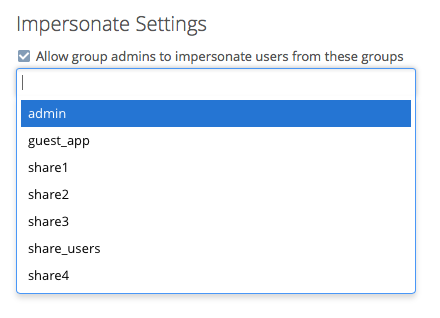

===================
Impersonating Users
===================

Sometimes you may need to use your ownCloud installation as another user, whether to help users debug an issue or to get a better understanding of what they see when they use their ownCloud account.
The ability to do so is a feature delivered via an ownCloud app called `Impersonate <https://marketplace.owncloud.com/apps/impersonate>`_. 

.. note::
   This functionality is available only to administrators.

Installing the Application
--------------------------

To install it, from the Market in your ownCloud installation, filter down the list of available apps to the **Tools** category, and in the filtered list click on the **Impersonate** app. 

.. image:: ../images/apps/impersonate/impersonate-uninstalled.png 
   :alt: The ownCloud Marketplace Impersonate app.

In the bottom right-hand corner of the Impersonate app’s details click the blue ``Install`` button, and the app will install in your ownCloud installation shortly afterward

.. image:: ../images/apps/impersonate/impersonate-installed.png 
   :alt: The ownCloud Marketplace Impersonate app is installed.

Impersonating a User
--------------------

When installed, you can then impersonate users; in effect, you will be logged in as said user. 
To do so, go to the Users list, where you will now see a new column available called "**Impersonate**", as in the screenshot below.

Click the gray head icon next to the user that you want to impersonate.
Doing so will log you in as that user, temporarily pausing your current session. 
You will see a notification at the top of the page that confirms you’re now logged in as (or impersonating) that user.

.. image:: ../images/apps/impersonate/impersonating-a-user.png 
   :alt: Impersonating a user.

Anything that you see until you log out will be what that user would see. 

Ending an Impersonation
-----------------------

When you're ready to stop impersonating the user, log out and you will return to your normal user session.

Restrict Impersonation to Groups & Group administrators 
-------------------------------------------------------

As a security measure, the application lets ownCloud administrators restrict the ability to impersonate users to administrators of specific groups.
When enabled and configured, only a group's administrator can impersonate members of their group.

For example, if an ownCloud administrator restricts user impersonation only to the group: 'group1', then **only** 'group1'’s administrators can impersonate users belonging to 'group1'.
No other users can impersonate other users.

.. note::
 ownCloud administrators can always impersonate all users of an ownCloud instance when the application is installed.

To enable this option, in the administrator settings panel (``administrator -> Settings -> Admin``) in the "**Additional**" section, you'll see a section titled: "**Impersonate Settings**"; which you can see below.

.. image:: ../images/apps/impersonate/impersonate-settings.png
   :alt: Impersonate App settings

Check the checkbox under that, and a textbox will appear. 
If you click in the textbox, you will see a list of available groups on your ownCloud installation. 
As you type, the list will filter down to only ones that match the text entered, as you can see below.

Choose one or more groups from the list, and they will be added to the textbox. 

.. Links
   
.. _Marketplace: https://marketplace.owncloud.com/
