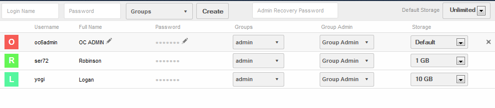
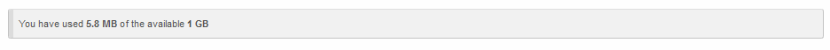
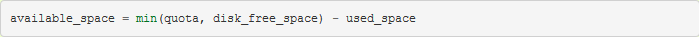

=================
Quota Calculation
=================

Introduction
============

ownCloud allows the admin to specify a storage quota for users.
This quota is the maximum space a user is allowed to utilize for files located in their home storage.

The users quota is set in the Users page within ownCloud when creating a user.

|10000000000003DF000000D953A456B6_png|

Each user can have a different quota (shown above in the Storage column).
In addition, there is a default quota should a user not have a quota specified.

It is important to note that when setting a quota, the administrator needs to be aware that it applies only to the actual files and not the metadata.
This means when allocating a quota, the admin should make sure at least 10% more space is available for each user.

Checking available space
========================

A user can check their available space on the Personal page.

|10000000000003A800000039364066E4_png|

The available space for a given user is calculated using the following formula:

|10000000000002BB000000266DB6AD1A_png|

Where disk_free_space is the space available on the partition where the user’s home storage is located on the server.

Sharing
=======

Shared files or directories are counted against the owner’s quota and not the “shared-to” user’s quota.

Shared Files
------------

When user A shares a file with user B, the size of the file will be counted against user A’s quota.
This is the case even if the file is modified by user B or if user B increases the file size.

Shared Directories
------------------

When user A shares a directory with User B, all files uploaded to that directory by user B will count against user A’s quota.
Likewise, files within that directory which are modified by user B will count against user A’s quota.

Resharing
---------

If user A shares a file with user B who then reshares a file to user C, the space occupied by that file is counted against user A’s quota.

Public sharing with upload permission
-------------------------------------

If user A publicly shares a directory via a link and enables “public upload” permission, files uploaded to that directory from the outside are counted against user A’s quota.
Excluded from quota
===================

The following sections describe information which is not counted in a user’s quota.

Metadata and cache
------------------

Application metadata and cached information are excluded from total used space.
Examples of such data are thumbnails (icon previews, pictures app), temporary files, and encryption keys.

Deleted Files
-------------

Files which have been moved to the trash bin do not count against a user’s quota.
Deleted items are permanently deleted, oldest to newest, should the user run out of space to make room for new files.

For example, if the user has a 10GB quota, and has used 4GB of space and 5GB in the trash bin, the user will still have 6GB available space.
If, however, the user uploads 6GB, ownCloud will permanently delete files from the trash bin in order to make room for the new files.

Version Control
---------------

Older versions do not count against the user’s quota.
The versions app will delete old versions, oldest to newest, should the user run out of space to make room for new files.

For example, if the user has a 10GB quota, and has used 4GB and 5GB is used on older versions, the user will still have 6GB available space.
If, however, the user uploads 6GB, ownCloud will discard older versions to make room for the new files.

Encryption
----------

Encrypted files are slightly larger than their unencrypted equivalents.
The unencrypted file size is used to determine the quota.

External Storage
----------------

External storage, mounted by either a user or the admin, is not taken into consideration when calculating the user’s storage.

