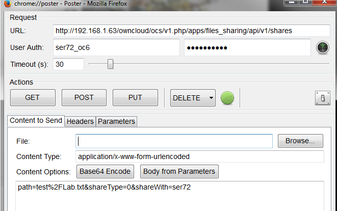
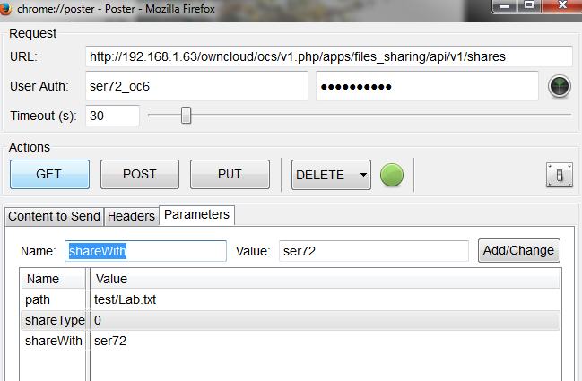
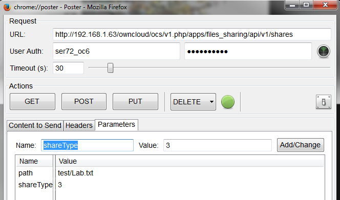
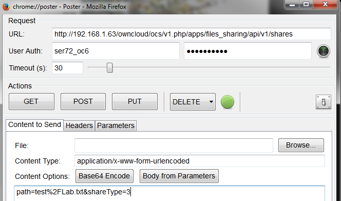

Create a new Share
==================

To create a new share the following may be used.
This allows sharing with a user or group or as a link.

+--------------------+-----------------------------------------------+---------+---------------------------------------------------------------------+
| Syntax             | <Base URL>                                    |         |                                                                     |
|                    |                                               |         |                                                                     |
+--------------------+-----------------------------------------------+---------+---------------------------------------------------------------------+
| Method             | POST                                          |         |                                                                     |
|                    |                                               |         |                                                                     |
+--------------------+-----------------------------------------------+---------+---------------------------------------------------------------------+
| Mandatory Argument | path                                          | string  | Full path of the file/folder being shared                           |
|                    |                                               |         |                                                                     |
+--------------------+-----------------------------------------------+---------+---------------------------------------------------------------------+
| Mandatory Argument | shareType                                     | int     | ‘0’ = user, ‘1’ = group, ‘3’ = Public link                          |
|                    |                                               |         |                                                                     |
+--------------------+-----------------------------------------------+---------+---------------------------------------------------------------------+
| Argument           | shareWith                                     | string  | User/group ID with who the file should be shared.                   |
|                    |                                               |         | This is mandatory for shareType of 0 or 1                           |
|                    |                                               |         |                                                                     |
+--------------------+-----------------------------------------------+---------+---------------------------------------------------------------------+
| Argument           | publicUpload                                  | boolean | If ‘false’ (default) public cannot upload to a public shared folder |
|                    |                                               |         |                                                                     |
|                    |                                               |         | If ‘true’ public can upload to a shared folder                      |
|                    |                                               |         |                                                                     |
|                    |                                               |         | Only available for public link shares                               |
|                    |                                               |         |                                                                     |
+--------------------+-----------------------------------------------+---------+---------------------------------------------------------------------+
| Argument           | password                                      | string  | Password to protect a public link share                             |
|                    |                                               |         |                                                                     |
|                    |                                               |         | Only available for public link shares                               |
|                    |                                               |         |                                                                     |
+--------------------+-----------------------------------------------+---------+---------------------------------------------------------------------+
| Argument           | permissions                                   | int     | From table in section 2.2 for user or group shares                  |
|                    |                                               |         |                                                                     |
+--------------------+-----------------------------------------------+---------+---------------------------------------------------------------------+
| Result             | XML Code with share ID of newly created share |         |                                                                     |
|                    |                                               |         |                                                                     |
+--------------------+-----------------------------------------------+---------+---------------------------------------------------------------------+

The following is a list of returned status codes:

+------------------+---------------------------------+
| HTTP Status Code | Description                     |
|                  |                                 |
+------------------+---------------------------------+
| 100              | Successful                      |
|                  |                                 |
+------------------+---------------------------------+
| 400              | Unknown Share type              |
|                  |                                 |
+------------------+---------------------------------+
| 403              | Public Upload disabled by admin |
|                  |                                 |
+------------------+---------------------------------+
| 404              | File couldn’t be shared         |
|                  |                                 |
+------------------+---------------------------------+

Poster – Share as a link
------------------------

The following example shares the file “test/Lab.txt” as a public link

+---------------+---------------------------------------------+
| Field         | Value                                       |
|               |                                             |
+---------------+---------------------------------------------+
| **URL**       | Base URL for the API of the ownCloud server |
|               |                                             |
+---------------+---------------------------------------------+
| **User Auth** | User ID of the file owner                   |
|               |                                             |
+---------------+---------------------------------------------+
| **Password**  | User’s Password                             |
|               |                                             |
+---------------+---------------------------------------------+
| **Name**      | Argument being passed                       |
|               |                                             |
+---------------+---------------------------------------------+
| **Value**     | Full path of file/folder shared             |
|               |                                             |
+---------------+---------------------------------------------+

|1000000000000298000001874D3CA506_png|

Navigate to the “Content to Send” tab and select “Body from Parameters”

|1000000000000298000001870B0581FA_png|

Select POST.

Curl – Share as link
--------------------

$ curl \http://<ip>/ocs/v1.php/apps/files_sharing/api/v1/shares -k -u user:password -X POST –data “path=<file>&shareType=3”

Output
------

+-------------------------------------------------------------------------------------------------------------+--------------------------------+
| <?xml version="1.0"?>                                                                                       |                                |
|                                                                                                             |                                |
+-------------------------------------------------------------------------------------------------------------+--------------------------------+
| <ocs>                                                                                                       |                                |
|                                                                                                             |                                |
+-------------------------------------------------------------------------------------------------------------+--------------------------------+
| <meta>                                                                                                      |                                |
|                                                                                                             |                                |
+-------------------------------------------------------------------------------------------------------------+--------------------------------+
| <status>ok</status>                                                                                         |                                |
|                                                                                                             |                                |
+-------------------------------------------------------------------------------------------------------------+--------------------------------+
| <statuscode>100</statuscode>                                                                                | Status = 100: successful       |
|                                                                                                             |                                |
+-------------------------------------------------------------------------------------------------------------+--------------------------------+
| <message/>                                                                                                  |                                |
|                                                                                                             |                                |
+-------------------------------------------------------------------------------------------------------------+--------------------------------+
| </meta>                                                                                                     |                                |
|                                                                                                             |                                |
+-------------------------------------------------------------------------------------------------------------+--------------------------------+
| <data>                                                                                                      |                                |
|                                                                                                             |                                |
+-------------------------------------------------------------------------------------------------------------+--------------------------------+
| <id>9</id>                                                                                                  | Share ID = 9                   |
|                                                                                                             |                                |
+-------------------------------------------------------------------------------------------------------------+--------------------------------+
| <url>http://192.168.1.63/owncloud6RC3/public.php?service=files&amp;t=e1947aaeaa2b88a69cc1e90bf27ddfe2</url> | Share Link.                    |
|                                                                                                             | Send this to the desired users |
|                                                                                                             |                                |
+-------------------------------------------------------------------------------------------------------------+--------------------------------+
| <token>e1947aaeaa2b88a69cc1e90bf27ddfe2</token>                                                             |                                |
|                                                                                                             |                                |
+-------------------------------------------------------------------------------------------------------------+--------------------------------+
| </data>                                                                                                     |                                |
|                                                                                                             |                                |
+-------------------------------------------------------------------------------------------------------------+--------------------------------+
| **</ocs>**                                                                                                  |                                |
|                                                                                                             |                                |
+-------------------------------------------------------------------------------------------------------------+--------------------------------+

Poster – Share with user
------------------------

The following example shares a file called “test/Lab.txt” with user “ser72”

+---------------+---------------------------------------------+
| Field         | Value                                       |
|               |                                             |
+---------------+---------------------------------------------+
| **URL**       | Base URL for the API of the ownCloud server |
|               |                                             |
+---------------+---------------------------------------------+
| **User Auth** | User ID of the file owner                   |
|               |                                             |
+---------------+---------------------------------------------+
| **Password**  | User’s Password                             |
|               |                                             |
+---------------+---------------------------------------------+
| **Name**      | Argument being passed                       |
|               |                                             |
+---------------+---------------------------------------------+
| **Value**     | Full path of file/folder shared             |
|               |                                             |
+---------------+---------------------------------------------+

|1000000000000289000001A9D7F3941F_png|

Navigate to the “Content to Send Tab” and select “Body from Parameters”

|10000000000002950000019EF5732E36_png|

Select POST.

Curl – Share with User
----------------------

$ curl \http://<ip>/ocs/v1.php/apps/files_sharing/api/v1/shares -k -u user:password -X POST –data "path=<file>&shareType=0&shareWith=<user>"

Output
------

+------------------------------+-------------------------+
| <?xml version="1.0"?>        |                         |
|                              |                         |
+------------------------------+-------------------------+
| <ocs>                        |                         |
|                              |                         |
+------------------------------+-------------------------+
| <meta>                       |                         |
|                              |                         |
+------------------------------+-------------------------+
| <status>ok</status>          |                         |
|                              |                         |
+------------------------------+-------------------------+
| <statuscode>100</statuscode> | Status: 100: Successful |
|                              |                         |
+------------------------------+-------------------------+
| <message/>                   |                         |
|                              |                         |
+------------------------------+-------------------------+
| </meta>                      |                         |
|                              |                         |
+------------------------------+-------------------------+
| <data>                       |                         |
|                              |                         |
+------------------------------+-------------------------+
| <id>10</id>                  | Share ID = 10           |
|                              |                         |
+------------------------------+-------------------------+
| </data>                      |                         |
|                              |                         |
+------------------------------+-------------------------+
| </ocs>                       |                         |
|                              |                         |
+------------------------------+-------------------------+

