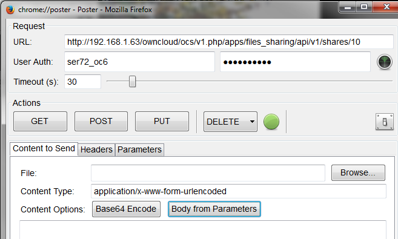

Delete Share
============

The following method should be used in the event that a file share should be removed.

Note: the share ID can be obtained from the output of any of the previous Share API calls or the creation of a new share.

+----------+-----------------------+
| Syntax   | <Base URL>/<share id> |
|          |                       |
+----------+-----------------------+
| Method   | DELETE                |
|          |                       |
+----------+-----------------------+
| Argument | Share ID (int)        |
|          |                       |
+----------+-----------------------+

The following is a list of returned status codes:

+------------------+--------------------------+
| HTTP Status Code | Description              |
|                  |                          |
+------------------+--------------------------+
| 100              | Successful               |
|                  |                          |
+------------------+--------------------------+
| 404              | File couldn’t be deleted |
|                  |                          |
+------------------+--------------------------+

Poster
------

To remove the share identified by ID 10, use the following method.

|10000000000002910000018B31D51F03_png|

Press DELETE

Curl
----

$ curl –X "DELETE" \http://<user>:<password>@<ip>/ocs/v1.php/apps/files_sharing/api/v1/files/<share_id>

Output
------

+------------------------------+------------------------+
| <?xml version="1.0"?>        |                        |
|                              |                        |
+------------------------------+------------------------+
| <ocs>                        |                        |
|                              |                        |
+------------------------------+------------------------+
| <meta>                       |                        |
|                              |                        |
+------------------------------+------------------------+
| <status>ok</status>          |                        |
|                              |                        |
+------------------------------+------------------------+
| <statuscode>100</statuscode> | Status=100: Successful |
|                              |                        |
+------------------------------+------------------------+
| <message/>                   |                        |
|                              |                        |
+------------------------------+------------------------+
| </meta>                      |                        |
|                              |                        |
+------------------------------+------------------------+
| <data/>                      |                        |
|                              |                        |
+------------------------------+------------------------+
| </ocs>                       |                        |
|                              |                        |
+------------------------------+------------------------+

