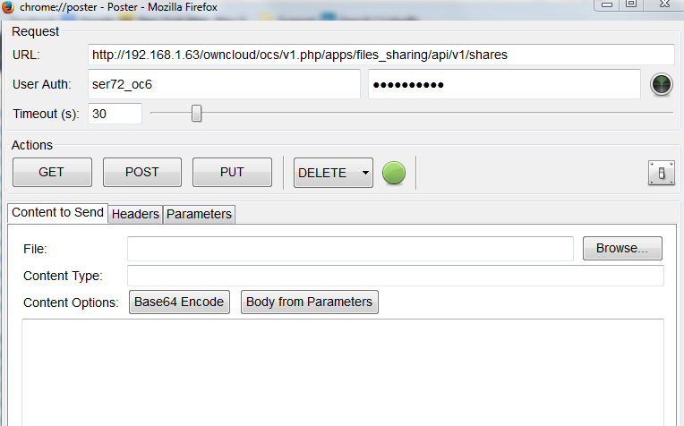

Get All Shares
==============

To obtain a list of all files shared by a user, the following can be used.

+--------+--------------------------------------+
| Syntax | <Base URL>                           |
|        |                                      |
+--------+--------------------------------------+
| Method | GET                                  |
|        |                                      |
+--------+--------------------------------------+
| Result | XML code with all shares by the user |
|        |                                      |
+--------+--------------------------------------+

The following is a list of returned status codes:

+------------------+---------------------+
| HTTP Status Code | Description         |
|                  |                     |
+------------------+---------------------+
| 100              | Successful          |
|                  |                     |
+------------------+---------------------+
| 404              | Couldn’t get shares |
|                  |                     |
+------------------+---------------------+

Poster
------

+---------------+---------------------------------------------+
| Field         | Value                                       |
|               |                                             |
+---------------+---------------------------------------------+
| **URL**       | Base URL for the API of the ownCloud server |
|               |                                             |
+---------------+---------------------------------------------+
| **User Auth** | User ID performing the Share                |
|               |                                             |
+---------------+---------------------------------------------+
| **Password**  | User’s Password                             |
|               |                                             |
+---------------+---------------------------------------------+

|10000201000002FC000001DC2DDAD2F1_png|

Select “GET”

Curl
----

The user is the id of the user who shares the files.
The password belongs to that user as well.

$ curl \http://<user>:<password>@<ip>/ocs/v1.php/apps/files_sharing/api/v1/shares

Output
------

+--------------------------------------------------------+---------------------------------------------+
| <?xml version="1.0"?>                                  |                                             |
|                                                        |                                             |
+--------------------------------------------------------+---------------------------------------------+
| <ocs>                                                  |                                             |
|                                                        |                                             |
+--------------------------------------------------------+---------------------------------------------+
| <meta>                                                 |                                             |
|                                                        |                                             |
+--------------------------------------------------------+---------------------------------------------+
| <status>ok</status>                                    |                                             |
|                                                        |                                             |
+--------------------------------------------------------+---------------------------------------------+
| <statuscode>100</statuscode>                           | Status = 100: Successful                    |
|                                                        |                                             |
+--------------------------------------------------------+---------------------------------------------+
| <message/>                                             |                                             |
|                                                        |                                             |
+--------------------------------------------------------+---------------------------------------------+
| </meta>                                                |                                             |
|                                                        |                                             |
+--------------------------------------------------------+---------------------------------------------+
| <data>                                                 |                                             |
|                                                        |                                             |
+--------------------------------------------------------+---------------------------------------------+
| <element>                                              |                                             |
|                                                        |                                             |
+--------------------------------------------------------+---------------------------------------------+
| <id>6</id>                                             | Share ID = 6                                |
|                                                        |                                             |
+--------------------------------------------------------+---------------------------------------------+
| <item_type>file</item_type>                            |                                             |
|                                                        |                                             |
+--------------------------------------------------------+---------------------------------------------+
| <item_source>138</item_source>                         |                                             |
|                                                        |                                             |
+--------------------------------------------------------+---------------------------------------------+
| <parent/>                                              |                                             |
|                                                        |                                             |
+--------------------------------------------------------+---------------------------------------------+
| <share_type>0</share_type>                             | Share Type = 0: User share                  |
|                                                        |                                             |
+--------------------------------------------------------+---------------------------------------------+
| <share_with>ser72</share_with>                         | File shared with user ser72                 |
|                                                        |                                             |
+--------------------------------------------------------+---------------------------------------------+
| <file_source>138</file_source>                         |                                             |
|                                                        |                                             |
+--------------------------------------------------------+---------------------------------------------+
| <path>/Lab.txt</path>                                  | File name /Lab.txt                          |
|                                                        |                                             |
+--------------------------------------------------------+---------------------------------------------+
| <permissions>27</permissions>                          | Permissions: Re-share, Read, Delete, Update |
|                                                        |                                             |
+--------------------------------------------------------+---------------------------------------------+
| <stime>1386697532</stime>                              |                                             |
|                                                        |                                             |
+--------------------------------------------------------+---------------------------------------------+
| <expiration/>                                          |                                             |
|                                                        |                                             |
+--------------------------------------------------------+---------------------------------------------+
| <token/>                                               |                                             |
|                                                        |                                             |
+--------------------------------------------------------+---------------------------------------------+
| <storage>4</storage>                                   |                                             |
|                                                        |                                             |
+--------------------------------------------------------+---------------------------------------------+
| <mail_send>0</mail_send>                               | Do not send email alerting of the share     |
|                                                        |                                             |
+--------------------------------------------------------+---------------------------------------------+
| <share_with_displayname>ser72</share_with_displayname> |                                             |
|                                                        |                                             |
+--------------------------------------------------------+---------------------------------------------+
| </element>                                             |                                             |
|                                                        |                                             |
+--------------------------------------------------------+---------------------------------------------+
| </data>                                                |                                             |
|                                                        |                                             |
+--------------------------------------------------------+---------------------------------------------+
| </ocs>                                                 |                                             |
|                                                        |                                             |
+--------------------------------------------------------+---------------------------------------------+

