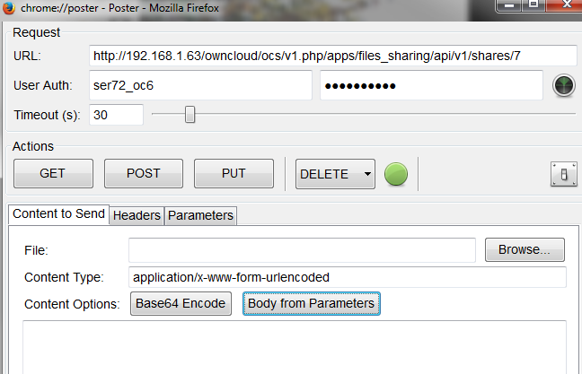

Get Information about a known share
===================================

To get information about a share when the share ID is known, use the following.

Note: the share ID can be obtained from the output of any of the previous Share API calls or the creation of a new share.

+-----------+---------------------------------+
| Syntax    | <Base URL>/<share id>           |
|           |                                 |
+-----------+---------------------------------+
| Method    | GET                             |
|           |                                 |
+-----------+---------------------------------+
| Arguments | Share id (int)                  |
|           |                                 |
+-----------+---------------------------------+
| Result    | XML code with share information |
|           |                                 |
+-----------+---------------------------------+
|           |                                 |
+-----------+---------------------------------+

The following is a list of returned status codes:

+------------------+---------------------+
| HTTP Status Code | Description         |
|                  |                     |
+------------------+---------------------+
| 100              | Successful          |
|                  |                     |
+------------------+---------------------+
| 404              | Share doesn’t exist |
|                  |                     |
+------------------+---------------------+

Poster
------

This example shows the output of share information for share ID “7”

+---------------+--------------------------------------------------------+
| Field         | Value                                                  |
|               |                                                        |
+---------------+--------------------------------------------------------+
| **URL**       | Base URL for the API of the ownCloud server/<share id> |
|               |                                                        |
+---------------+--------------------------------------------------------+
| **User Auth** | User ID of the file owner                              |
|               |                                                        |
+---------------+--------------------------------------------------------+
| **Password**  | User’s Password                                        |
|               |                                                        |
+---------------+--------------------------------------------------------+

|1000000000000288000001A1D5BE4881_png|

Curl
----

$ curl \http://<user>:<passowrd>@<ip>/ocs/v1.php/apps/files_sharing/api/v1/shares/<share_id>

Output
------

+--------------------------------------------------------+------------------------+
| <?xml version="1.0"?>                                  |                        |
|                                                        |                        |
+--------------------------------------------------------+------------------------+
| <ocs>                                                  |                        |
|                                                        |                        |
+--------------------------------------------------------+------------------------+
| <meta>                                                 |                        |
|                                                        |                        |
+--------------------------------------------------------+------------------------+
| <status>ok</status>                                    | Status=100: successful |
|                                                        |                        |
+--------------------------------------------------------+------------------------+
| <statuscode>100</statuscode>                           |                        |
|                                                        |                        |
+--------------------------------------------------------+------------------------+
| <message/>                                             |                        |
|                                                        |                        |
+--------------------------------------------------------+------------------------+
| </meta>                                                |                        |
|                                                        |                        |
+--------------------------------------------------------+------------------------+
| <data>                                                 |                        |
|                                                        |                        |
+--------------------------------------------------------+------------------------+
| <element>                                              |                        |
|                                                        |                        |
+--------------------------------------------------------+------------------------+
| <id>7</id>                                             | Share ID = 7           |
|                                                        |                        |
+--------------------------------------------------------+------------------------+
| <item_type>file</item_type>                            |                        |
|                                                        |                        |
+--------------------------------------------------------+------------------------+
| <item_source>675</item_source>                         |                        |
|                                                        |                        |
+--------------------------------------------------------+------------------------+
| <parent/>                                              |                        |
|                                                        |                        |
+--------------------------------------------------------+------------------------+
| <share_type>0</share_type>                             | Share type = 0: user   |
|                                                        |                        |
+--------------------------------------------------------+------------------------+
| <share_with>ser72</share_with>                         | Share with user ser72  |
|                                                        |                        |
+--------------------------------------------------------+------------------------+
| <file_source>675</file_source>                         |                        |
|                                                        |                        |
+--------------------------------------------------------+------------------------+
| <path>/test share api/ieee.txt</path>                  |                        |
|                                                        |                        |
+--------------------------------------------------------+------------------------+
| <permissions>27</permissions>                          |                        |
|                                                        |                        |
+--------------------------------------------------------+------------------------+
| <stime>1386698116</stime>                              |                        |
|                                                        |                        |
+--------------------------------------------------------+------------------------+
| <expiration/>                                          |                        |
|                                                        |                        |
+--------------------------------------------------------+------------------------+
| <token/>                                               |                        |
|                                                        |                        |
+--------------------------------------------------------+------------------------+
| <storage>4</storage>                                   |                        |
|                                                        |                        |
+--------------------------------------------------------+------------------------+
| <mail_send>0</mail_send>                               |                        |
|                                                        |                        |
+--------------------------------------------------------+------------------------+
| <share_with_displayname>ser72</share_with_displayname> |                        |
|                                                        |                        |
+--------------------------------------------------------+------------------------+
| </element>                                             |                        |
|                                                        |                        |
+--------------------------------------------------------+------------------------+
| </data>                                                |                        |
|                                                        |                        |
+--------------------------------------------------------+------------------------+
| </ocs>                                                 |                        |
|                                                        |                        |
+--------------------------------------------------------+------------------------+

