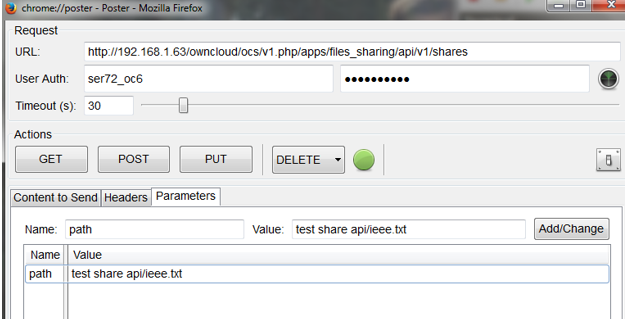
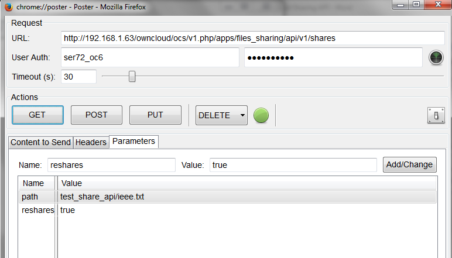
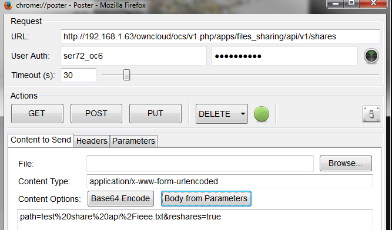
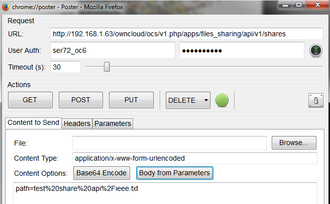

Get Shares from a Specific File or Folder
=========================================

The following will provide a list shares for a specific file.
The input is the full path of the desired file.
The output is a list of everyone who has the file shared with them.

+------------------------+----------------------+---------+-----------------------------------------------------------------------------+
| **Syntax**             | <Base URL>           |         |                                                                             |
|                        |                      |         |                                                                             |
+------------------------+----------------------+---------+-----------------------------------------------------------------------------+
| **Method**             | GET                  |         |                                                                             |
|                        |                      |         |                                                                             |
+------------------------+----------------------+---------+-----------------------------------------------------------------------------+
| **Mandatory Argument** | Path                 | string  | Path to file or folder                                                      |
|                        |                      |         |                                                                             |
+------------------------+----------------------+---------+-----------------------------------------------------------------------------+
| **Argument**           | Reshares             | boolean | If set to ‘false’ (default), only shares from the current user are returned |
|                        |                      |         |                                                                             |
|                        |                      |         | If set to ‘true’, all shares from the given file are returned               |
|                        |                      |         |                                                                             |
+------------------------+----------------------+---------+-----------------------------------------------------------------------------+
| **Argument**           | Subfiles             | boolean | If set to ‘false’ (default), lists only the folder being shared             |
|                        |                      |         |                                                                             |
|                        |                      |         | If set to ‘true’, all shared files within the folder are returned.          |
|                        |                      |         |                                                                             |
+------------------------+----------------------+---------+-----------------------------------------------------------------------------+
| **Result**             | XML code with shares |         |                                                                             |
|                        |                      |         |                                                                             |
+------------------------+----------------------+---------+-----------------------------------------------------------------------------+

The following is a list of returned status codes:

+------------------+------------------------------------------------------+
| HTTP Status Code | Description                                          |
|                  |                                                      |
+------------------+------------------------------------------------------+
| 100              | Successful                                           |
|                  |                                                      |
+------------------+------------------------------------------------------+
| 400              | Not a directory (if the ‘subfile’ argument was used) |
|                  |                                                      |
+------------------+------------------------------------------------------+
| 404              | File does not exist                                  |
|                  |                                                      |
+------------------+------------------------------------------------------+

Poster – Default arguments
--------------------------

This example shows the output of share information for “test share api/ieee.txt”

+---------------+---------------------------------------------+
| Field         | Value                                       |
|               |                                             |
+---------------+---------------------------------------------+
| **URL**       | Base URL for the API of the ownCloud server |
|               |                                             |
+---------------+---------------------------------------------+
| **User Auth** | User ID of the file owner                   |
|               |                                             |
+---------------+---------------------------------------------+
| **Password**  | User’s Password                             |
|               |                                             |
+---------------+---------------------------------------------+
| **Name**      | Argument being passed                       |
|               |                                             |
+---------------+---------------------------------------------+
| **Value**     | Full path of file/folder shared             |
|               |                                             |
+---------------+---------------------------------------------+

Navigate to the “Parameters” tab and input the Name and value.

|10000000000002720000013FB6EDA793_png|

Navigate to the “Content to Send” tab and select “Body from Parameters” to move the required parameters to the query.

|1000000000000291000001951B69B9A6_png|

Select GET.

Curl – Default configuration
----------------------------

$ curl –G –data "path=test_share_api/ieee.txt" \http://<userid>:<password>@<ip>/ocs/v1.php/apps/files_sharing/api/v1/shares

Output
------

+--------------------------------------------------------+-------------------------------+
| <?xml version="1.0"?>                                  |                               |
|                                                        |                               |
+--------------------------------------------------------+-------------------------------+
| <ocs>                                                  |                               |
|                                                        |                               |
+--------------------------------------------------------+-------------------------------+
| <meta>                                                 |                               |
|                                                        |                               |
+--------------------------------------------------------+-------------------------------+
| <status>ok</status>                                    |                               |
|                                                        |                               |
+--------------------------------------------------------+-------------------------------+
| <statuscode>100</statuscode>                           | Status=100: Successful        |
|                                                        |                               |
+--------------------------------------------------------+-------------------------------+
| <message/>                                             |                               |
|                                                        |                               |
+--------------------------------------------------------+-------------------------------+
| </meta>                                                |                               |
|                                                        |                               |
+--------------------------------------------------------+-------------------------------+
| <data>                                                 |                               |
|                                                        |                               |
+--------------------------------------------------------+-------------------------------+
| <element>                                              |                               |
|                                                        |                               |
+--------------------------------------------------------+-------------------------------+
| <id>7</id>                                             | Share ID=7                    |
|                                                        |                               |
+--------------------------------------------------------+-------------------------------+
| <item_type>file</item_type>                            |                               |
|                                                        |                               |
+--------------------------------------------------------+-------------------------------+
| <item_source>675</item_source>                         |                               |
|                                                        |                               |
+--------------------------------------------------------+-------------------------------+
| <parent/>                                              |                               |
|                                                        |                               |
+--------------------------------------------------------+-------------------------------+
| <share_type>0</share_type>                             | Share Type=0: user            |
|                                                        |                               |
+--------------------------------------------------------+-------------------------------+
| <share_with>ser72</share_with>                         | Share with user ser72         |
|                                                        |                               |
+--------------------------------------------------------+-------------------------------+
| <file_source>675</file_source>                         |                               |
|                                                        |                               |
+--------------------------------------------------------+-------------------------------+
| <path>/test share api/ieee.txt</path>                  | File /test share api/ieee.txt |
|                                                        |                               |
+--------------------------------------------------------+-------------------------------+
| <permissions>27</permissions>                          | Permissions 27                |
|                                                        |                               |
+--------------------------------------------------------+-------------------------------+
| <stime>1386698116</stime>                              |                               |
|                                                        |                               |
+--------------------------------------------------------+-------------------------------+
| <expiration/>                                          |                               |
|                                                        |                               |
+--------------------------------------------------------+-------------------------------+
| <token/>                                               |                               |
|                                                        |                               |
+--------------------------------------------------------+-------------------------------+
| <storage>4</storage>                                   |                               |
|                                                        |                               |
+--------------------------------------------------------+-------------------------------+
| <mail_send>0</mail_send>                               |                               |
|                                                        |                               |
+--------------------------------------------------------+-------------------------------+
| <share_with_displayname>ser72</share_with_displayname> |                               |
|                                                        |                               |
+--------------------------------------------------------+-------------------------------+
| </element>                                             |                               |
|                                                        |                               |
+--------------------------------------------------------+-------------------------------+
| </data>                                                |                               |
|                                                        |                               |
+--------------------------------------------------------+-------------------------------+
| </ocs>                                                 |                               |
|                                                        |                               |
+--------------------------------------------------------+-------------------------------+

Poster – To add another argument, such as re-shares
---------------------------------------------------

This example shows the output of share information for “test share api/ieee.txt”.
reshares is set to true which will show output if the file is re-shared by another user.

|1000000000000304000001B964698779_png|

Navigate to the “Content to Send” tab and select “Body from Parameters”

|100000000000029B0000018885B5282E_png|

Select Get

Curl – To add another argument, such as re-shares
-------------------------------------------------

$ curl –G –data "path=test_share_api/ieee.tx&reshares=true" \http://<userid>:<password>@<ip>/ocs/v1.php/apps/files_sharing/api/v1/shares

Output
------

+--------------------------------------------------------+--------------------------------------+
| <?xml version="1.0"?>                                  |                                      |
|                                                        |                                      |
+--------------------------------------------------------+--------------------------------------+
| <ocs>                                                  |                                      |
|                                                        |                                      |
+--------------------------------------------------------+--------------------------------------+
| <meta>                                                 |                                      |
|                                                        |                                      |
+--------------------------------------------------------+--------------------------------------+
| <status>ok</status>                                    |                                      |
|                                                        |                                      |
+--------------------------------------------------------+--------------------------------------+
| <statuscode>100</statuscode>                           | Status=100: Successful               |
|                                                        |                                      |
+--------------------------------------------------------+--------------------------------------+
| <message/>                                             |                                      |
|                                                        |                                      |
+--------------------------------------------------------+--------------------------------------+
| </meta>                                                |                                      |
|                                                        |                                      |
+--------------------------------------------------------+--------------------------------------+
| <data>                                                 |                                      |
|                                                        |                                      |
+--------------------------------------------------------+--------------------------------------+
| <element>                                              |                                      |
|                                                        |                                      |
+--------------------------------------------------------+--------------------------------------+
| <id>7</id>                                             | Share id = 7                         |
|                                                        |                                      |
+--------------------------------------------------------+--------------------------------------+
| <item_type>file</item_type>                            |                                      |
|                                                        |                                      |
+--------------------------------------------------------+--------------------------------------+
| <item_source>675</item_source>                         |                                      |
|                                                        |                                      |
+--------------------------------------------------------+--------------------------------------+
| <parent/>                                              |                                      |
|                                                        |                                      |
+--------------------------------------------------------+--------------------------------------+
| <share_type>0</share_type>                             | Share Type=0: User                   |
|                                                        |                                      |
+--------------------------------------------------------+--------------------------------------+
| <share_with>ser72</share_with>                         | Share with user ser72                |
|                                                        |                                      |
+--------------------------------------------------------+--------------------------------------+
| <file_source>675</file_source>                         |                                      |
|                                                        |                                      |
+--------------------------------------------------------+--------------------------------------+
| <path>/test share api/ieee.txt</path>                  |                                      |
|                                                        |                                      |
+--------------------------------------------------------+--------------------------------------+
| <permissions>27</permissions>                          | Permissions 27                       |
|                                                        |                                      |
+--------------------------------------------------------+--------------------------------------+
| <stime>1386698116</stime>                              |                                      |
|                                                        |                                      |
+--------------------------------------------------------+--------------------------------------+
| <expiration/>                                          |                                      |
|                                                        |                                      |
+--------------------------------------------------------+--------------------------------------+
| <token/>                                               |                                      |
|                                                        |                                      |
+--------------------------------------------------------+--------------------------------------+
| <storage>4</storage>                                   |                                      |
|                                                        |                                      |
+--------------------------------------------------------+--------------------------------------+
| <mail_send>0</mail_send>                               |                                      |
|                                                        |                                      |
+--------------------------------------------------------+--------------------------------------+
| <share_with_displayname>ser72</share_with_displayname> |                                      |
|                                                        |                                      |
+--------------------------------------------------------+--------------------------------------+
| </element>                                             |                                      |
|                                                        |                                      |
+--------------------------------------------------------+--------------------------------------+
| <element>                                              |                                      |
|                                                        |                                      |
+--------------------------------------------------------+--------------------------------------+
| <id>8</id>                                             | Share id 8                           |
|                                                        |                                      |
+--------------------------------------------------------+--------------------------------------+
| <item_type>file</item_type>                            |                                      |
|                                                        |                                      |
+--------------------------------------------------------+--------------------------------------+
| <parent>7</parent>                                     |                                      |
|                                                        |                                      |
+--------------------------------------------------------+--------------------------------------+
| <share_type>0</share_type>                             | Parent share id = 7                  |
|                                                        |                                      |
+--------------------------------------------------------+--------------------------------------+
| <share_with>ser73</share_with>                         | Share with ser73                     |
|                                                        |                                      |
+--------------------------------------------------------+--------------------------------------+
| <file_source>675</file_source>                         |                                      |
|                                                        |                                      |
+--------------------------------------------------------+--------------------------------------+
| <path>/test share api/ieee.txt</path>                  | Share file /test share api/ieee.txt  |
|                                                        |                                      |
+--------------------------------------------------------+--------------------------------------+
| <permissions>19</permissions>                          | Permissions 19 – read, update, share |
|                                                        |                                      |
+--------------------------------------------------------+--------------------------------------+
| <stime>1386698465</stime>                              |                                      |
|                                                        |                                      |
+--------------------------------------------------------+--------------------------------------+
| <expiration/>                                          |                                      |
|                                                        |                                      |
+--------------------------------------------------------+--------------------------------------+
| <token/>                                               |                                      |
|                                                        |                                      |
+--------------------------------------------------------+--------------------------------------+
| <storage>4</storage>                                   |                                      |
|                                                        |                                      |
+--------------------------------------------------------+--------------------------------------+
| <mail_send>0</mail_send>                               |                                      |
|                                                        |                                      |
+--------------------------------------------------------+--------------------------------------+
| <share_with_displayname>ser73</share_with_displayname> |                                      |
|                                                        |                                      |
+--------------------------------------------------------+--------------------------------------+
| </element>                                             |                                      |
|                                                        |                                      |
+--------------------------------------------------------+--------------------------------------+
| </data>                                                |                                      |
|                                                        |                                      |
+--------------------------------------------------------+--------------------------------------+
| </ocs>                                                 |                                      |
|                                                        |                                      |
+--------------------------------------------------------+--------------------------------------+

