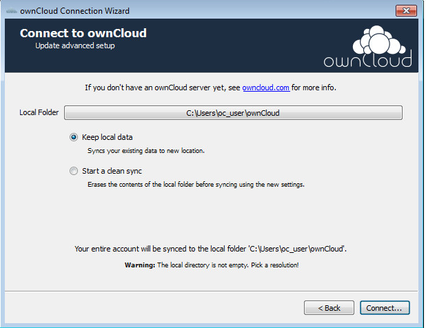

Setting up an Account
=====================

If no account has been configured, the ownCloud Client will automatically assist in connecting to the ownCloud server after the application has been started.

The first step is to enter the URL to the ownCloud server.
This is the same address that is used in the browser.

|10000000000002650000018CA6A1BE66_png|

Next, enter the username and password.
These are the same credentials used to log into the web interface.

|10000000000002690000018D3A8C9F17_png|

Finally, select the folder that the ownCloud Client will sync the contents of the ownCloud account with.
By default, this folder is called ownCloud, which resides in the home directory.

|10000000000002650000018E4285E964_png|

At this time, the synchronization between the root directories of the ownCloud server will begin.

If selecting a local folder that already contains data, there are two options that exist.

|100000000000026A000001DCAF8778F2_png|

*   Keep local data: If selected, the files in the local folder on the client will be synced up to the ownCloud server.

*   Start a clean sync: If selected, all files in the local folder on the client will be deleted and therefore not synced to the ownCloud server.

.. |10000000000002690000018D3A8C9F17_png| image:: images/10000000000002690000018D3A8C9F17.png
    :width: 6.4272in
    :height: 4.1346in

.. |10000000000002650000018CA6A1BE66_png| image:: images/10000000000002650000018CA6A1BE66.png
    :width: 6.3846in
    :height: 4.1252in

.. |10000000000002650000018E4285E964_png| image:: images/10000000000002650000018E4285E964.png
    :width: 6.3846in
    :height: 4.1457in

