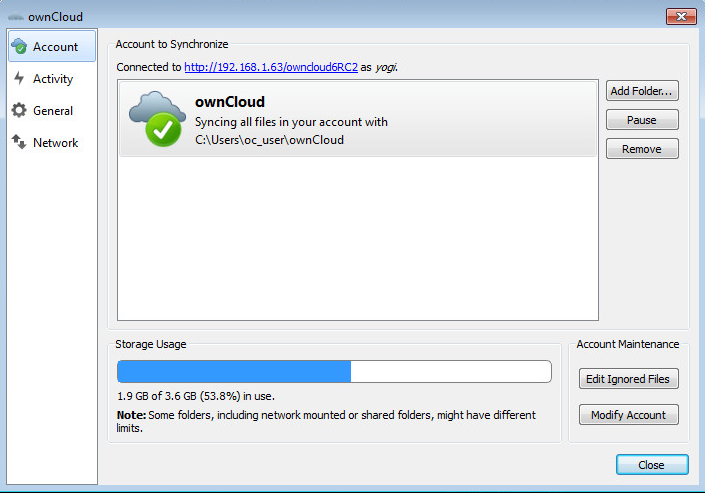
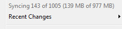

Visual Tour
===========

Icon
----

The ownCloud Client remains in the background and is visible as an icon in the system tray (Windows, KDE), status bar (MAC OS X), or notification area (Ubuntu).

|100000000000001D0000001E5C455170_png|

Menu
----

A right click on the icon provides the following menu.

|10000000000000D2000000F553818155_png|

Where:

*   Open ownCloud in browser: Opens the ownCloud web interface.

*   Open folder ‘ownCloud’: Opens the local folder.
    If multiple sync targets have been defined, an entry will exist for each local folder.

*   Disk Space Indicator: Shows how much space is used on the server.

*   Operation indicator: Shows the status of the current sync process, or ‘up to date’ if the client and server are in sync.

|10000000000000F20000003BAA849B42_png|

*   Recent changes: shows the last six files modified by sync operations and provides access to the Sync Activity window which lists all changes since the last restart of the ownCloud client.

*   Settings…: Provides access to the settings menu.
    Same result as a left click on the icon.

*   Help: Opens a browser to display the documentation.

*   Sign out: Signs the client out of the server.

*   Quit ownCloud: Quits ownCloud, ending a currently running sync.

Settings
--------

Account Settings
~~~~~~~~~~~~~~~~

The Account Settings tab provides an executive summary about the synced folders in the account and gives the ability to modify them.

|10000000000002C1000001ED5CECCC6D_png|

Where:

*   “Connected to <ownCloud instance> as <user>”: Indicates the ownCloud server which the client is syncing with and the user account on that server.

*   Add Folder…: Provides the ability to add another folder to sync.

|10000000000001EE00000164642CCA08_png|

The Directory and alias name must be unique.

|10000000000001F40000016609A0CFCC_png|

Select the folder on the server to sync with.
It is important to note that, a server folder can only sync to the client one time.
So, in the above example, the sync is to the server root directory and thus it is not possible to select another folder under the root to sync.

*   Pause/Resume: will pause the current sync or prevent the client from starting a new sync.
    Resume will resume the sync process.

*   Remove:
    Will remove the selected folder from being synced.
    This is used, for instance, when there is a desire to sync only a few folders and not the root.
    First, remove the root from sync, then add the folders to sync as desired.

*   Storage Usage: Provides further details on the storage utilization on the ownCloud server.

*   Edit Ignored Files: provides a list of files which will be ignored, i.e., will not sync between the client and server.
    The ignored files editor allows adding patterns for files or directories that should be excluded from the sync process.
    Besides normal characters, wild cards may be used, an asterisk ‘*’ indicating multiple characters, or a question mark ‘?’ indicating a single character.

|10000000000001E50000018C3AD09A21_png|

*   Modify Account: Allows the user to change the ownCloud server being synced to.
    It brings up the Setting up an Account (section
    above) windows.

Activity
~~~~~~~~

The Activity window, which can be invoked either from the main menu (
Recent Changes -> Details…
) or the Activity tab on the left side of the settings window, provides an in-depth account of the recent sync activity.
It will show files that have not been synced because they are on the ignored files list, or because they cannot be synced in a cross-platform manner due to containing special characters that cannot be stored on certain file systems.

|10000000000002BB000001EABD7E6DF0_png|

General
~~~~~~~

This tab provides several options:

|10000000000002BF000001E5B544E7E7_png|

*   Launch on System Startup: This option is automatically activated once a user has created his account.
    Unchecking this box will cause the ownCloud client to not launch on startup for a particular user.

*   Show Desktop Notifications: When checked, bubble notifications when a set of sync operations has been performed are provided.

*   Use Monochrome Icons: Use less obtrusive icons.
    Especially useful on MAC OS.

*   About: provides information about authors as well as build conditions.
    This information is valuable when submitting a support request.

Network
~~~~~~~

This tab contains proxy settings and bandwidth limiting settings.

|10000000000002C3000001EBBD39E47A_png|

Proxy Settings
^^^^^^^^^^^^^^

*   No Proxy: Check this if the ownCloud client should circumvent the default proxy on the system.

*   Use system proxy: Default value.
    This will follow the system’s proxy settings.
    On Linux it will use the value of the variable
    http_proxy.

*   Specify proxy manually as: Allows to specify custom proxy settings.
    If it is required to go through a HTTP(S) proxy server.
    SOCKSv5 on the other hand is useful in special company LAN setups, or in combination with the OpenSSH dynamic application level forwarding feature.

*   Host: Enter the host name or IP address of the proxy server followed by the port number.
    HTTP proxies usually listen on ports 8080 (default) or 3128.
    SOCKS server usually listens on port 1080.

*   Proxy server requires authentication: Should be checked if the proxy server does not allow anonymous usage.
    If checked, a username and password must be provided.

Bandwidth Limiting
^^^^^^^^^^^^^^^^^^

The Download Bandwidth can be either unlimited (default) or limited to a custom value.
This is the bandwidth available for data flowing from the ownCloud Server to the client.

The Upload Bandwidth, the bandwidth available or data flowing from the ownCloud client to the server, has an additional option to limit automatically.
When this option is checked, the ownCloud client will surrender available bandwidth to other applications.
Use this option if there are issues with real time communication in conjunction with the ownCloud Client.

.. |10000000000002BB000001EABD7E6DF0_png| image:: images/10000000000002BB000001EABD7E6DF0.png
    :width: 6.5in
    :height: 4.5563in

.. |10000000000001F40000016609A0CFCC_png| image:: images/10000000000001F40000016609A0CFCC.png
    :width: 5.2083in
    :height: 3.7291in

.. |10000000000000D2000000F553818155_png| image:: images/10000000000000D2000000F553818155.png
    :width: 2.1874in
    :height: 2.552in

.. |10000000000001EE00000164642CCA08_png| image:: images/10000000000001EE00000164642CCA08.png
    :width: 5.1457in
    :height: 3.7083in

.. |10000000000002C3000001EBBD39E47A_png| image:: images/10000000000002C3000001EBBD39E47A.png
    :width: 6.5in
    :height: 4.5138in

.. |10000000000002BF000001E5B544E7E7_png| image:: images/10000000000002BF000001E5B544E7E7.png
    :width: 6.5in
    :height: 4.4839in

.. |100000000000001D0000001E5C455170_png| image:: images/100000000000001D0000001E5C455170.png
    :width: 0.302in
    :height: 0.3126in

.. |10000000000001E50000018C3AD09A21_png| image:: images/10000000000001E50000018C3AD09A21.png
    :width: 5.052in
    :height: 4.1252in

