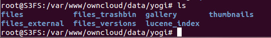

Configuration and storage
=========================

Configuration
-------------

By default, the ownCloud versions app is enabled.
To verify or disable, navigate to the apps
page and select Versions.

|10000000000004ED000000BE3B9E25D5_png|
|1000000000000336000000F38C3FAF84_png|
|1000000000000336000000F38C3FAF84_png|
|1000000000000336000000F38C3FAF84_png|
|1000000000000336000000F38C3FAF84_png|

Storage
-------

Previous versions of files are stored in the
data/<user>/files_versions
folder.

|100000000000021C0000004CACBF786C_png|

This directory is automatically created when the first file version is created.

The naming convention of the files in this directory are
<file_name>.v<unix_timestamp>.

|10000000000002210000002DE3BE7515_png|

.. |1000000000000336000000F38C3FAF84_png| image:: images/1000000000000336000000F38C3FAF84.png
    :width: 6.5in
    :height: 1.9217in

.. |10000000000002210000002DE3BE7515_png| image:: images/10000000000002210000002DE3BE7515.png
    :width: 5.6772in
    :height: 0.4689in

.. |10000000000004ED000000BE3B9E25D5_png| image:: images/10000000000004ED000000BE3B9E25D5.png
    :width: 6.5in
    :height: 0.9791in

