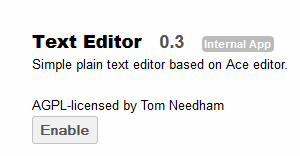

Configuration
=============

Text Editor
-----------

The Text Editor App allows users to view and edit text files.
To enable this app, navigate to the Apps page and select “Text Editor” then Enable.

|100000000000012C0000009C444B4720_png|

Image Viewer
------------

The image viewer app allows users to preview image files within the ownCloud web interface.
To enable, navigate to the Apps page and select “Image Viewer” then enable.

|10000000000001400000008A557EF7E3_png|

.. |10000000000001400000008A557EF7E3_png| image:: images/10000000000001400000008A557EF7E3.png
    :width: 3.3335in
    :height: 1.4374in

