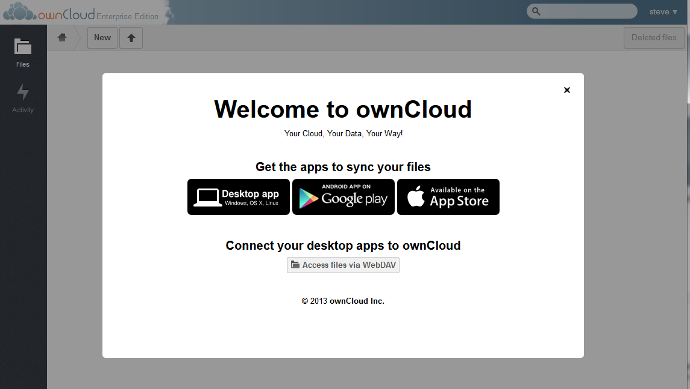

Initial Log In
==============

The ownCloud initial login screen is as follows.

|1000000000000453000001BFFCF48776_png|

It should be noted, that if the instance of ownCloud is themed differently, there will be a different logo on the screen.

To log into ownCloud, enter the username and password provided by your ownCloud admin.
To remain logged into ownCloud under the same credentials, select the checkbox next to Remember.

Upon initial login, the user will most likely see the “Welcome to ownCloud” banner as below.

|1000000000000479000002887E7F48EA_png|

This banner provides links to download the desktop sync app (see Desktop Client document), as well as the mobile apps.
This banner will appear upon the first login only, provided the admin has not disabled it.
To close the banner and start using ownCloud, select the ‘x’ in the upper right corner of the banner.

.. |1000000000000453000001BFFCF48776_png| image:: images/1000000000000453000001BFFCF48776.png
    :width: 6.5in
    :height: 2.6252in

