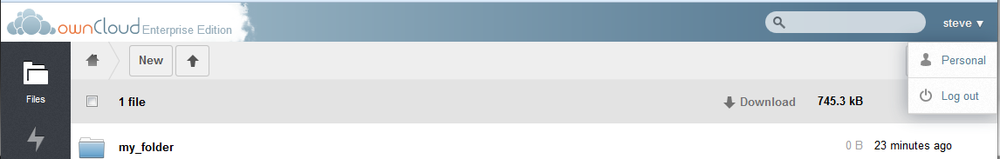

Personal Configurations
=======================

Each ownCloud user may configure some personal preferences.
To make these configurations, navigate to the Personal page.
Select the user name and the following menu will appear.

|100000000000047A000000B727198874_png|

Select Personal to get to the configuration page.

Configuration options on this page may appear or disappear depending on what the ownCloud admin has configured.
The basic configuration parameters are as follows.

|1000000000000467000002B63162E59B_png|

|10000000000004690000026615360BEB_png|

Important links
---------------

The top section of the Personal page contains the same links as the First Run Wizard described earlier in this document.
For more information on this, see the document on the First Run Wizard.

Quota
-----

Below shows the used and remaining space for the user.
For information as to how this is calculated, refer to the ownCloud Quota Calculations document.

Password Change
---------------

If the user desires to change the password, do so in this section.
Enter the current password followed by the new password and select “Change Password”.
It should be noted, that when using LDAP authentication, the password is contained within the LDAP and not locally thus this field will not change the password.

Change Display Name
-------------------

To change the way your name is displayed within ownCloud, enter the desired name under “Full Name”.

Add Email Address
-----------------

For password recovery and share notifications, it is important for ownCloud to have an email on record.
Enter the desired email address under the EMAIL section.

Avatar
------

ownCloud allows a user to upload an Avatar for their ownCloud instance.
This can be done under the “Profile Picture” section of the Personal Page.

To upload a new Avatar, select the “Upload new” button.
If the desired avatar exists on the ownCloud file system, select “Select new from Files” and to remove the avatar and return to the default, select “Remove image”

Language
--------

If English is not the user’s native language, they may change the language in this section.

WebDAV
------

This provides the address to use in order to access a user’s files via WebDav.

.. |1000000000000467000002B63162E59B_png| image:: images/1000000000000467000002B63162E59B.png
    :width: 6.5in
    :height: 4.0028in

.. |10000000000004690000026615360BEB_png| image:: images/10000000000004690000026615360BEB.png
    :width: 6.5in
    :height: 3.5346in

