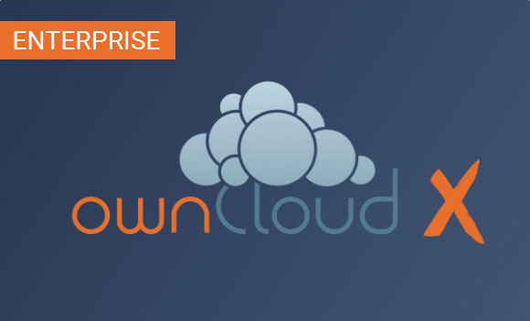
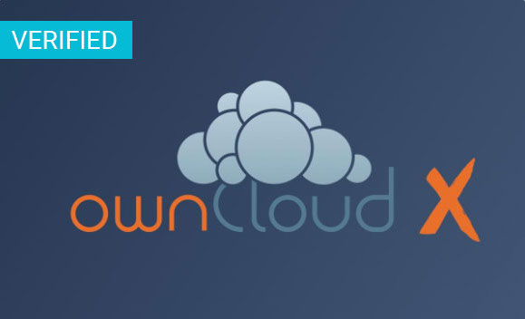

======================================
Publishing in the ownCloud Marketplace 
======================================

.. sectionauthor:: Jos Poortvliet <jospoortvliet@gmail.com>

The ownCloud Marketplace
------------------------

With the ownCloud marketplace, introduced in 2017, we offer a flexible and easy way to publish your apps and extend your ownCloud. 
In addition every ownCloud gets shipped with the new market app which makes it possible to manage apps directly out of your running ownCloud instance. 
Connected with the ownCloud marketplace it mirrors your marketplace account and provides an easy way to install and update apps. 

The process of publishing apps aims to be:

* Secure
* Transparent
* Welcoming
* Fair
* Easy to maintain

Apps in the store are divided in three 'levels' of trust:

* Official
* Approved
* Experimental

With each level come requirements and a position in the store.

Official
^^^^^^^^

Official apps are developed by and within the ownCloud community and its `Github <https://github.com/owncloud>`_ repository and offer functionality central to ownCloud. They are ready for serious use and can be considered a part of ownCloud.

Requirements:

* Developed in ownCloud github repo.
* Minimum of 2 active maintainers and contributions from others.
* Security audited and design reviewed.
* App is at least 6 months old and has seen regular releases.
* Follows app guidelines.
* Supports the same platforms and technologies mentioned in the release notes of the ownCloud version this app is made for.

.. * app is signed, identity verified

ownCloud Marketplace:

* Available in Apps page in separate category.
* Sorted first in all overviews, "Official" tag.
* Shown as featured, on https://owncloud.org etc.
* Major releases optionally featured on https://owncloud.org and sent to owncloud-announce list.
* New versions/updates approved by at least one other person.

.. note::
   Official apps include those that are part of the release tarball. 
   We'd like to keep the tarball minimal so most official apps are not part of the standard installation.

Approved
^^^^^^^^

Approved apps are developed by trusted developers and have passed a cursory security check. 
They are actively maintained in an open code repository and their maintainers deem them to be stable for casual to normal use.

Requirements:

* Code is developed in an open and version-managed code repository, ideally GitHub with git but other scm/hosting is OK.
* Minimum of one active developer/maintainer.
* Minimum 5 ratings, average score 60/100 or better.
* App is at least 3 months old.
* Follows app guidelines.
* The developer is trusted.
* App is subject to unannounced security audits.
* Has defined requirements and dependencies (like what browsers, databases, PHP versions and so on are supported).

.. * app is signed, at least domain verified

.. note:: **Developer trust**: The developer(s) is/are known in community; he/she has/have been active for a while, have met others at events and/or worked with others in various areas.

.. note:: **Security audits**: in practice this means that at least some of the code of this developer has been audited; either through another app by the same developer or with an earlier version of the app. And that the attitude of the developer towards these audits has been positive.

ownCloud Marketplace:

* Visible in ownCloud Marketplace by default
* Sorted above experimental apps
* Search results sorted by ratings
* Developer can directly push new versions to the store
* Warning shows for security/stability risks

Experimental
^^^^^^^^^^^^

Apps which have not been checked at all for security and/or are new, known to be unstable or under heavy development.

Requirements:

* No malicious intent found from this developer at any time
* 0 confirmed security problems
* Less than 3 unconfirmed 'security flags'
* Rating over 20/100

.. * app is signed but no verification has to be done

ownCloud Marketplace:

* Show up in Apps page provided user has enabled "allow installation of experimental apps" in the settings.
* Warning about security and stability risks is shown for app
* Sorted below all others.

App Categories
--------------

The following categories are available for apps to be filed under:

- Automation
- Collaboration
- Customization
- External plugins
- Games
- Integration
- Multimedia
- Productivity
- Security
- Storage
- Tools

To make your app available under one of these categories please make sure to user the proper tag in your info.xml:

.. code-block:: xml
   
 <category>security</category>

Note: For publishing themes this tag must be present but empty.

.. code-block:: xml

 <category></category>
 
App Tags
--------
 
Besides these categories apps can have different tags:

- Enterprise
- Verified
- Trusted

Enterprise
^^^^^^^^^^

Apps with the "Enterprise" tag are official ownCloud enterprise apps. 
These can only be uploaded by ownCloud itself and represent ownCloud Enterprise Edition features.

Verified
^^^^^^^^

To get the "verified" label on your app, you must request a review. 
We then will look into your app and check if it meets the ownCloud app development guidelines (see below).
The advantages of verified apps are:

- Labeled with "verified" badge
- Available in apps page in separate category
- Only verified apps can be displayed in the "featured" area
- Major releases optionally featured on https://owncloud.org and sent to owncloud-announce list

   
Trusted
^^^^^^^

If your app reaches a rating level of 4 or higher based on 40 ratings or more it automatically gets the badge "trusted". 
It represents a community oriented level of quality which makes it more attractive to other users.
The advantages of trusted apps are:

- Labeled with "trusted" badge
- User can filter by trusted apps

App Review Process
------------------

To request an app review go to "Account" > "My Products" > "Edit app" and click on the button "Request review". 
Usually it takes 3-5 work days to review your app. 
You will be notified about the result. 

If it is successful, your app will get the "verified" badge.
Please be aware of when uploading a new release to a verified app, you need to request a new review for the new release. 
To keep your verified badge, request the review before setting your new release to "published".

App Guidelines
--------------

The following are the guidelines your app should follow to provide a high quality.

Legal and Security
^^^^^^^^^^^^^^^^^^

- Apps can not use "ownCloud" in their name
- Irregular and unannounced security audits of all apps can and will take place.
- If any indication of malicious intent or bad faith is found the developer(s) in question can count on a minimum 2 year ban from any ownCloud infrastructure.
- Malicious intent includes deliberate spying on users by leaking user data to a third party system or adding a back door (like a hard-coded user account) to ownCloud. An unintentional security bug that gets fixed in time won’t be considered bad faith.
- Apps do not violate any laws; it has to comply with copyright- and trademark law.
- App authors have to respond timely to security concerns and not make ownCloud more vulnerable to attack.

.. note:: Distributing malicious or illegal applications can have legal consequences including, but not limited to ownCloud or affected users taking legal action.

Technical
^^^^^^^^^

- Apps can only use the public ownCloud API
- At time of the release of an app it can only be configured to be compatible with the latest ownCloud release +1
- Apps should not cause ownCloud to break, consume excessive memory or slow ownCloud down
- Apps should not hamper functionality of ownCloud unless that is explicitly the goal of the app @DeepDiver1975 please review and update technical requirements to new marketplace requirements if changed

Providing Information
^^^^^^^^^^^^^^^^^^^^^

When uploading an app it should provide a professional and informative look. To do so, please consider the following:

- The title of your app can be up to 50 characters. Provide an unique name make it easy to users to identify the product. Do not include your developer and/or company name into the title.
- The summary of your app can be up to 90 characters. Provide a short description. This gets displayed below the product title and on the product tiles
- The description of your app can be up to 4000 characters and supports markdown. Provide all necessary, detailed information about your app. This should contain all information to convince the user to use/buy/download your app. So, don't get lost in technical details. Explain in simple, precise steps what the user will get. When writing, focus on the benefits your app offers.

Images
^^^^^^

- Provide meaningful images to your users.
- For best results, images should be 1400px wide and should go with a roughly aspect ratio of 2:1
- The first image provided in your apps info.xml will be used as preview image and gets displayed in the top area of your marketplace app page.

Respect the Users
^^^^^^^^^^^^^^^^^

- Apps have to follow design and HTML/CSS layout guidelines
- Apps correctly clean up after themselves on uninstall and correctly handle up- and downgrades
- Apps clearly communicate their intended purpose and active features, including features introduced through updates.
- Apps respect the users’ choices and do not make unexpected changes, or limit users’ ability to revert them. For example, they do not remove other apps or disable settings.
- Apps must respect user privacy. If user data is sent anywhere, this must be clearly explained and be kept to a minimum for the functioning of an app. Use proper security measures when needed.

Disclaimer
----------

ownCloud reserves the right to block and/or delete any uploaded app which does not comply with the ownCloud quality standards. Additionally we reserve the right to ban publishers who attempt to and/or upload malicious code. This does not depend on whether it happens intentionally or not.

Available Products Tags
-----------------------

============= =====================================================================================================
Tag           Description
============= =====================================================================================================
id            A unique id; URL of your app will be based on this.
name          The name/title of your app; Max. 50 characters; Provide a concise name so users can identify your app 
              easily; Do not include your developers/company name.
summary       Provide a short description (max. 90 chars). This gets displayed below the product title and on the 
              product tiles; mandatory since ownCloud 10.0.0.
description   Max. 4000 characters; Provide all necessary, detailed information about the product. This should 
              contain all user relevant information. Don't get lost in technical details, focus on the benefits the 
              product offers; Also, use markdown to layout your description.
license       At the moment following license are available:
              - ocl - ownCloud commercial license; ownCloud enterprise apps only
              - agpl
              - mit
version       The release version of your app. Note: To overwrite a release (using the same version number) it 
              must be in state "``planned``". Once published, you cannot replace a release.
category      The category you want to publish your app in; For all available categories see above.
screenshot    Image URL; insert multiple tags if you want to include multiple images; Note: marketplace will store 
              images in its own file system. You do not need to provide the images on you own hosted area after the 
              upload.
dependencies  Min and max version of ownCloud platform your app works with. For example: 
              
              .. code-block:: xml
                 
               <dependencies>
                 <owncloud min-version="10.0" max-version="10.0" />
               </dependencies>

============= =====================================================================================================

For a complete list of tags see: https://doc.owncloud.org/server/latest/developer_manual/app/info.html.
