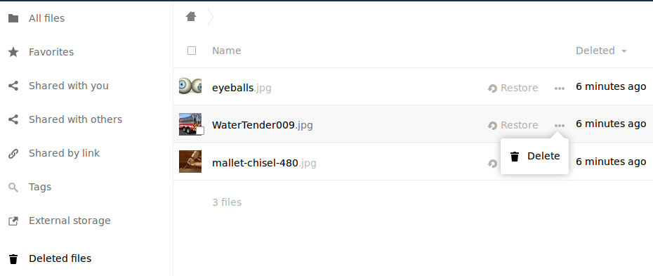

=====================
Managing the Trashbin
=====================

The ownCloud Trashbin (``files_trashbin``) permanently deletes files according to users' storage quotas and age of files. When a user deletes a file it is not immediately removed from your ownCloud server, but goes into the Trashbin. Then the user has the options to un-delete the file, or to delete it permanently.

As the ownCloud server administrator, you have two ``occ`` commands for permanently deleting files from the Trashbin manually, without waiting for the normal aging-out process::

 trashbin
  trashbin:cleanup   Remove deleted files
  trashbin:expire    Expires the users trashbin  

The ``trashbin:cleanup`` command removes the deleted files of all users, or you may specify certain users in a space-delimited list. This example removes all the deleted files of all users::

 sudo -u www-data php occ trashbin:cleanup
 Remove all deleted files
 Remove deleted files for users on backend Database
  user1
  user2
  user3
  user4

This example removes the deleted files of user2 and user4::

 sudo -u www-data php occ trashbin:cleanup user2 user4
  Remove deleted files of user2
  Remove deleted files of user4

``trashbin:expire`` deletes only expired files according to the ``trashbin_retention_obligation`` setting in ``config.php``. The default setting is ``auto``, which keeps files in the trashbin for 30 days, then deletes the oldest files as space is needed to keep users within their storage quotas. Files may not be deleted if the space is not needed.

The default is to delete expired files for all users, or you may list users in a space-delimited list::

 sudo -u www-data php occ trashbin:cleanup user1 user2
  Remove deleted files of user1
  Remove deleted files of user2

See the **Deleted Files** section in :doc:`../configuration_server/config_sample_php_parameters`, and the :ref:`trashbin_label` section of :doc:`../configuration_server/occ_command`.