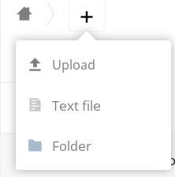
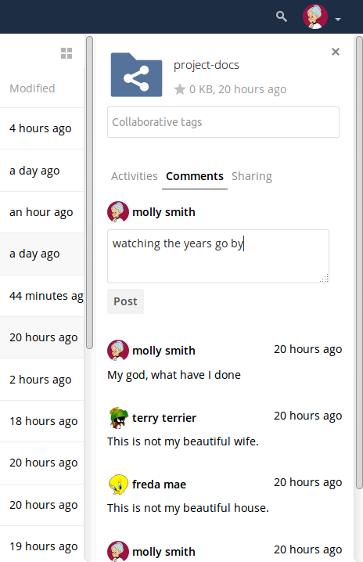
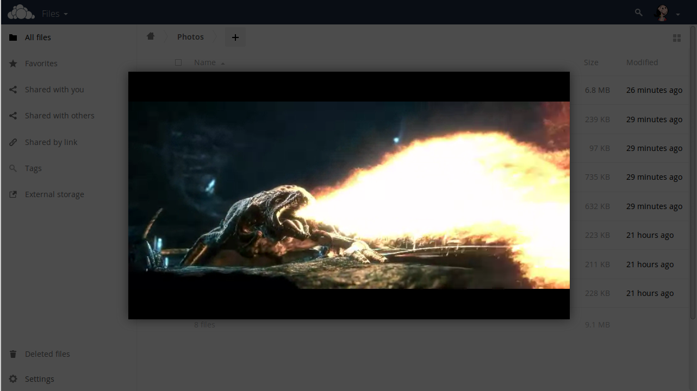
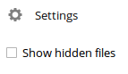

======================================================
Accessing your Files Using the ownCloud Web Interface
======================================================

You can access your ownCloud files with the ownCloud Web interface, as well as
create, preview, edit, delete, share, and re-share files. 

.. IMPORTANT::
   Your ownCloud administrator has the option to disable these features. If any
   of them are missing on your system ask your server administrator.

.. figure:: ../images/files_page.png
   :alt: The Files view screen.

   The ownCloud Files view UI.
  
File Controls
-------------
   
When you mouseover, or hover, over a file in the Files view, as in the image
below, ownCloud displays three file controls. These are:

- `Marking Favorites`_
- `Sharing Files`_
- `The Overflow Menu`_
  
.. figure:: ../images/files_file-controls.png
   :alt: File controls

Marking Favorites
~~~~~~~~~~~~~~~~~

Click the star to the left of the file icon to mark it as a favorite, and
quickly find all of your favorites with the Favorites filter on the left
sidebar.
  
.. figure:: ../images/files_mark-as-favorite.png
   :alt: Marking files as favorites.
  
Sharing Files
~~~~~~~~~~~~~

The sharing files control is a shortcut to the file and folder sharing
functionality within ownCloud. ownCloud sharing supports:

- Sharing files and folders with users or groups 
- Creating public shares with hyperlinks 
- Listing recipients of existing shares
- Deleting existing shares 
  
.. note:: New in 9.0: you can see all re-shares of your original file shares.

The Overflow Menu  
~~~~~~~~~~~~~~~~~

The Overflow Menu allows you to:

- Display file details 
- Rename files
- Download files
- Delete files
  
.. figure:: ../images/files_page-3.png
   :alt: Overflow menu.
   
Display File Details
^^^^^^^^^^^^^^^^^^^^

When you display details about a file, by clicking "Details" in the Overflow Menu, a set of tabs (or views) are available. These are:

================= =============================================================
View              Description
================= =============================================================
Details           This shows details about a file, such as its name, size, 
                  and when it was created or last updated.
Activity          This shows a history of activity on the file, such as when 
                  it was created, updated, and shared.
Sharing           It's here that shares are managed. To know more, refer to 
                  the `Share Files`_ section.
Version           This shows a history of all the versions of the file. This is
                  not available for folders.
================= =============================================================
  
You can see an example of the Activity view in the image below.
  
.. figure:: ../images/files_page-4.png
   :alt: Details screen.  

Navigating Inside ownCloud
--------------------------------

Navigating through folders in ownCloud is as simple as clicking on a folder to 
open it and using the back button on your browser to move to a previous level. 
ownCloud also provides a navigation bar at the top of the Files field for quick 
navigation.

Create and Upload Files and Directories
~~~~~~~~~~~~~~~~~~~~~~~~~~~~~~~~~~~~~~~

Upload or create new files or folders directly in an ownCloud folder by clicking 
on the *New* button in the Files app.

The *New* button provides the following options:

========= ======================================================================
Option    Description
========= ======================================================================
Up arrow  Upload files from your computer into ownCloud. You can also upload 
          files by dragging and dropping them from your file manager.
Text file Creates a new text file and adds the file to your current folder.
Folder    Creates a new folder in the current folder.
========= ======================================================================
  
Select Files or Folders
~~~~~~~~~~~~~~~~~~~~~~~~~~

You can select one or more files or folders by clicking on their checkboxes.  To
select all files in the current directory, click on the checkbox located at the
top of the files listing.

When you select multiple files, you can delete all of them, or download them as
a ZIP file by using the ``Delete`` or ``Download`` buttons that appear at the
top.

.. note:: If the ``Download`` button is not visible, the administrator has
   disabled this feature.

Filter the Files View
~~~~~~~~~~~~~~~~~~~~~~~~

The right sidebar on the Files page contains several filters for quickly sorting 
and managing your files.

================== =============================================================
Option             Description
================== =============================================================
All files          The default view; displays all files that you have access to
Favorites          Files or folders marked with the yellow star 
Shared with you    Displays all files shared with you by another user or group
Shared with others Displays all files that you have shared with other users or 
                   groups
Shared by link     Displays all files that are shared by you via public link
External Storage   Files that you have access to on external storage devices 
                   and services such as Dropbox, Google, and Amazon S3
================== =============================================================

Move Files
~~~~~~~~~~~~

You can move files and folders by dragging and dropping them into any directory.
   
Share Files
-------------

Clicking the share icon on any file or folder opens the Details view on the
right, where the Share tab has focus. 

Sharing Status Icons
~~~~~~~~~~~~~~~~~~~~

Any folder that has been shared is marked with the ``Shared`` overlay icon. 
Public link shares are marked with a chain link. Un-shared folders are blank.

.. figure:: ../images/files_page-5.png
   :alt: Share status icons.

If your ownCloud server is the Enterprise edition, you may also have access to
Sharepoint and Windows Network Drive file shares. These have special status
icons. An icon with a red plugin and background means you have to enter a login
to get access to the share.

.. figure:: ../images/files_share-options.png

Create A Share
~~~~~~~~~~~~~~

To share a file or folder, immediately below the Share tab, you will see a text
field. In this field, you can enter any number of users (whether local to your
ownCloud server or remote) or groups who you would like to share the file or
folder with.

If username auto-completion is enabled, when you start typing the user or group
name ownCloud will automatically complete it for you, if possible.

After a file or folder has been shared, `Share Permissions`_ can be set on
it. In the image below, you can see that the directory "event-Photos" is shared
with the user "pierpont", who can *share*, *edit*, *create*, *change*, and
*delete* the directory.
  
.. figure:: ../images/files_page-2.png
   :alt: Sharing files.

Sharing Files with Guest Users
^^^^^^^^^^^^^^^^^^^^^^^^^^^^^^

Users can also share files and folders with guest users. 
To do so, your ownCloud administrator will need to have installed the Guest application.

If it's already installed, in the "**User and Groups**" field of the Sharing panel, type the username of a user who is not already a user in your ownCloud installation.
You will then see a popup appear with the suffix ``(guest)``, as in the screenshot below.

.. image:: ../images/guest-users/share-with-guest-users.png
   :alt: Sharing with guest users.
   
After you click the username in the list, you'll see a modal dialog appear, where you can add the new user to the list of guest users. 

.. image:: ../images/guest-users/add-user-to-guests.png
   :alt: Add a guest user modal dialog.

The Name field will be pre-filled with the username you supplied. 
All you need to do is add the user's email address, and click "**Save and Share**".
After you do that, the content will be shared with the user with all permissions applied, except for the ability to share with other users.

.. image:: ../images/guest-users/content-shared-with-guest-user.png
   :alt: Content shared with a guest user.

Update A Share
~~~~~~~~~~~~~~

To change any of the properties of a share, again, you first need to view the
Share tab. From there, you can:

- Delete a user's access to a share
- Give more users access to a share
- Change a user's share permissions
- Add or remove password protection
- Set or remove a share's expiration date

As this functionality is already described in other parts of the `Sharing
Files`_ section, it won't be specifically covered here.

Delete A Share
~~~~~~~~~~~~~~

Despite the name of this section, you don't actually delete a share. Rather
what you do is remove the access of user's to whom it's already been shared
with. When all users access to a shared resource has been removed, the resource
is no longer shared. 

To do that, you need to click on the rubbish bin icon, on the far right-hand
side of the name of each user it's been shared with, who should no longer have
access to it.

Password Protect Files
~~~~~~~~~~~~~~~~~~~~~~~~

It's also possible to password protect shared files and folders. If you want to
do so, then you need to enable this functionality. Specifically, click the
checkbox labeled "*Password protect*" under the "*Share Link*" section. 

When you do so, you'll see a password field appear. In there, add the password
that the user will need to enter to access the shared resource and press the
return key.

Using Private Links
~~~~~~~~~~~~~~~~~~~~

Another way to access a file or folder is via a private link. 
It’s a handy way of creating a permanent link for yourself or to point others to a file or folder, within a share, more efficiently. 
To access the private link, in the Sharing Panel for a file or folder, next to its name you’ll see a small link icon (1), as in the screenshot below. 

.. image:: ../images/private-link/private-link.png
   :alt: Obtaining a private link for a shared file or folder

If you click it, a new textbox will appear above the "**Collaborative tags**" field, populated with the link’s URI (2). 

.. note:: 
   Only people who have access to the file or folder can use the link.

Change The Share Expiration Date
~~~~~~~~~~~~~~~~~~~~~~~~~~~~~~~~

In older versions of ownCloud, you could set an expiration date on both local 
and public shares. Since the most recent version three, key, changes have been
made: 

- You can *only* set an expiration date on public shares
- Local shares do not expire when public shares expire 
- A local share can only be "expired" (or deleted) by clicking the trash can icon

Create or Connect to Federation Share Links
~~~~~~~~~~~~~~~~~~~~~~~~~~~~~~~~~~~~~~~~~~~

Federated Cloud Sharing allows you to mount file shares from remote ownCloud
servers, and manage them just like a local share. In ownCloud 8 the process
for creating a new sharing link is easier and more streamlined. See
:doc:`federated_cloud_sharing` to learn to how to create and connect to new
Federated Cloud shares.

Share Permissions
~~~~~~~~~~~~~~~~~

Shares can have a combination of the following five permission types:
 
========== ===================================================================
Permission Definition
========== ===================================================================
can share  Allows the users you share with to re-share
can edit   Allows the users you share with to edit your shared files, and to 
           collaborate using the Documents app
create     Allows the users you share with to create new files and add them 
           to the share
change     Allows uploading a new version of a shared file and replacing it
delete     Allows the users you share with to delete shared files
========== ===================================================================
   
Custom Groups
-------------

In previous versions of ownCloud, if you wanted to share a file or a folder with more than one person, you had to share it  either with many people individually, or share to one or more groups. 
However, you could only share with groups which your ownCloud administrator had already created. 

This wasn't the most efficient way to work. 
To address that, as of ownCloud 10.0, you can now create your own groups on-the-fly, through a feature called "Custom Groups". 
Here's how to use it. 

Creating Custom Groups
~~~~~~~~~~~~~~~~~~~~~~

Assuming that your ownCloud administrator's already `enabled custom groups`_; under the admin menu, in the top right-hand corner, click "**Settings**" (1).
Then, in the main menu on the settings page, in "**Personal**" section, click the option: "**Customgroups**" (2).
This will take you to the "**Custom Groups**" admin page. 

.. image:: ../images/custom-groups/owncloud-create-custom-group-annotated.png
   :alt: The Custom Groups administration panel

To create a new custom group, in the text field at the top where you see the placeholder text: "**Group name**", add the group name and click "**Create group**".
After a moment or two, you’ll see the new custom group appear in the groups list.

.. note::
   Please be aware of two things: 1) Custom groups are visible **only** to members of the group, but **not** to anyone outside the group and 2) ownCloud administrators can see and modify all custom groups of an instance.

Managing Group Members
~~~~~~~~~~~~~~~~~~~~~~

.. image:: ../images/custom-groups/custom-group-manage-group-members.png
   :alt: Manage members in a custom group

To add or remove users in a custom group, click your role (1), which will likely be "**Member**" (at least at first), and you'll see a panel appear on the right-hand side listing the group's users and their roles. 
In the "**Add user to this group field**" at the top of the panel (2), start typing the name of the user that you want to add. 

After a moment or two, you'll see a list of users that match what you've typed appear (if there are any) in a popup list. 
Click the one that you want, and they'll be added to the group. 
Finally, you’ll see a confirmation at the top of the page (3), indicating that the user’s been added to the custom group.

.. note:: 
   Members can only use a group for sharing, whereas group admins can manage a group's members, change a group's name, change members' roles, and delete groups.

Sharing with the Group
~~~~~~~~~~~~~~~~~~~~~~

.. image:: ../images/custom-groups/owncloud-share-to-custom-group.png
   :alt: Sharing files and folders with custom groups

To share a file or folder with your custom group, open the sharing panel (1). 
Then, in the "**User and Groups**" field (2), type part of the name of the custom group and wait a moment or two. 

The name of the group should be displayed in a popup list, which you can see in the screenshot above. 
Click on it, and the file or folder will then be shared with your custom group with all permissions initially set.

How to Change Group Names
~~~~~~~~~~~~~~~~~~~~~~~~~

If you want to change the name of the custom group, mouseover the group's name in the custom groups list, where you will see a pencil appear to the right of the existing name. 
Click it, and a text field will appear, pre-populated with the existing name. 
Change the name and click enter, and the name will be changed.

.. image:: ../images/custom-groups/rename-custom-group.png
   :alt: Rename a custom group

Tag Files
-------------

.. figure:: ../images/file_popup-menu.png
   :alt: Files popup menu.

In ownCloud, you can assign one or more tags to files and folders. To do so, go
to the "**Details**" view, inside `The Overflow Menu`_. There, you'll see a text
field, with the placeholder text "**Collaborative tags**" if no tags have yet
been added, below the file's icon, name, and other details. 

In that field, type the tag's name, which can be composed of one or multiple
words, and press the return key to complete it. If you want to use multiple
words, there is no need to use single or double-quotes. Type as many words as
you want for the tag, and when you press the return key, your tag will be
completed.

.. NOTE::
   All tags are system tags, so they are shared by all users on your ownCloud
   server.

.. figure:: ../images/files_page-7.png
   :alt: Creating file tags.

When you place the cursor inside the tags field, and as you type the tag name,
a list of the system tags will appear. If you type a new tag name, the visible
tags list will be filtered, based on the text that you've typed. 

If you see a tag in the list which is what you had intended to type, or is
a better fit than what you had in mind, click on it, and it will be added to the
file or folder's tag list. This can save you a lot of time and effort.

Untag a File or Folder
~~~~~~~~~~~~~~~~~~~~~~

If a file or folder is already tagged, the tag names in the popup list will have
a check mark to the left of the tag's name. To remove that tag from the file or
folder, click the tag's name. You will see that the check mark disappears.

Edit Tags
~~~~~~~~~

To edit a tag, click the pencil icon on the far right-hand side of the tag's
name, in the tags popup list. This will display a text box, containing the tag's
name. Be sure that you want to change the tag's name, as it will be updated for
all users.

Delete Tags
~~~~~~~~~~~

To delete a tag, as above, click the pencil icon on the far right-hand side of
the tag's name, in the tags popup list. Next to the text box containing the
tag's name, you will also see a delete icon. 

Click this to remove the tag from
the system tag's list. As with renaming a tag, remember that deleting a tag
removes it for all users. So please be sure that you want to do this.

Filter By Tag
~~~~~~~~~~~~~

To filter by tag, use the **Tags** filter on the left sidebar of the Files
page. There are three types of tags: 

========== ====================================================================
Tag        Description
========== ====================================================================
Visible    All users may see, rename, and apply these tags to files and folders
Restricted Tags are assignable and editable only to the users and groups which
           have permission to use them. Other users can filter files by 
           restricted tags, but cannot tag files with them or rename them. 
           The tags are marked (restricted)
Invisible  Visible only to ownCloud admins
========== ====================================================================

When you use the **Tag** filter on your Files page you'll see something like the
following image. If you do not have Admin rights then you will not see any
invisible tags.

.. figure:: ../images/files_page-8.png
   :alt: Viewing file tags.
 
Comments
--------

In ownCloud, you can add one or more comments on both files and folders. This
section describes how to add, edit, and delete comments.

Add Comments
~~~~~~~~~~~~

Use the Details view, in The Overflow Menu, to add and read comments on any
file or folder. Comments are visible to everyone who has access to the file or
folder. To add a comment, as in the example below, click the **Comments** tab
in the Details view, write a comment in the New Comment field, and click
"Post".

Edit Comments
~~~~~~~~~~~~~

To edit an existing comment on a file or folder, hover the mouse over the
comment and you will see a pencil icon appear. By clicking on the pencil, the
*"Edit Comment"* field will appear, pre-filled with the comment text. Change
the text as necessary and click *"Save"*. If you change your mind, just click
*"Cancel"*.

Delete Comments
~~~~~~~~~~~~~~~

To delete an existing comment on a file or folder, as with editing comments,
hover the mouse over the comment and you will see a pencil icon appear. Click
the pencil, and a rubbish bin icon appears on the far right-hand side of the
comment author's name, above the *"Edit Comment"* text field. Click the rubbish
bin, and the comment will be deleted after a few seconds.

Play Videos 
-----------

You can play videos in ownCloud with the Video Player app, by clicking once on
the file. Please note, video streaming by the native ownCloud video player
depends on your Web browser and the video's format. 

If your ownCloud administrator has enabled video streaming, and it doesn't work
in your Web browser, it may be a browser-related issue. See
https://developer.mozilla.org/en-US/docs/Web/HTML/Supported_media_formats#Browser_compatibility
for supported multimedia formats in Web browsers. 

   
Settings
--------
   
The **Settings** gear icon, in the lower left-hand corner of the ownCloud
window, allows you to show or hide hidden files in your ownCloud Web
interface. These are also called dotfiles, because they are prefixed with
a dot, e.g. ``.mailfile``. 

The dot tells your operating system to hide these files in your file browsers,
unless you choose to display them. Usually, these are configuration files, so
having the option to hide them reduces clutter.

 
Preview Files
-------------

ownCloud can display thumbnail previews for image files, MP3 covers, and text
files, if this enabled by your server administrator. You can also display
uncompressed text files, OpenDocument files, videos, and image files in the
ownCloud embedded viewers by clicking on the file name. 

There may be other file types you can preview if your ownCloud administrator has
enabled them. If ownCloud cannot display a file, it starts a download process
and downloads the file to your computer. 

.. Links
   
.. _enabled custom groups: https://doc.owncloud.com/server/10.0/admin_manual/configuration_user/user_configuration.html#enabling-custom-groups
