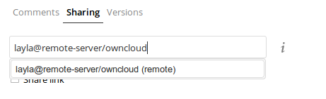
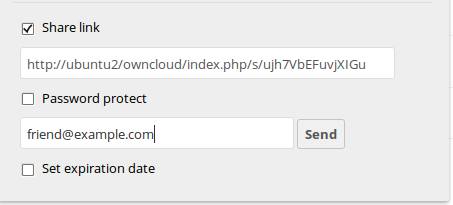
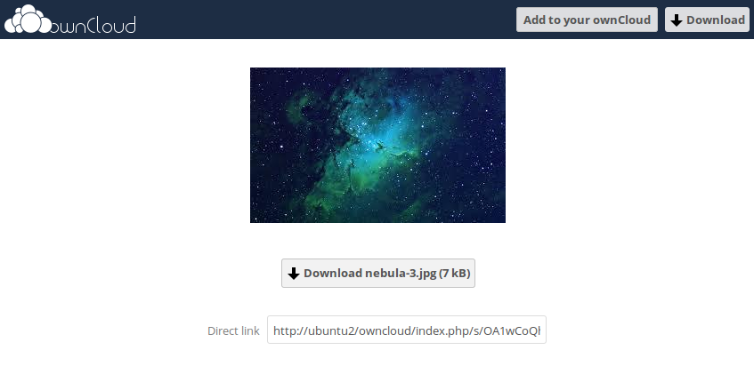
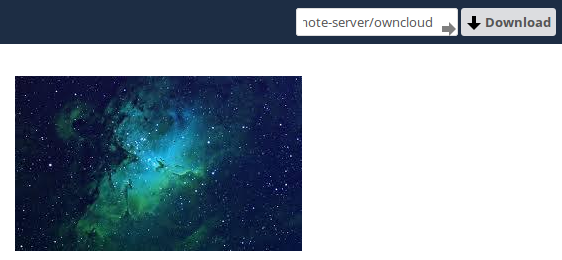

=======================
Using Federation Shares
=======================

Federation Sharing allows you to mount file shares from remote ownCloud servers, in effect 
creating your own cloud of ownClouds. You can create direct share links with 
users on other ownCloud servers.

.. important:: 
   Sharing to groups from federated ownCloud instances is not supported.

How Federated Sharing Works
---------------------------

Federated sharing, conceptually, is not that sophisticated a concept. 
Here's how it works.

Say we have three users: *James*, *Mary*, and *Paul*.
James has a folder (Majorca-Holiday-Pics) which he shares with Mary, who’s on a separate ownCloud instance.
Mary, in turn, (re)shares the folder with Paul, who’s on the same ownCloud instance as Mary. 

You might think that there are two — even three — copies of the shared folder. 
In reality, there’s only one. 
*In effect* there are three — all owned by the original sharer (James). 

The key point to keep in mind is that when a share is re-shared, it’s shared, internally, on behalf of the original owner.
To keep track of all this, during the share process references are created between the shares, that show: 

* James was the original owner of the shared resource
* James shared a copy with Mary and Mary re-shared a copy with Paul.

Creating a New Federation Share
-------------------------------

Federation sharing is enabled on new or upgraded ownCloud installations
by default. Follow these steps to create a new share with other ownCloud 9 servers:

1. Go to your ``Files`` page and click the Share icon on the file or directory 
you want to share. In the sidebar enter the username and URL of the remote user
in this form: ``<username>@<oc-server-url>``. In this example, that is
``layla@remote-server/owncloud``. The form automatically echoes the address 
that you type and labels it as "remote". Click on the label.

2. When your local ownCloud server makes a successful connection with the remote
ownCloud server you'll see a confirmation. Your only share option is **Can 
edit**. 
   
Click the Share button anytime to see who you have shared your file with. Remove 
your linked share anytime by clicking the trash can icon. This only unlinks the 
share, and does not delete any files.

Creating a New Federated Cloud Share via Email
----------------------------------------------

Use this method when you are sharing with users on ownCloud 8.x and older.

What if you do not know the username or URL? Then you can have ownCloud create 
the link for you and email it to your recipient. 

When your recipient receives your email they will have to take a number of 
steps to complete the share link. First they must open the link you sent them in 
a Web browser, and then click the **Add to your ownCloud** button.

The **Add to your ownCloud** button changes to a form field, and your recipient 
needs to enter the URL of their ownCloud server in this field and press the 
return key, or click the arrow.

Next, they will see a dialog asking to confirm. All they have to do is click 
the **Add remote share** button and they're finished.
 
Remove your linked share anytime by clicking the trash can icon. This only 
unlinks the share, and does not delete any files.
