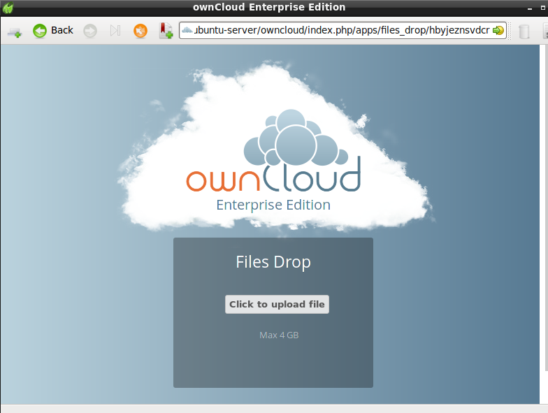
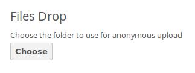
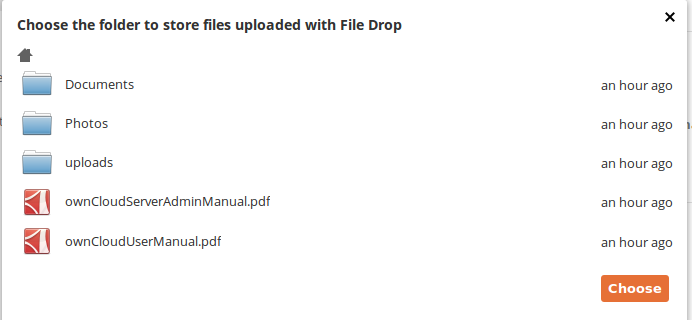

==================================
Making Anonymous Uploads (ES Only)
==================================

If your ownCloud administrator (Enterprise Subscription only) has enabled the 
File Drop application, you may upload files to special directory on the server 
without logging in. You will not be allowed to see the contents of this 
directory, or to make any changes. This is an excellent alternative to sending 
large attachments via email, using an FTP server, or using commercial 
file-sharing services.

If your ownCloud administrator allows it, you may also create your own special 
upload directory so that other people can upload files to you without having to 
log in to the server.

Setting Up File Drop
--------------------

See `TODO` to learn how to set up your own File Drop.

Uploading Files
---------------

Using the File Drop app is extremely simple. You receive a link to the upload 
folder, click the link, and then you'll see an ownCloud page with a **Click to 
upload** button.

   *Click to enlarge*
   
This opens a file picker, and you select the file or directory you want to 
upload.

   *Click to enlarge*
   
When your upload is completed, you'll see a confirmation message with the 
filenames.

