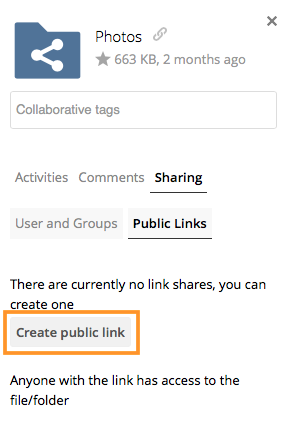

==================
Public Link Shares
==================

With ownCloud X (10.0), we introduced the ability to create multiple public links per file or folder.
This offers a lot of flexibility for creating different kinds of share links for a single file or folder, such as *different passwords*, *expiry dates*, and *permissions*. 

As of ownCloud version 10.0.2 you can create :ref:`Drop Folders <create_drop_folder_label>`, where users can upload files to a central location, but not be able to change any existing ones, nor see other files which already have been uploaded.

Creating Public Link Shares   
~~~~~~~~~~~~~~~~~~~~~~~~~~~

To create a public link share, first view the Sharing Panel of the file or folder that you want to create a public link share for, and under **"Public Links"** click **"Create public link"**.

Then, as with other shares, provide the name in the **"Link Name"** field, and fill out the options that suit what you want the link to support. 
You can find details of what each option does below.

.. image:: ../images/public-link/public-link-settings.png
   :alt: Create a public link - step two.

Finally, click **"Save"** to complete creation of the share. 
Now that the share is created, you can:

- Copy the link to the share and give it out
- Update the share’s settings
- Share the link via social media and email
- Delete the public link

Share Settings Explained
^^^^^^^^^^^^^^^^^^^^^^^^

================= =================================================== 
Setting           Description
================= =================================================== 
Allow editing     It also allows renaming, deleting, and moving.
Show file listing The option allows recipients to list the files in 
                  the shared folder. If you don't give permission to 
                  view the files you have :ref:`a drop folder 
                  <create_drop_folder_label>`.
Password          Sets a password for protecting the link.
Expiration        Sets an expiry date for the link.
================= =================================================== 

